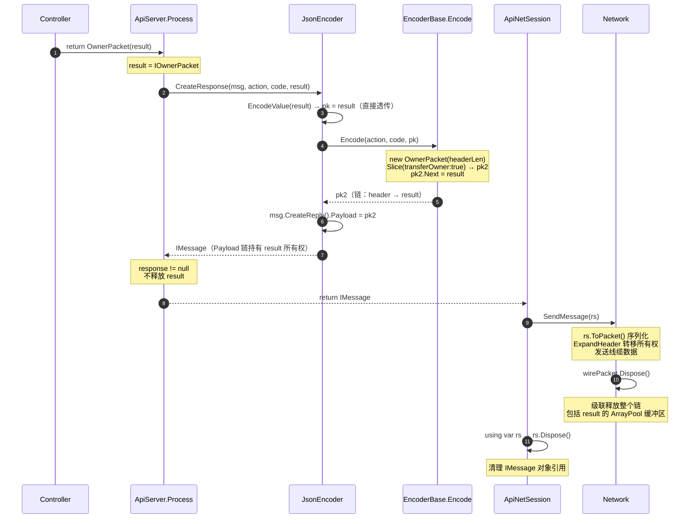
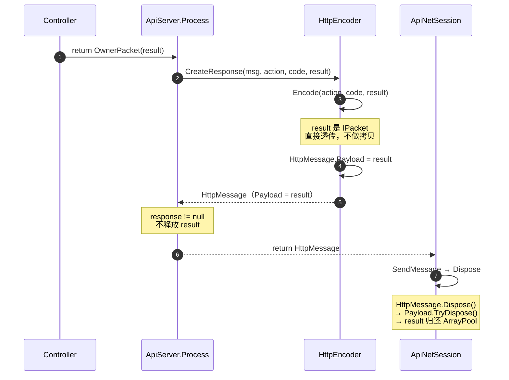

# RPC 内存管理设计

本文档说明 NewLife.Remoting 中 RPC 流水线的零拷贝内存管理机制，重点描述 `IOwnerPacket` 所有权转移与级联释放的设计。

---

## 目录

- [设计目标](#设计目标)
- [核心概念](#核心概念)
- [所有权转移流程](#所有权转移流程)
  - [SRMP 协议路径](#srmp-协议路径)
  - [HTTP 协议路径](#http-协议路径)
- [关键代码路径](#关键代码路径)
- [设计巧妙之处](#设计巧妙之处)
- [注意事项](#注意事项)

---

## 设计目标

RPC 服务端处理大量并发请求时，频繁的内存分配和 GC 是主要性能瓶颈。本设计通过以下机制实现高性能内存管理：

1. **零拷贝**：Controller 返回的数据包直接挂载到响应消息链，不做额外拷贝
2. **池化复用**：使用 `ArrayPool<Byte>.Shared` 管理缓冲区，避免频繁 GC
3. **所有权转移**：通过链式结构自动传递内存管理责任，无需手动跟踪
4. **级联释放**：Dispose 响应消息时自动释放整个数据包链

---

## 核心概念

| 类型 | 说明 |
|------|------|
| `IPacket` | 数据包接口，支持链式结构（`Next` 属性） |
| `IOwnerPacket` | 拥有缓冲区管理权的数据包，继承 `IPacket` + `IDisposable` |
| `OwnerPacket` | `IOwnerPacket` 的实现，基于 `ArrayPool<Byte>.Shared` |
| `IMessage` | 消息接口，继承 `IDisposable`，`Payload` 承载数据包链 |
| `DefaultMessage` | SRMP 协议消息，Dispose 时释放 Payload 链 |
| `HttpMessage` | HTTP 协议消息，Dispose 时释放 Header + Payload 链 |

### 链式结构

```
IMessage.Payload → OwnerPacket(header) → Next → OwnerPacket(data) → Next → ...
```

`OwnerPacket.Dispose()` 会：
1. 归还自身缓冲区到 `ArrayPool`
2. 调用 `Next.TryDispose()` 级联释放后续节点
3. 将 `Next` 置 null，防止重复释放

---

## 所有权转移流程

### SRMP 协议路径



### HTTP 协议路径



---

## 关键代码路径

### 1. Controller 返回 IOwnerPacket

```csharp
public IOwnerPacket GetBinaryData()
{
    var pk = new OwnerPacket(dataLength);
    // 填充数据到 pk.GetSpan()
    return pk; // 所有权转移给 RPC 流水线
}
```

### 2. ApiServer.Process 所有权管理

```csharp
Object? result = null;
IMessage? response = null;
try
{
    result = OnProcess(...); // 可能返回 IOwnerPacket

    // 编码响应，result 所有权转移给 IMessage.Payload 链
    response = enc.CreateResponse(msg, action, code, result);
    return response;
}
finally
{
    // 仅在 result 未纳入响应时才释放（OneWay/异常场景）
    // 若响应已成功创建，result 已挂载到 Payload 链，
    // 由上层 using IMessage 释放时级联归还 ArrayPool
    if (response == null) result.TryDispose();
}
```

### 3. 上层调用者释放

```csharp
// ApiNetSession.OnReceive
using var rs = _Host.Process(this, msg, this);
if (rs != null) Session.SendMessage(rs);
// using 退出时 Dispose IMessage，级联释放 Payload 链中所有 IOwnerPacket
```

---

## 设计巧妙之处

### 1. 零拷贝链式传递

Controller 返回的 `IOwnerPacket` 不经过任何拷贝，直接作为 `Next` 节点挂载到编码器生成的头部包后面。整个 RPC 响应流水线中，业务数据始终保持在同一块 ArrayPool 缓冲区中。

### 2. 所有权自动传递

通过 `OwnerPacket.Slice(transferOwner: true)` 和 `OwnerPacket(owner, expandSize)` 构造函数，所有权在切片和头部扩展操作中自动转移。开发者无需手动跟踪哪个对象负责释放缓冲区。

### 3. 单点释放的级联机制

只需 `Dispose` 链头的 `IMessage`，整个数据包链自动级联释放：

```
IMessage.Dispose()
  → Payload.TryDispose()     // 释放头部 OwnerPacket
    → Next.TryDispose()      // 释放业务数据 OwnerPacket
      → Next.TryDispose()    // 继续级联...
        → ArrayPool.Return() // 缓冲区归还
```

### 4. 条件释放避免 use-after-free

`ApiServer.Process` 使用 `response` 变量跟踪响应是否成功创建：
- **响应成功**：`result` 的所有权已转移给 `IMessage`，`finally` 中不释放
- **OneWay/异常**：`response == null`，`result` 需要在 `finally` 中释放

这避免了两种风险：
- 提前释放（use-after-free）：响应消息的 Payload 引用了已归还的缓冲区
- 内存泄漏：异常场景下 `IOwnerPacket` 未被释放

### 5. ExpandHeader 的所有权接力

`DefaultMessage.ToPacket()` 调用 `ExpandHeader` 在数据包前面插入协议头部时：
- 若缓冲区有足够的前置空间，直接扩展（零分配）
- 所有权从原包转移到新包，`Next` 链也一并转移
- 网络层发送完毕后释放线缆包，级联释放整个链

---

## 注意事项

1. **不要在 Controller 中 Dispose 返回的 IOwnerPacket**——所有权已转移给 RPC 流水线
2. **不要缓存 IOwnerPacket 的 Span/Memory**——缓冲区可能随时被归还到池中
3. **上层必须 using IMessage**——忘记 Dispose 会导致 ArrayPool 缓冲区泄漏
4. **ToPacket() 会转移 Payload 所有权**——之后 IMessage.Dispose 不会级联释放缓冲区，而是由网络层释放线缆包

---

## 相关文件

| 文件 | 说明 |
|------|------|
| `NewLife.Remoting/ApiServer.cs` | `Process` 方法中的所有权管理 |
| `NewLife.Remoting/JsonEncoder.cs` | SRMP 协议的编码与所有权透传 |
| `NewLife.Remoting/Http/HttpEncoder.cs` | HTTP 协议的编码与所有权透传 |
| `NewLife.Remoting/Http/HttpMessage.cs` | HTTP 消息的级联 Dispose |
| `NewLife.Remoting/ApiNetServer.cs` | 上层 `using var rs` 释放模式 |
| `NewLife.Remoting/IEncoder.cs` | `EncoderBase.Encode` 链式包构建 |
| `XUnitTest/OwnerPacketLifecycleTests.cs` | 所有权转移与级联释放的单元测试 |

---

*文档由 NewLife 团队维护，如有疑问欢迎反馈*
