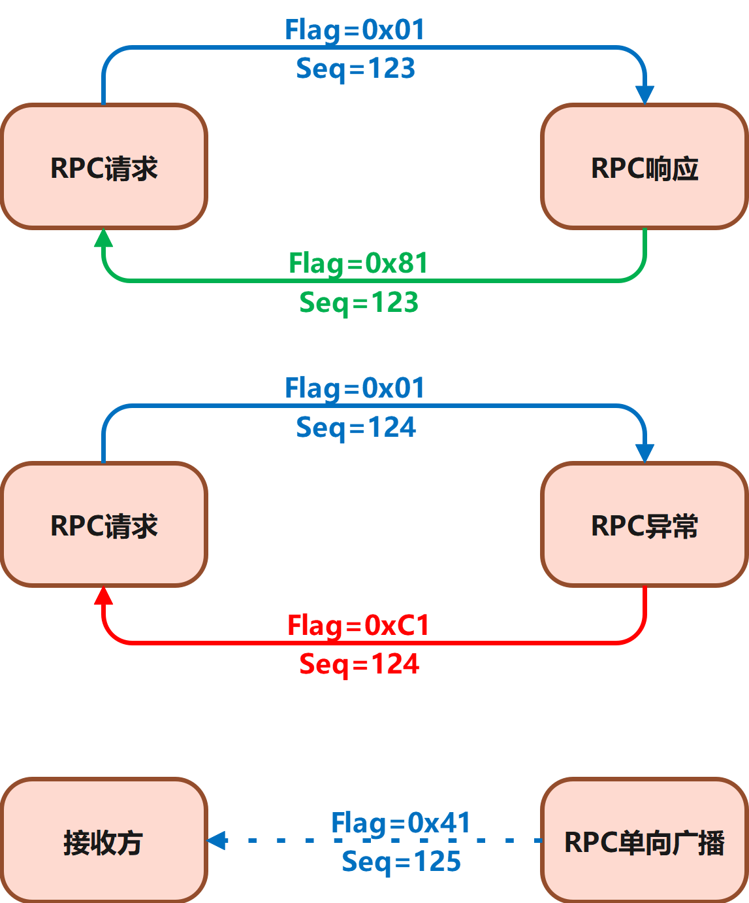


# SRMP协议
​	在分布式系统中，RPC通信尤为重要。SRMP是新生命团队专门为了RPC框架而设计的通信协议，既支持内网高速通信，也能覆盖物联网嵌入式设备。

​	经过十多年实战经验积累以及多方共同讨论，新生命团队（[https://newlifex.com](https://newlifex.com)）在2016年制订了一种简单而又具有较好扩展性的RPC（Remote Procedure Call）协议。

​	全称：**简易远程消息交换协议**，简称： **SRMP（Simple Remote Messaging Protocol）**

SRMP主要定位于以下场景：

- 内网高速通信，大吞吐量（>10万tps）、低延迟（<1ms）

- 外网远程通信，稳定可靠，海量连接（>10万）

- 物联网硬件设备，容易简单实现协议

- 支持TCP/UDP/串口/蓝牙BLE等多种通信方式

  

## 协议基础

## 消息结构

**协议： 1 Flag + 1 Sequence + 2 Length + N Payload**  

- 1 个字节标识位 Flag：标识请求、响应、异常、单向广播等；最高两位定义消息类型，详见“通信方式”。  
- 1 个字节序列号 Sequence：用于请求/响应配对和多路复用。  
- 2 个字节负载长度 Length（小端）：指示后续负载数据长度（不包含头部 4 个字节），解决粘包问题；最大 65534（0xFFFE）。  
- N 个字节负载数据 Payload：数据内容完全由业务决定。  

  

## 长度扩展

数据中心内网通信中，负载数据大于等于 64k 时，长度字段填 65535（0xFFFF），启用后续 4 字节扩展长度（小端），最大长度 4G（0xFFFFFFFF），此时头部总长度是 8 字节。  
嵌入式物联网硬件设备建议直接忽略扩展长度，仅需支持 4 字节头部，限制负载数据小于 64k。  

采用固定 2 字节表示长度，方便任意语言接入，特别是嵌入式实现；内网高速通信可在需要时扩容到 8 字节头部。  
1 字节序列号，主要用于 UDP/串口/无线通信等做请求与响应的匹配，这是多路复用的基础。  


## 通信方式

本协议默认采用请求-应答模式，此外还支持异常响应及单向广播。Flag 最高两位定义消息类型：  

- 00：请求（Request），示例常量 0x01  
- 01：单向（One-way/Broadcast），示例常量 0x41  
- 10：响应（Response），示例常量 0x81  
- 11：异常（Error/Exception Response），示例常量 0xC1  

注：上述示例常量保留了较低位的保留/业务位，与现有实现兼容。


1. 客户端向服务端发起RPC请求（Flag=0x01），携带自增序列号Seq，异步等待响应。

2. 服务端收到RPC请求后，处理业务并把结果打包成RPC响应（Flag=0x81），使用相同的Seq发回去给客户端。

3. 客户端收到响应后，匹配Seq，返回给调用方。

4. 服务端处理RPC请求出现异常时，打包RPC异常（Flag=0xC1），使用相同的Seq返回给客户端。

5. 客户端收到异常响应后，匹配Seq，向调用方抛出异常。

6. 客户端和服务端随时可以向对方发送单向广播（Flag=0x41），接收方无需回复。典型用途是命令/事件通知（如 ClientBase 中的 Notify）。

7. 客户端可以发起RPC请求以及单向广播，服务端仅能回复响应以及发送单向广播而不能主动发起RPC请求。

   

## RPC报文

SRMP主要分为请求、响应、异常和单向广播几种报文。报文由协议头和负载数据体两大部分组成。

## 请求报文

RPC请求报文，数据体分为接口名称Action和请求参数Data两部分。1个字节表示名称长度，因此名称最大长度为255字节（UTF-8）。4个字节表示请求参数的数据长度，最大4G。

如若有扩展需要，可在后面附加多个具有4字节长度的变长数据，整体格式不变。例如，某些场景需要Token令牌或者TraceId追踪，实际上可以作为请求参数一部分来整体封包。

请求参数默认采用Json序列化封包，高速接口支持直接以二进制Packet作为参数，绕开序列化的成本开支。强烈建议10000tps以上的接口采用高速Packet传参，此时接口入参只能有一个Packet参数。用户自己对参数进行二进制序列化。

在高并发大吞吐系统中，序列化成本占据整体通信耗时的70%以上，远远超过网络开支。  

| 字节 | 7 | 6 | 5 | 4 | 3 | 2 | 1 | 0 |
| --- | --- | --- | --- | --- | --- | --- | --- | --- |
| 1 Flag | 请求0 | 单向0 | 保留 |  |  |  |  |  |
| 1 Seq | 序列号（0~255） |  |  |  |  |  |  |  |
| 2 Length | 数据长度（0~65534，小端） |  |  |  |  |  |  |  |
| Body | 名称长度（1字节，按UTF-8字节长度计） |  | 接口名称（Action） |  |  |  |  |  |
|  | 数据长度（4字节，小端） |  | 请求参数（Data） |  |  |  |  |  |

备注：当 Length=0xFFFF 时，紧随其后一个 4 字节（小端）扩展长度字段。


## 响应报文

RPC响应报文，数据体分为接口名称 Action 和结果数据 Data 两部分。1 个字节表示名称长度，因此名称最大长度为 255 字节（UTF-8）。4 个字节表示结果数据的数据长度，最大 4G。

如若有扩展需要，可在后面附加多个具有4字节长度的变长数据，整体格式不变。

响应数据默认采用Json序列化封包，高速接口支持直接以二进制Packet作为数据，绕开序列化的成本开支。强烈建议10000tps以上的接口采用Packet作为响应数据，此时接口返回类型必须是Packet。用户自己对数据进行二进制反序列化。  

| 字节 | 7 | 6 | 5 | 4 | 3 | 2 | 1 | 0 |
| --- | --- | --- | --- | --- | --- | --- | --- | --- |
| 1 Flag | 响应1 | 错误0 | 保留 |  |  |  |  |  |
| 1 Seq | 序列号（0~255） |  |  |  |  |  |  |  |
| 2 Length | 数据长度（0~65534，小端） |  |  |  |  |  |  |  |
| Body | 名称长度（1字节，按UTF-8字节长度计） |  | 接口名称（Action） |  |  |  |  |  |
|  | 数据长度（4字节，小端） |  | 结果数据（Data） |  |  |  |  |  |


## 异常报文

RPC异常响应报文，数据体分为接口名 Action、错误码 Code 和结果数据 Data 三部分。响应代码 Code 固定 4 字节 Int32（小端），其它同响应报文。

| 字节 | 7 | 6 | 5 | 4 | 3 | 2 | 1 | 0 |
| --- | --- | --- | --- | --- | --- | --- | --- | --- |
| 1 Flag | 响应1 | 错误1 | 保留 |  |  |  |  |  |
| 1 Seq | 序列号（0~255） |  |  |  |  |  |  |  |
| 2 Length | 数据长度（0~65534，小端） |  |  |  |  |  |  |  |
| Body | 名称长度（1字节，按UTF-8字节长度计） |  | 接口名称（Action） |  |  |  |  |  |
|  | 响应代码（Code，4字节，小端） |  |  |  |  |  |  |  |
|  | 数据长度（4字节，小端） |  | 结果数据（Data） |  |  |  |  |  |


## 单向广播

RPC 单向广播报文，标记位高位填 01，其它同请求报文。常用于命令/事件通知（如 Notify）。

| 字节 | 7 | 6 | 5 | 4 | 3 | 2 | 1 | 0 |
| --- | --- | --- | --- | --- | --- | --- | --- | --- |
| 1 Flag | 请求0 | 单向1 | 保留 |  |  |  |  |  |
| 1 Seq | 序列号（0~255） |  |  |  |  |  |  |  |
| 2 Length | 数据长度（0~65534，小端） |  |  |  |  |  |  |  |
| Body | 名称长度（1字节，按UTF-8字节长度计） |  | 接口名称（Action） |  |  |  |  |  |
|  | 数据长度（4字节，小端） |  | 请求参数（Data） |  |  |  |  |  |


## 参数封包

客户端请求和服务端响应，其中都有Data数据主体部分（请求参数和结果数据），根据使用场景不同，主要分为Json封包、二进制封包和基础类型封包等方式。SRMP协议强大之处在于，可以混合使用多种封包方式，简单接口使用Json封包和基础类型封包，文件和多媒体传输接口使用二进制封包。  
请求参数对应接口入参，接口返回对应Invoke返回，一般要求两边类型对应。但也不尽然，只要一边能够解析另一边的数据就行。


## 封包原理

1. 客户端发起Invoke调用时，接口名称Action和参数对象Data将封包成为请求报文。其中接口名称固定为字符串封包，而请求参数根据使用场景不同，使用不同的封包方式，**最终都是二进制数据**。  

2. **服务端接口入参，一般使用客户端请求参数相同类型**，但也可以使用完全不同的类型，只要能够解析出来即可。例如，不管请求参数是什么类型，接口入参一定可以使用Byte[]或Packet，此时可就得自己解析二进制数据了。又如，请求参数是复杂对象，使用Json封包，而接口入参使用String，那么将会收到一段Json字符串。  

3. 服务端接口返回结果数据，一般使用强类型对象，使用Json封包或二进制封包返回，**最终也都是二进制数据**。  

4. 客户端Invoke收到服务端响应时，**根据TResult解析结果数据Data**，一般使用服务端接口的返回类型。也可以使用Byte[]/Packet/String/IDictionary<String,Object>等类型解析返回数据。  

5. 如果服务端接口抛出异常，将返回异常报文，并且把异常信息打包在Data中返回。客户端（如 ClientBase）在 Invoke 内部解析异常报文的 Code 与 Data 后，**抛出 ApiException 异常**。

   

## Json封包

请求参数或结果数据是复杂对象时，默认使用Json序列化。

```csharp
await _Client.InvokeAsync<Object>("api/info", new { state="abcd", state2=1234 })
```
 
客户端使用以上代码，请求参数Data的封包就是：`{"state":"abcd","state2":1234}`，共30字节。

Json封包具有很好的可读性和兼容性，能够满足绝大多数应用场景。它的缺点就是性能损耗，频繁传输较大对象时，大部分时间都耗费在Json序列化之上。


## 二进制封包

请求参数或结果数据是极为复杂且需要自定义序列化的对象，或者干脆直接就是传输二进制数据时，使用二进制封包。

复杂对象支持 **IAccessor 接口** 时，可通过该接口的 Read/Write 实现二进制序列化及反序列化；

参数或结果直接就是 **Byte[]** 或 **Packet** 时，直接封包；

```csharp
await _Client.InvokeAsync<Object>("api/info", new MyAccessor{ state="abcd", state2=1234 })
```
 
客户端使用以上代码，请求参数Data的封包就是：`0461626364D209`，共 7 个字节，远比 Json 封包的 30 字节要小得多。  
二进制封包具有极高的吞吐性能、极小的报文大小。它的缺点就是可读性很差，网络抓包后几乎识别不出来内容。例如文件传输和多媒体传输等场景，就可以优先使用二进制封包。


## 基础类型封包

请求参数和结果数据也支持使用简单类型，例如整数、小数、布尔型、时间日期和字符串等，此时统一按照字符串进行封包传输。

### 扩展附注

- Action 名称长度字段为 1 字节，按 UTF-8 编码后的字节长度计数，最大 255 字节；若名称需要超过此限制，可通过自定义扩展段承载（4 字节小端长度 + N 字节数据）。  
- 当启用长度扩展（Length=0xFFFF）时，扩展长度字段与后续所有长度字段均采用小端字节序，与实现保持一致。  
- Notify 用于单向下行通知，典型为命令分发，ClientBase 会在接收到 Notify 后解析为命令模型并调用命令处理委托。  

