# SRV — 服务端架构

> **版本**：v3.8 | **日期**：2026-07-23
> **覆盖模块**：SRV（服务端基础）+ CMD（指令下发）
> **关联文档**：[架构设计](架构设计.md) · [需求文档](需求文档.md) · [功能清单](功能清单.md)

---

## 1. 模块概述

### 1.1 定位

SRV 是 NewLife.Remoting 的服务端基础模块，为 IoT/星尘场景提供**设备生命周期管理**的一站式能力——登录、鉴权、注册、心跳保活、在线管理、事件上报、升级检查、命令下发与响应回传。包含两个紧密耦合的子模块：

| 模块 | 编码 | 层级 | 职责 |
|:----|:----:|:----:|------|
| **服务端基础** | SRV | 扩展层 | 控制器基类、设备服务接口与实现、JWT 令牌服务 |
| **指令下发** | CMD | 核心层 | 会话管理器、事件总线命令广播、WS/SSE 长连接推送 |

### 1.2 依赖关系

```
RPC (ApiServer/Encoder) ──► SRV (BaseDeviceController/IDeviceService) ──► CMD (SessionManager/CommandSession)
```

- SRV 依赖 RPC 核心框架的 `ApiServer`/`Encoder` 进行 HTTP 请求路由与编解码
- CMD 依赖 RPC 的事件总线机制进行跨实例命令广播
- SRV 的 `BaseDeviceController` 同时调用 SRV 的 `IDeviceService`（业务逻辑）和 CMD 的 `ISessionManager`（命令下发通道）

### 1.3 分层架构

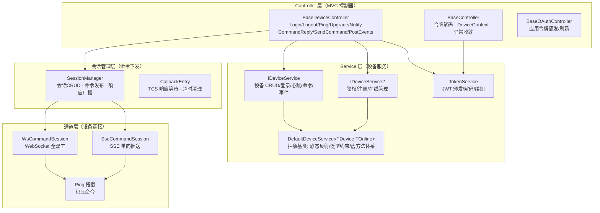
```mermaid
flowchart TD
    subgraph Controller["Controller 层（MVC 控制器）"]
        BC[BaseController<br/>令牌解码 · DeviceContext · 异常收敛]
        BD[BaseDeviceController<br/>Login/Logout/Ping/Upgrade/Notify<br/>CommandReply/SendCommand/PostEvents]
        OA[BaseOAuthController<br/>应用令牌颁发/刷新]
    end

    subgraph Service["Service 层（设备服务）"]
        IDev[IDeviceService<br/>设备 CRUD/登录/心跳/命令/事件]
        IDev2[IDeviceService2<br/>鉴权/注册/在线管理]
        DDS[DefaultDeviceService&lt;TDevice,TOnline&gt;<br/>抽象基类: 静态反射/泛型约束/虚方法体系]
        TokenSvc[TokenService<br/>JWT 颁发/解码/续期]
    end

    subgraph Session["会话管理层（命令下发）"]
        SM[SessionManager<br/>会话CRUD · 命令发布 · 响应广播]
        CB[CallbackEntry<br/>TCS 响应等待 · 超时清理]
    end

    subgraph Channel["通道层（设备连接）"]
        Ws[WsCommandSession<br/>WebSocket 全双工]
        Sse[SseCommandSession<br/>SSE 单向推送]
        Ping["Ping 搭载<br/>积压命令"]
    end

    BD --> IDev
    BD --> IDev2
    BD --> TokenSvc
    BC --> TokenSvc
    BD --> SM
    SM --> Ws
    SM --> Sse
    IDev --> DDS
    IDev2 --> DDS
    Ws --> Ping
    Sse --> Ping
```

---

## 2. 服务层架构

### 2.1 接口体系

服务层由三层接口/抽象类构成，逐层增强能力：

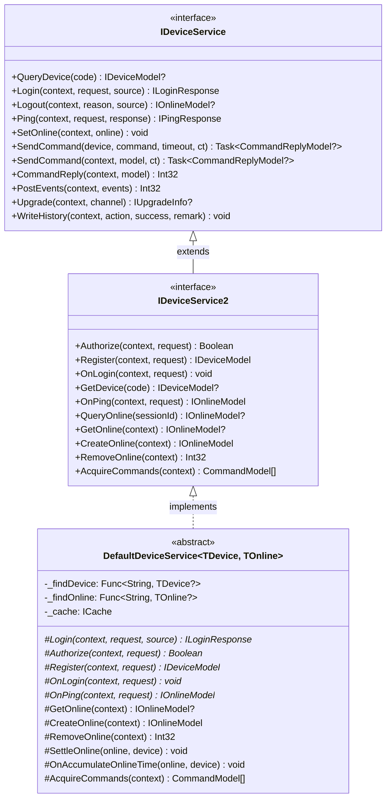
```mermaid
classDiagram
    class IDeviceService {
        <<interface>>
        +QueryDevice(code) IDeviceModel?
        +Login(context, request, source) ILoginResponse
        +Logout(context, reason, source) IOnlineModel?
        +Ping(context, request, response) IPingResponse
        +SetOnline(context, online) void
        +SendCommand(device, command, timeout, ct) Task~CommandReplyModel?~
        +SendCommand(context, model, ct) Task~CommandReplyModel?~
        +CommandReply(context, model) Int32
        +PostEvents(context, events) Int32
        +Upgrade(context, channel) IUpgradeInfo?
        +WriteHistory(context, action, success, remark) void
    }

    class IDeviceService2 {
        <<interface>>
        +Authorize(context, request) Boolean
        +Register(context, request) IDeviceModel
        +OnLogin(context, request) void
        +GetDevice(code) IDeviceModel?
        +OnPing(context, request) IOnlineModel
        +QueryOnline(sessionId) IOnlineModel?
        +GetOnline(context) IOnlineModel?
        +CreateOnline(context) IOnlineModel
        +RemoveOnline(context) Int32
        +AcquireCommands(context) CommandModel[]
    }

    class DefaultDeviceService~TDevice, TOnline~ {
        <<abstract>>
        -_findDevice: Func~String, TDevice?~
        -_findOnline: Func~String, TOnline?~
        -_cache: ICache
        #Login(context, request, source) ILoginResponse *
        #Authorize(context, request) Boolean *
        #Register(context, request) IDeviceModel *
        #OnLogin(context, request) void *
        #OnPing(context, request) IOnlineModel *
        #GetOnline(context) IOnlineModel?
        #CreateOnline(context) IOnlineModel
        #RemoveOnline(context) Int32
        #SettleOnline(online, device) void
        #OnAccumulateOnlineTime(online, device) void
        #AcquireCommands(context) CommandModel[]
    }

    IDeviceService <|-- IDeviceService2 : extends
    IDeviceService2 <|.. DefaultDeviceService : implements
```

### 2.2 关键设计点

#### 静态反射（零运行时反射）

`DefaultDeviceService` 在静态构造器中使用反射一次性查找并缓存委托：

```csharp
static DefaultDeviceService()
{
    // 查找 TDevice 的 FindByCode 或 FindByName
    var type = typeof(TDevice);
    var method = type.GetMethod("FindByCode", ...)
                ?? type.GetMethod("FindByName", ...);
    _findDevice = method?.CreateDelegate<Func<String, TDevice?>>();

    // 查找 TOnline 的 FindBySessionId
    type = typeof(TOnline);
    var method = type.GetMethod("FindBySessionId", ...)
                ?? type.GetMethod("FindBySessionID", ...);
    _findOnline = method?.CreateDelegate<Func<String, TOnline?>>();
}
```

**效果**：后续每次 `QueryDevice`/`QueryOnline` 调用直接执行委托，无反射开销。

#### 泛型约束

```csharp
public abstract class DefaultDeviceService<TDevice, TOnline>(...)
    : IDeviceService2
    where TDevice : Entity<TDevice>, IDeviceModel, new()
    where TOnline : Entity<TOnline>, IOnlineModel, new()
```

- `TDevice` 必须是 XCode 实体且实现 `IDeviceModel`，支持 `FindByCode`/`Save`/`Insert`/`Delete` 等实体操作
- `TOnline` 必须是 XCode 实体且实现 `IOnlineModel`，支持 `FindBySessionId` 等操作
- `new()` 约束允许 `Entity<TDevice>.Meta.Factory.Create()` 创建设备实例

#### 可重写虚方法体系

| 方法 | 触发时机 | 默认行为 | 重写场景 |
|------|---------|---------|---------|
| `Authorize` | Login 中验证密钥 | 明文对比 + passwordProvider 验证 | 自定义鉴权算法 |
| `Register` | 鉴权失败后的自动注册 | 查库/新建 → 生成密钥 → OnRegister | 自定义注册策略 |
| `OnRegister` | Register 内部填充数据 | `device.Save()` | 补充额外字段 |
| `OnLogin` | 鉴权+注册成功后 | GetOnline/CreateOnline → 写历史 | 自定义登录后处理 |
| `OnPing` | Ping 中更新在线 | GetOnline/CreateOnline → Save | 自定义心跳逻辑 |
| `SettleOnline` | 注销/超时清理 | 累加时长 + LoginTime=MinValue | 自定义结算策略 |
| `OnAccumulateOnlineTime` | SettleOnline 内部 | 空实现 | 累加会话时长到设备实体 |
| `AcquireCommands` | Ping/NotifySSE 中获取积压命令 | 返回空数组 | 从数据库查询待下发命令 |

#### IDeviceModel / IDeviceModel2 双接口

```csharp
public interface IDeviceModel { String Code { get; } String Name { get; } Boolean Enable { get; } }
public interface IDeviceModel2 : IDeviceModel
{
    String Secret { get; set; }      // 设备密钥
    Int32 Period { get; }            // 心跳周期
    String? NewServer { get; }       // 服务器迁移地址
    IExtend CreateHistory(...);      // 创建设备历史
    IOnlineModel CreateOnline(...);  // 创建在线记录
}
```

**设计意图**：`IDeviceModel` 是基础契约（适用于只读场景），`IDeviceModel2` 提供管理能力（密钥/历史/在线）。`DefaultDeviceService` 内部通过 `is IDeviceModel2` 判断并使用增强能力。

#### 设备缓存策略

```
GetDevice(code):
  1. _cache.Get<IDeviceModel>(cacheKey)  // 先查缓存
  2. 未命中 → QueryDevice(code)          // 查数据库
  3. _cache.Set(cacheKey, device, 60)     // 写入缓存（60 秒 TTL）
```

**注意**：`GetDevice` 用于 SendCommand 中查找目标设备（高频查询场景），而直接查库的 `QueryDevice` 用于一次性的登录/鉴权场景，确保拿到最新状态。

#### 全链路追踪

每个关键方法（Login/Ping/Authorize/Register/Logout/CreateOnline/SettleOnline 等）均使用 `_tracer?.NewSpan(...)` 埋点，span 名称统一为 `{Name}{MethodName}` 模式（如 `DeviceLogin`、`DevicePing`），便于在 APM 系统中聚合分析。

---

## 3. 控制器管线

`BaseController` 是 SRV 控制器的基类，通过 ASP.NET Core 的 `IActionFilter` 机制在每个请求前后执行管线逻辑。

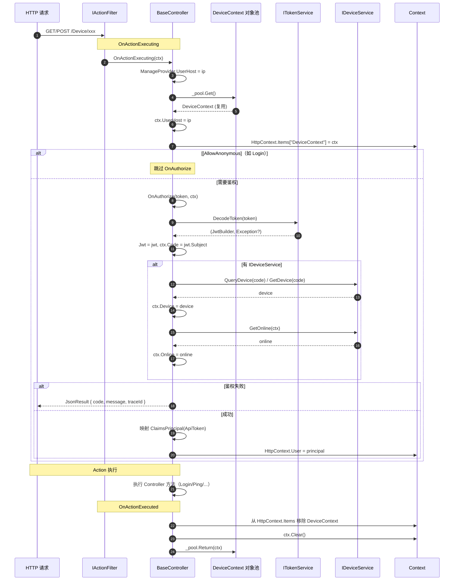
```mermaid
sequenceDiagram
    autonumber
    participant HTTP as HTTP 请求
    participant Filter as IActionFilter
    participant BC as BaseController
    participant Pool as DeviceContext 对象池
    participant TokenSvc as ITokenService
    participant Svc as IDeviceService

    HTTP->>Filter: GET/POST /Device/xxx
    Note over Filter,BC: OnActionExecuting
    Filter->>BC: OnActionExecuting(ctx)
    BC->>BC: ManageProvider.UserHost = ip
    BC->>Pool: _pool.Get()
    Pool-->>BC: DeviceContext (复用)
    BC->>BC: ctx.UserHost = ip
    BC->>Context: HttpContext.Items["DeviceContext"] = ctx

    alt [AllowAnonymous]（如 Login）
        Note over BC: 跳过 OnAuthorize
    else 需要鉴权
        BC->>BC: OnAuthorize(token, ctx)
        BC->>TokenSvc: DecodeToken(token)
        TokenSvc-->>BC: (JwtBuilder, Exception?)
        BC->>BC: Jwt = jwt, ctx.Code = jwt.Subject
        alt 有 IDeviceService
            BC->>Svc: QueryDevice(code) / GetDevice(code)
            Svc-->>BC: device
            BC->>BC: ctx.Device = device
            BC->>Svc: GetOnline(ctx)
            Svc-->>BC: online
            BC->>BC: ctx.Online = online
        end
        alt 鉴权失败
            BC-->>HTTP: JsonResult { code, message, traceId }
        else 成功
            BC->>BC: 映射 ClaimsPrincipal(ApiToken)
            BC->>Context: HttpContext.User = principal
        end
    end

    Note over BC,HTTP: Action 执行
    BC->>BC: 执行 Controller 方法（Login/Ping/...）

    Note over Filter,BC: OnActionExecuted
    BC->>Context: 从 HttpContext.Items 移除 DeviceContext
    BC->>Context: ctx.Clear()
    BC->>Pool: _pool.Return(ctx)
```

### 3.1 DeviceContext 对象池

```csharp
private static readonly Pool<DeviceContext> _pool = new(256);
```

- 每请求从池中获取，用后归还（`OnActionExecuted` 中 `Clear()` → `Return()`）
- 避免高频请求下 DeviceContext 对象的 GC 压力
- 池满时直接 new，不阻塞

### 3.2 异常收敛策略

| 异常类型 | HTTP 状态码 | 返回格式 | 说明 |
|----------|:-----------:|----------|------|
| `ApiException` | 自定义 Code | `{code, message, traceId}` | 业务异常，code 保持原值 |
| `XSqlException` | 500 | `{code:500, message:"数据库SQL错误", traceId}` | 屏蔽 SQL 细节 |
| 其他异常 | 500 | `{code:500, message, traceId}` | 通用错误 |

### 3.3 ClaimsPrincipal 映射

鉴权成功后，`BaseController` 将 JWT 令牌内容映射为 `ClaimsPrincipal`：

```csharp
var claims = new List<Claim>
{
    new Claim("code", code),
    new Claim(ClaimTypes.NameIdentifier, code),
    new Claim("client_id", context.ClientId),
};
var identity = new ClaimsIdentity(claims, "ApiToken");
HttpContext.User = new ClaimsPrincipal(identity);
```

这使得下游中间件和授权策略可以基于 `[Authorize]` 和 `User.Identity` 做细粒度权限控制。

---

## 4. 核心业务流程

### 4.1 登录流程（Login）

**入口**：`POST /Device/Login` → `[AllowAnonymous]` `BaseDeviceController.Login(ILoginRequest)`

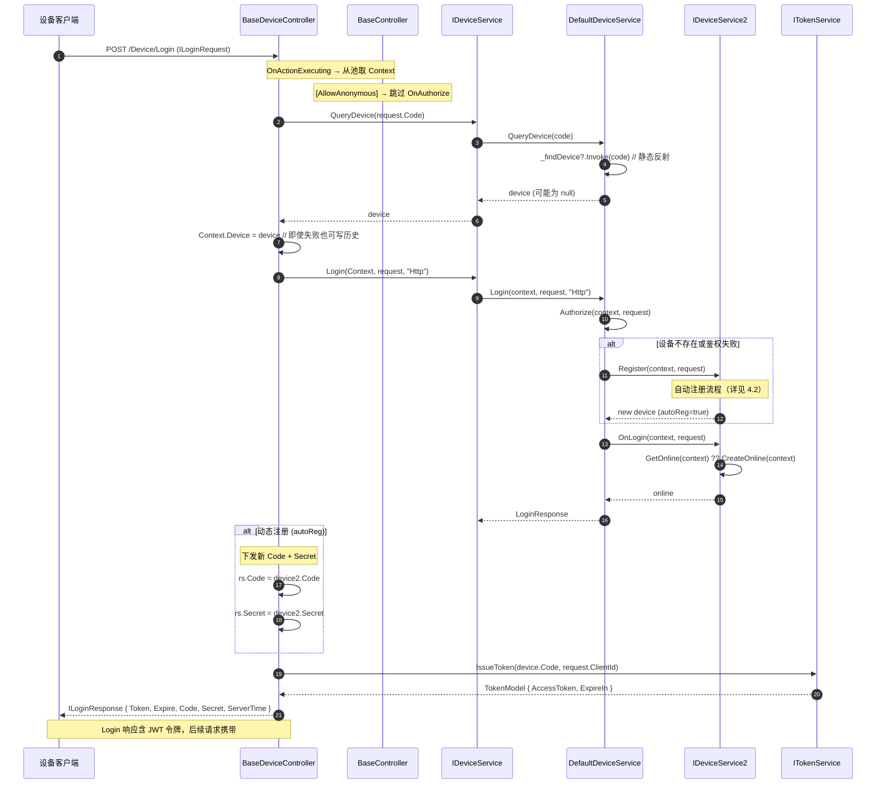
```mermaid
sequenceDiagram
    autonumber
    participant Device as 设备客户端
    participant BC as BaseDeviceController
    participant Filter as BaseController
    participant Svc as IDeviceService
    participant DDS as DefaultDeviceService
    participant DDS2 as IDeviceService2
    participant TokenSvc as ITokenService

    Device->>BC: POST /Device/Login (ILoginRequest)
    Note over BC,Filter: OnActionExecuting → 从池取 Context
    Note over Filter: [AllowAnonymous] → 跳过 OnAuthorize

    BC->>Svc: QueryDevice(request.Code)
    Svc->>DDS: QueryDevice(code)
    DDS->>DDS: _findDevice?.Invoke(code)  // 静态反射
    DDS-->>Svc: device (可能为 null)
    Svc-->>BC: device

    BC->>BC: Context.Device = device  // 即使失败也可写历史

    BC->>Svc: Login(Context, request, "Http")
    Svc->>DDS: Login(context, request, "Http")
    DDS->>DDS: Authorize(context, request)

    alt 设备不存在或鉴权失败
        DDS->>DDS2: Register(context, request)
        Note over DDS2: 自动注册流程（详见 4.2）
        DDS2-->>DDS: new device (autoReg=true)
    end

    DDS->>DDS2: OnLogin(context, request)
    DDS2->>DDS2: GetOnline(context) ?? CreateOnline(context)
    DDS2-->>DDS: online
    DDS-->>Svc: LoginResponse

    alt 动态注册 (autoReg)
        Note over BC: 下发新 Code + Secret
        BC->>BC: rs.Code = device2.Code
        BC->>BC: rs.Secret = device2.Secret
    end

    BC->>TokenSvc: IssueToken(device.Code, request.ClientId)
    TokenSvc-->>BC: TokenModel { AccessToken, ExpireIn }

    BC-->>Device: ILoginResponse { Token, Expire, Code, Secret, ServerTime }
    Note over BC,Device: Login 响应含 JWT 令牌，后续请求携带
```

**关键设计点**：

| 设计 | 说明 |
|------|------|
| `[AllowAnonymous]` | 首次登录无令牌，必须跳过鉴权 |
| **Authorize 双重验证** | 先明文对比 `device.Secret == request.Secret`，失败再用 `passwordProvider.Verify` 支持密码算法 |
| **自动注册** | 鉴权失败或设备不存在时自动执行 `Register` 流程，生成新密钥并保存 |
| **ClientId 生成** | `request.ClientId` 为空时自动生成 `Rand.NextString(8)`，作为 SessionId 的一部分 |
| **令牌颁发** | `IssueToken` 将 `device.Code` 设为 JWT Subject，`ClientId` 设为 JWT Id |
| **ServerTime** | 登录响应携带服务端 UTC 时间，客户端用于计算时差 |

### 4.2 自动注册流程（Register）

**触发条件**：`Login` 中 `device == null` 或 `Authorize` 返回 `false`

```mermaid
flowchart TD
    A[Authorize 失败 或 device==null] --> B{code 是否为空?}
    B -->|是| C[UUID.Crc 生成 8 位编码]
    B -->|否| D[使用 request.Code]
    C --> E[新建/查询设备实体]
    D --> E
    E --> F[device.Enable = true]
    F --> G[生成新密钥 Rand.NextString(16)]
    G --> H[OnRegister 填充数据并 Save]
    H --> I[WriteHistory 动态注册成功]
    I --> J[返回 device]
```

**代码流程**：
1. 确定设备编码：优先 `request.Code`，为空则用 `request.UUID.GetBytes().Crc().ToString("X8")`，再为空则随机 `Rand.NextString(8)`
2. 查库 `QueryDevice(code)` 或新建 `Entity<TDevice>.Meta.Factory.Create()`
3. 设置 `device.Enable = true`
4. 生成新密钥 `device.Secret = Rand.NextString(16)`
5. 调用虚方法 `OnRegister(context, request)` — 默认执行 `(device as IEntity).Save()`
6. 写历史记录 "动态注册"

### 4.3 注销流程（Logout）

**入口**：`GET/POST /Device/Logout?reason=xxx` → `BaseDeviceController.Logout`

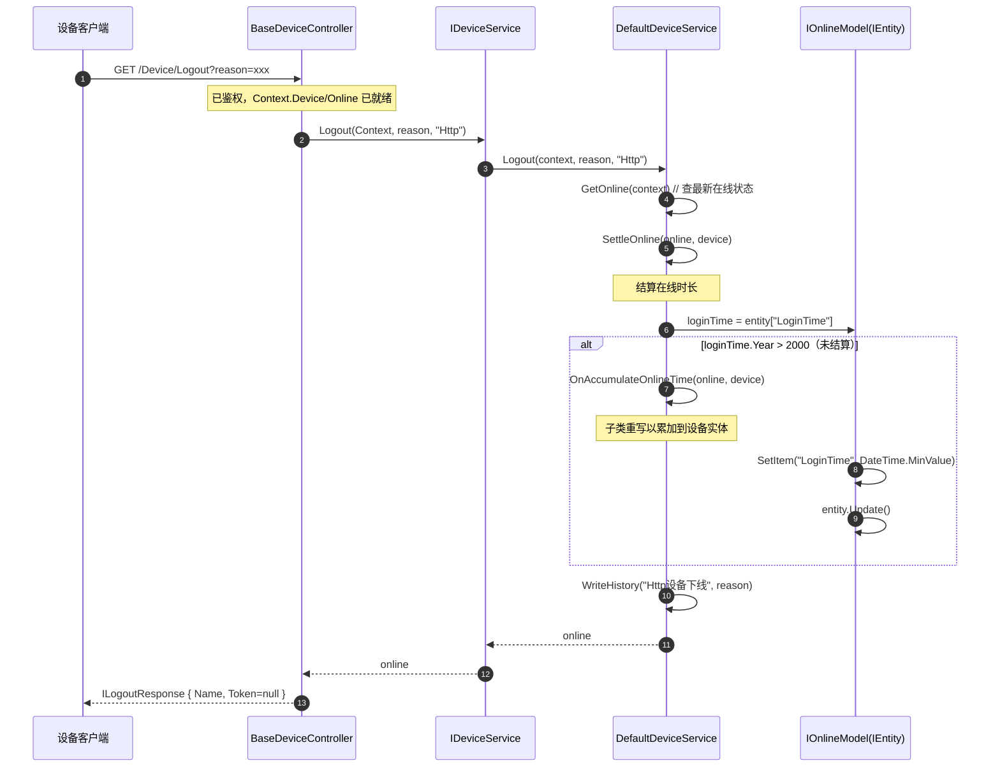
```mermaid
sequenceDiagram
    autonumber
    participant Device as 设备客户端
    participant BC as BaseDeviceController
    participant Svc as IDeviceService
    participant DDS as DefaultDeviceService
    participant Online as IOnlineModel(IEntity)

    Device->>BC: GET /Device/Logout?reason=xxx
    Note over BC: 已鉴权，Context.Device/Online 已就绪
    BC->>Svc: Logout(Context, reason, "Http")
    Svc->>DDS: Logout(context, reason, "Http")
    DDS->>DDS: GetOnline(context)  // 查最新在线状态
    DDS->>DDS: SettleOnline(online, device)

    Note over DDS: 结算在线时长
    DDS->>Online: loginTime = entity["LoginTime"]
    alt loginTime.Year > 2000（未结算）
        DDS->>DDS: OnAccumulateOnlineTime(online, device)
        Note over DDS: 子类重写以累加到设备实体
        Online->>Online: SetItem("LoginTime", DateTime.MinValue)
        Online->>Online: entity.Update()
    end

    DDS->>DDS: WriteHistory("Http设备下线", reason)
    DDS-->>Svc: online
    Svc-->>BC: online
    BC-->>Device: ILogoutResponse { Name, Token=null }
```

**关键设计点**：
- **SettleOnline 守卫**：检查 `LoginTime.Year > 2000` 防止重复结算。无论注销还是超时清理，都通过此方法统一结算
- **不删记录**：注销不清除数据库中的在线记录，记录保留供后续登录复用（`OnLogin` 中检查已有在线并刷新 `LoginTime`）
- **最终删除**：由超时清理线程 `RemoveOnline` 最终删除过期记录

### 4.4 心跳流程（Ping）

**入口**：`GET/POST /Device/Ping` → `BaseDeviceController.Ping(IPingRequest)`

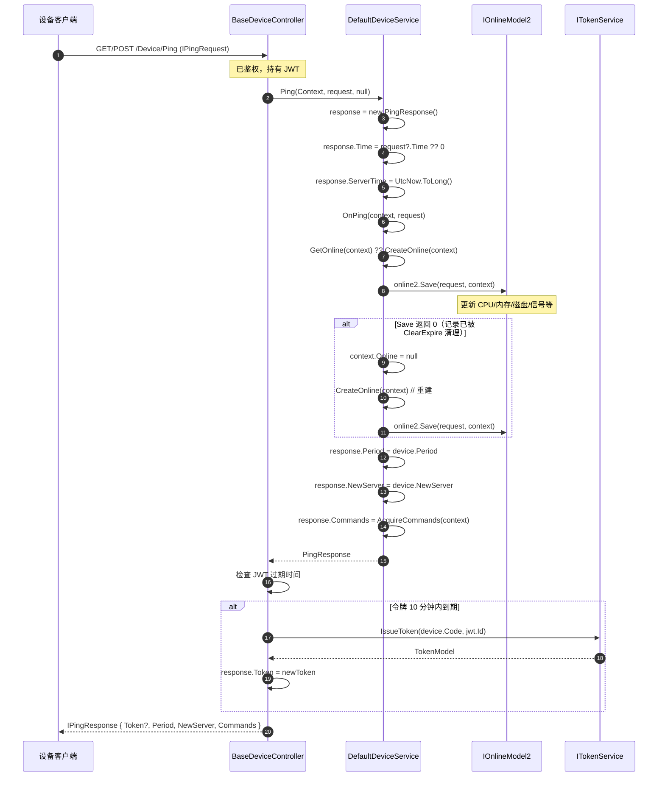
```mermaid
sequenceDiagram
    autonumber
    participant Device as 设备客户端
    participant BC as BaseDeviceController
    participant DDS as DefaultDeviceService
    participant Online as IOnlineModel2
    participant TokenSvc as ITokenService

    Device->>BC: GET/POST /Device/Ping (IPingRequest)
    Note over BC: 已鉴权，持有 JWT

    BC->>DDS: Ping(Context, request, null)
    DDS->>DDS: response = new PingResponse()
    DDS->>DDS: response.Time = request?.Time ?? 0
    DDS->>DDS: response.ServerTime = UtcNow.ToLong()

    DDS->>DDS: OnPing(context, request)
    DDS->>DDS: GetOnline(context) ?? CreateOnline(context)
    DDS->>Online: online2.Save(request, context)
    Note over Online: 更新 CPU/内存/磁盘/信号等

    alt Save 返回 0（记录已被 ClearExpire 清理）
        DDS->>DDS: context.Online = null
        DDS->>DDS: CreateOnline(context)  // 重建
        DDS->>Online: online2.Save(request, context)
    end

    DDS->>DDS: response.Period = device.Period
    DDS->>DDS: response.NewServer = device.NewServer
    DDS->>DDS: response.Commands = AcquireCommands(context)
    DDS-->>BC: PingResponse

    BC->>BC: 检查 JWT 过期时间
    alt 令牌 10 分钟内到期
        BC->>TokenSvc: IssueToken(device.Code, jwt.Id)
        TokenSvc-->>BC: TokenModel
        BC->>BC: response.Token = newToken
    end

    BC-->>Device: IPingResponse { Token?, Period, NewServer, Commands }
```

**关键设计点**：

| 设计 | 说明 |
|------|------|
| **积压命令搭载** | `IPingResponse2.Commands` 在下行方向携带待执行命令，设备在下一个心跳周期执行 |
| **服务器迁移** | `IPingResponse2.NewServer` 支持热迁移，客户端收到后切换连接地址 |
| **令牌自动续期** | 心跳中检测 JWT 是否在 10 分钟内过期，是则颁发新令牌 |
| **在线记录重建** | 在线记录被 `ClearExpire` 清理后，`Save()==0` 触发自动重建，保证心跳不断 |
| **心跳数据** | `IOnlineModel2.Save` 写入 CPU/内存/磁盘/信号/温度/电量等监控数据 |

### 4.5 升级检查流程（Upgrade）

**入口**：`GET/POST /Device/Upgrade?channel=xxx` → `BaseDeviceController.Upgrade`

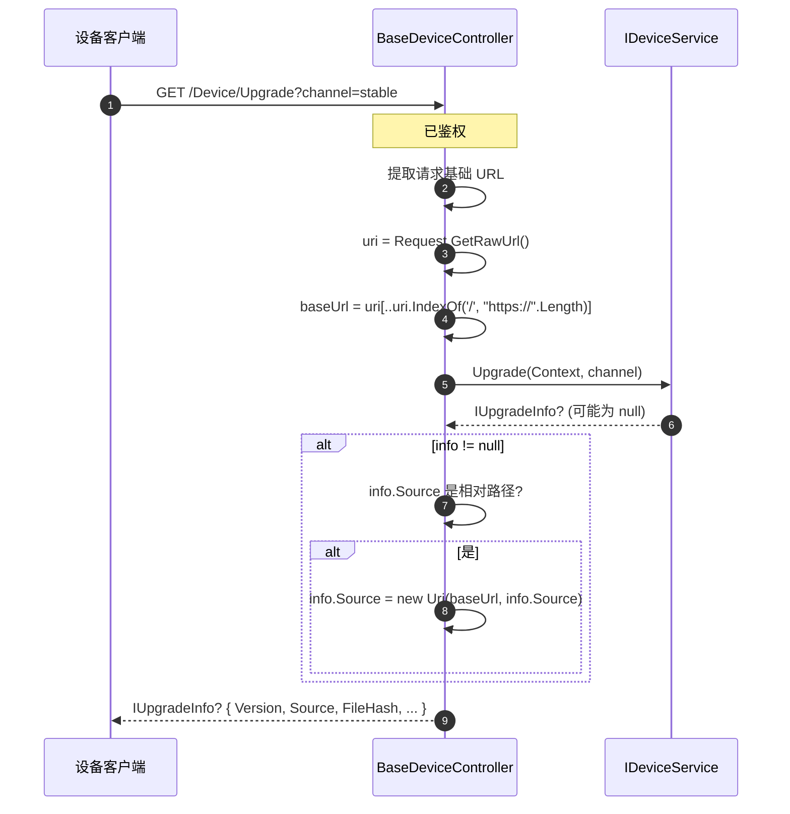
```mermaid
sequenceDiagram
    autonumber
    participant Device as 设备客户端
    participant BC as BaseDeviceController
    participant Svc as IDeviceService

    Device->>BC: GET /Device/Upgrade?channel=stable
    Note over BC: 已鉴权

    BC->>BC: 提取请求基础 URL
    BC->>BC: uri = Request.GetRawUrl()
    BC->>BC: baseUrl = uri[..uri.IndexOf('/', "https://".Length)]

    BC->>Svc: Upgrade(Context, channel)
    Svc-->>BC: IUpgradeInfo? (可能为 null)

    alt info != null
        BC->>BC: info.Source 是相对路径?
        alt 是
            BC->>BC: info.Source = new Uri(baseUrl, info.Source)
        end
    end

    BC-->>Device: IUpgradeInfo? { Version, Source, FileHash, ... }
```

**关键设计点**：
- 资源路径（`info.Source`）可能是相对路径，控制器负责解析为绝对 URL
- `Upgrade` 虚方法默认返回 `null`（无升级），子类重写实现具体升级策略
- 客户端发起升级流程（UPGD 模块）：下载 → 校验 → 解压 → 覆盖 → 重启

### 4.6 事件上报流程（PostEvents）

**入口**：`POST /Device/PostEvents` → `BaseDeviceController.PostEvents(EventModel[])`

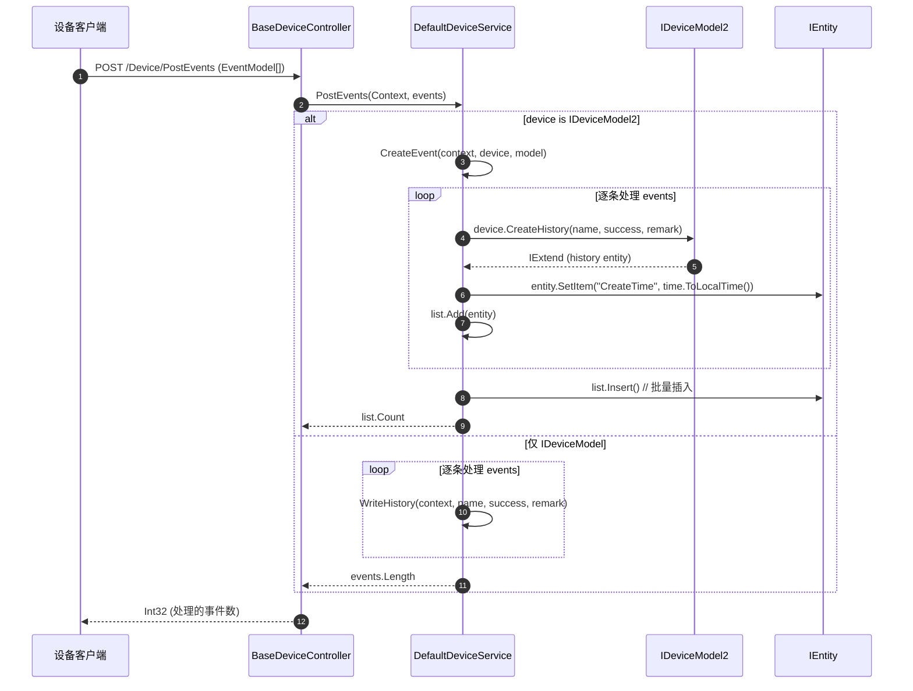
```mermaid
sequenceDiagram
    autonumber
    participant Device as 设备客户端
    participant BC as BaseDeviceController
    participant DDS as DefaultDeviceService
    participant Device2 as IDeviceModel2
    participant Entity as IEntity

    Device->>BC: POST /Device/PostEvents (EventModel[])
    BC->>DDS: PostEvents(Context, events)

    alt device is IDeviceModel2
        DDS->>DDS: CreateEvent(context, device, model)
        loop 逐条处理 events
            DDS->>Device2: device.CreateHistory(name, success, remark)
            Device2-->>DDS: IExtend (history entity)
            DDS->>Entity: entity.SetItem("CreateTime", time.ToLocalTime())
            DDS->>DDS: list.Add(entity)
        end
        DDS->>Entity: list.Insert()  // 批量插入
        DDS-->>BC: list.Count
    else 仅 IDeviceModel
        loop 逐条处理 events
            DDS->>DDS: WriteHistory(context, name, success, remark)
        end
        DDS-->>BC: events.Length
    end

    BC-->>Device: Int32 (处理的事件数)
```

**关键设计点**：
- 支持两种模式：`IDeviceModel2.CreateHistory` 批量插入（高性能） vs `WriteHistory` 逐条写入（兼容旧设备）
- 事件时间 `model.Time.ToDateTime().ToLocalTime()` 从 UTC Unix 毫秒转为本地时间
- 默认批量插入使用 `IEntity.Insert()`（XCode 批量操作）

### 4.7 长连接通知（Notify / NotifySSE）

服务端通过长连接主动推送命令到设备，支持双通道降级策略：**WebSocket 优先，SSE 降级，Ping 搭载托底**。

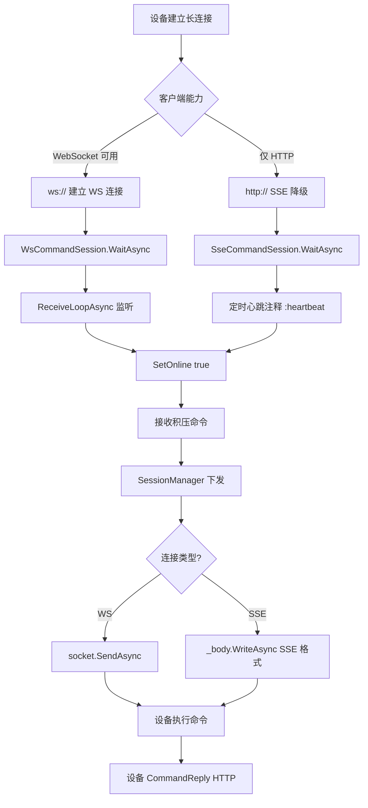
```mermaid
flowchart TD
    A[设备建立长连接] --> B{客户端能力}
    B -->|WebSocket 可用| C[ws:// 建立 WS 连接]
    B -->|仅 HTTP| D[http:// SSE 降级]
    C --> E[WsCommandSession.WaitAsync]
    D --> F[SseCommandSession.WaitAsync]
    E --> G[ReceiveLoopAsync 监听]
    F --> H[定时心跳注释 :heartbeat]
    G --> I[SetOnline true]
    H --> I
    I --> J[接收积压命令]
    J --> K[SessionManager 下发]
    K --> L{连接类型?}
    L -->|WS| M[socket.SendAsync]
    L -->|SSE| N[_body.WriteAsync SSE 格式]
    M --> O[设备执行命令]
    N --> O
    O --> P[设备 CommandReply HTTP]
```

#### Notify（WebSocket）

**入口**：`GET /Device/Notify`（需鉴权）

```
设备 → HTTP Upgrade → WebSocket → WsCommandSession 创建 → 下发积压命令 → ReceiveLoopAsync → 断开 → SetOnline(false)
```

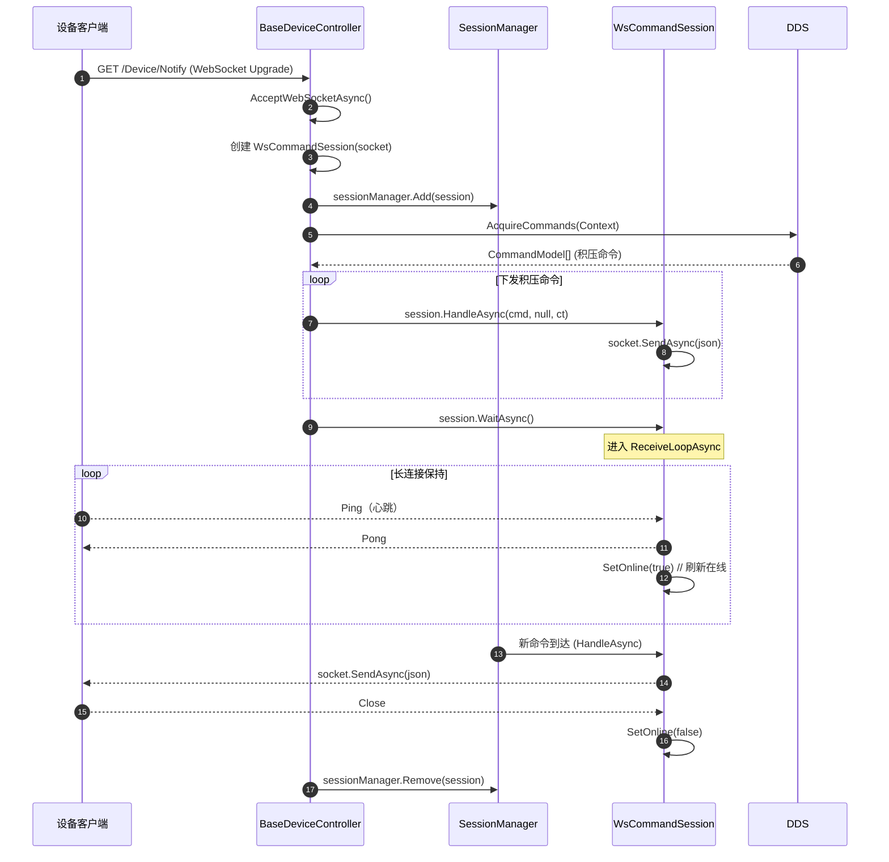
```mermaid
sequenceDiagram
    autonumber
    participant Device as 设备客户端
    participant BC as BaseDeviceController
    participant SM as SessionManager
    participant Ws as WsCommandSession

    Device->>BC: GET /Device/Notify (WebSocket Upgrade)
    BC->>BC: AcceptWebSocketAsync()
    BC->>BC: 创建 WsCommandSession(socket)
    BC->>SM: sessionManager.Add(session)

    BC->>DDS: AcquireCommands(Context)
    DDS-->>BC: CommandModel[] (积压命令)
    loop 下发积压命令
        BC->>Ws: session.HandleAsync(cmd, null, ct)
        Ws->>Ws: socket.SendAsync(json)
    end

    BC->>Ws: session.WaitAsync()
    Note over Ws: 进入 ReceiveLoopAsync

    loop 长连接保持
        Device-->>Ws: Ping（心跳）
        Ws-->>Device: Pong
        Ws->>Ws: SetOnline(true)  // 刷新在线
    end

    SM->>Ws: 新命令到达 (HandleAsync)
    Ws-->>Device: socket.SendAsync(json)

    Device-->>Ws: Close
    Ws->>Ws: SetOnline(false)
    BC->>SM: sessionManager.Remove(session)
```

#### NotifySSE（Server-Sent Events）

**入口**：`GET /Device/NotifySSE`（需鉴权）

```
设备 → HTTP GET → text/event-stream → SseCommandSession 创建 → 下发积压命令 → 定时心跳 → 断开 → SetOnline(false)
```

SSE 协议格式：

```
event: connected
data: {"code":"device-001"}

event: command
data: {"Id":1,"Command":"Restart","Argument":"now"}

: heartbeat

event: command
data: {"Id":2,"Command":"Upgrade","Argument":"v2.0"}
```

**关键设计点**：
- 30 秒心跳注释（`: heartbeat\n\n`）防止代理超时关闭连接
- 响应头 `X-Accel-Buffering: no` 禁用 nginx 缓冲
- SSE 仅支持服务端→客户端单向推送，设备执行结果需通过 `CommandReply` HTTP 接口回传
- 两个通道共用 `CommandSession` 基类和 `SessionManager`，切换成本低

---

## 5. 指令下发管线

指令下发是 SRV 最核心的交互流程——外部平台通过 HTTP API 向设备发送命令，设备通过长连接接收并执行，结果异步回传。

### 5.1 命令下发时序

**外部入口**：`POST /Device/SendCommand` → `[AllowAnonymous]` `BaseDeviceController.SendCommand(CommandInModel)`

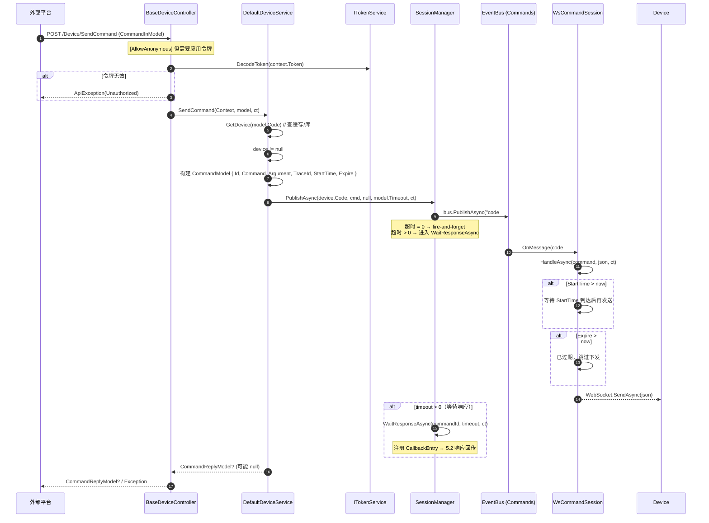
```mermaid
sequenceDiagram
    autonumber
    participant App as 外部平台
    participant BC as BaseDeviceController
    participant DDS as DefaultDeviceService
    participant TokenSvc as ITokenService
    participant SM as SessionManager
    participant Bus as EventBus (Commands)
    participant Ws as WsCommandSession

    App->>BC: POST /Device/SendCommand (CommandInModel)
    Note over BC: [AllowAnonymous] 但需要应用令牌

    BC->>TokenSvc: DecodeToken(context.Token)
    alt 令牌无效
        BC-->>App: ApiException(Unauthorized)
    end

    BC->>DDS: SendCommand(Context, model, ct)
    DDS->>DDS: GetDevice(model.Code)  // 查缓存/库
    DDS->>DDS: device != null

    DDS->>DDS: 构建 CommandModel { Id, Command, Argument, TraceId, StartTime, Expire }
    DDS->>SM: PublishAsync(device.Code, cmd, null, model.Timeout, ct)

    SM->>Bus: bus.PublishAsync("code#json", ct)  // 广播到所有实例
    Note over SM: 超时 = 0 → fire-and-forget<br/>超时 > 0 → 进入 WaitResponseAsync

    Bus->>Ws: OnMessage(code#json)
    Ws->>Ws: HandleAsync(command, json, ct)

    alt StartTime > now
        Ws->>Ws: 等待 StartTime 到达后再发送
    end
    alt Expire > now
        Ws->>Ws: 已过期，跳过下发
    end

    Ws-->>Device: WebSocket.SendAsync(json)

    alt timeout > 0（等待响应）
        SM->>SM: WaitResponseAsync(commandId, timeout, ct)
        Note over SM: 注册 CallbackEntry → 5.2 响应回传
    end

    DDS-->>BC: CommandReplyModel? (可能 null)
    BC-->>App: CommandReplyModel? / Exception
```

### 5.2 命令响应回传时序

**入口**：`POST /Device/CommandReply` → `BaseDeviceController.CommandReply(CommandReplyModel)`

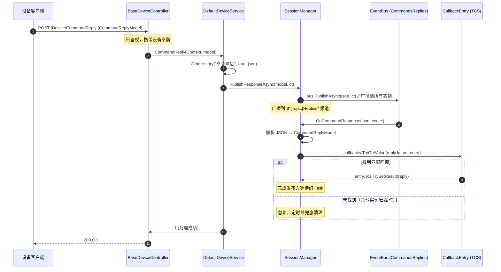
```mermaid
sequenceDiagram
    autonumber
    participant Device as 设备客户端
    participant BC as BaseDeviceController
    participant DDS as DefaultDeviceService
    participant SM as SessionManager
    participant RspBus as EventBus (CommandsReplies)
    participant Callback as CallbackEntry (TCS)

    Device->>BC: POST /Device/CommandReply (CommandReplyModel)
    Note over BC: 已鉴权，携带设备令牌

    BC->>DDS: CommandReply(Context, model)
    DDS->>DDS: WriteHistory("命令响应", true, json)

    DDS->>SM: PublishResponseAsync(model, ct)
    SM->>RspBus: bus.PublishAsync(json, ct)  // 广播到所有实例
    Note over SM: 广播到 $"{Topic}Replies" 频道

    RspBus->>SM: OnCommandResponse(json, ctx, ct)
    SM->>SM: 解析 JSON → CommandReplyModel

    SM->>Callback: _callbacks.TryGetValue(reply.Id, out entry)
    alt 找到匹配回调
        Callback->>SM: entry.Tcs.TrySetResult(reply)
        Note over SM: 完成发布方等待的 Task
    else 未找到（其他实例/已超时）
        Note over SM: 忽略，定时器兜底清理
    end

    DDS-->>BC: 1 (处理成功)
    BC-->>Device: 200 OK
```

### 5.3 集群多实例协作

指令下发天然支持多实例集群部署，依赖事件总线（Redis EventBus）全量广播实现跨实例通信：

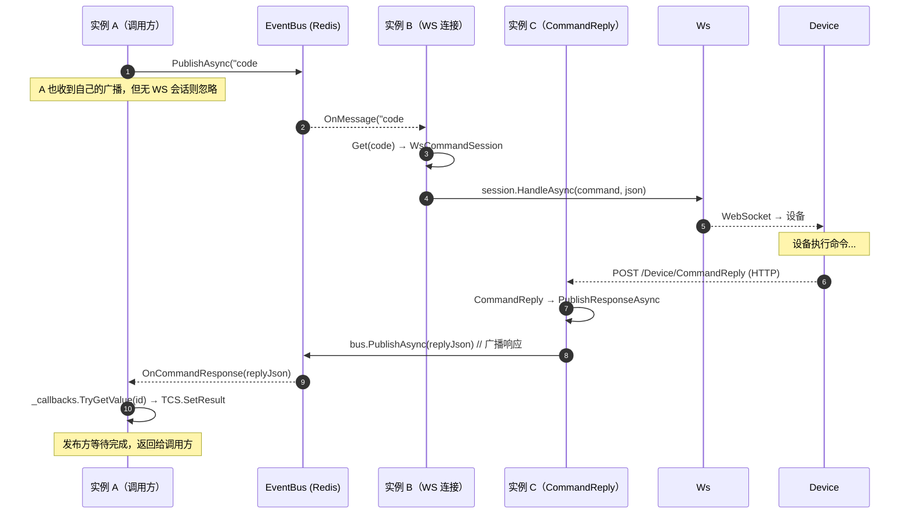
```mermaid
sequenceDiagram
    autonumber
    participant A as 实例 A（调用方）
    participant Bus as EventBus (Redis)
    participant B as 实例 B（WS 连接）
    participant C as 实例 C（CommandReply）

    A->>Bus: PublishAsync("code#json")  // 广播命令
    Note over A: A 也收到自己的广播，但无 WS 会话则忽略

    Bus-->>B: OnMessage("code#json")   // 订阅者收到
    B->>B: Get(code) → WsCommandSession
    B->>Ws: session.HandleAsync(command, json)
    Ws-->>Device: WebSocket → 设备

    Note over Device: 设备执行命令...

    Device-->>C: POST /Device/CommandReply (HTTP)
    C->>C: CommandReply → PublishResponseAsync
    C->>Bus: bus.PublishAsync(replyJson)  // 广播响应

    Bus-->>A: OnCommandResponse(replyJson)
    A->>A: _callbacks.TryGetValue(id) → TCS.SetResult

    Note over A: 发布方等待完成，返回给调用方
```

**关键特性**：
- **无需路由表**：命令全量广播，持有设备 WS 会话的实例负责下发，其余忽略
- **响应回传**：设备可能通过任何实例上报 `CommandReply`，通过事件总线回传给发起方
- **单机降级**：未配置 Redis EventBus 时自动使用内存 `EventBus<T>`，仅支持进程内通信

### 5.4 降级通道决策

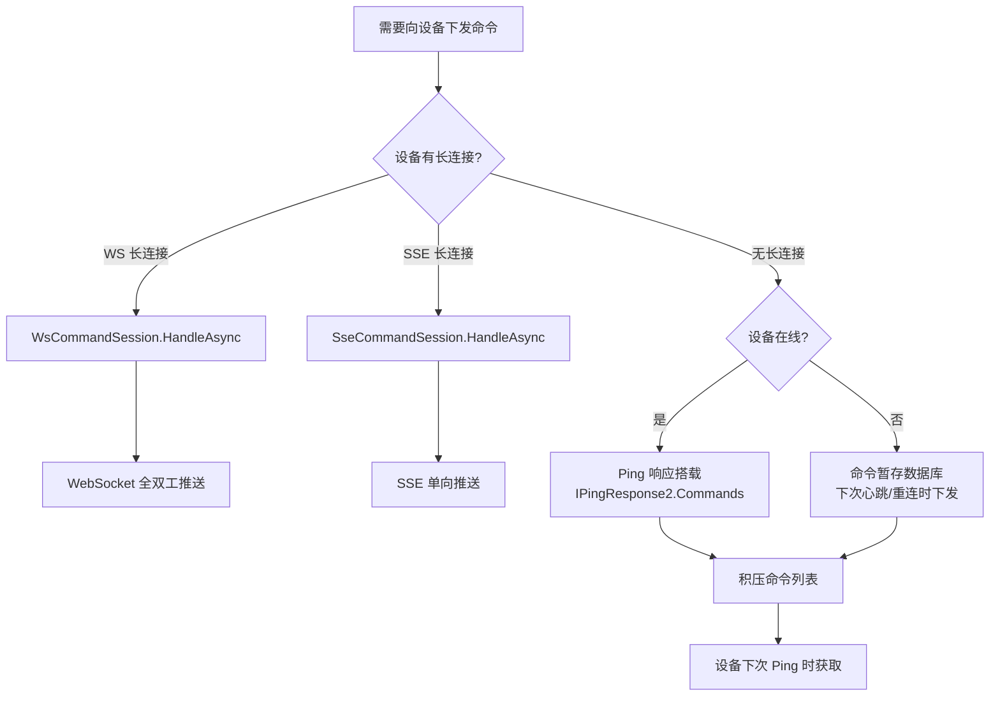
```mermaid
flowchart TD
    A[需要向设备下发命令] --> B{设备有长连接?}
    B -->|WS 长连接| C[WsCommandSession.HandleAsync]
    C --> D[WebSocket 全双工推送]
    B -->|SSE 长连接| E[SseCommandSession.HandleAsync]
    E --> F[SSE 单向推送]
    B -->|无长连接| G{设备在线?}
    G -->|是| H[Ping 响应搭载<br/>IPingResponse2.Commands]
    G -->|否| I[命令暂存数据库<br/>下次心跳/重连时下发]
    H --> J[积压命令列表]
    J --> K[设备下次 Ping 时获取]
    I --> J
```

### 5.5 CallbackEntry 内部类设计

```csharp
private class CallbackEntry
{
    public TaskCompletionSource<CommandReplyModel> Tcs { get; set; }
    public Int64 CreatedAt { get; set; }         // 创建时间戳
    public Int32 Timeout { get; set; }            // 超时毫秒数
    public ISpan? Span { get; set; }              // 追踪埋点
}
```

**生命周期**：
1. `WaitResponseAsync` 中创建 CallbackEntry，注册到 `_callbacks[commandId]`
2. 通过 `Task.WhenAny(tcs.Task, Task.Delay(timeout))` 等待超时或完成
3. `finally` 块保证无论成功/超时/取消都清理回调注册
4. 定时器 `RemoveNotAlive` 中 `CleanupExpiredCallbacks` 兜底清理（防止极端情况泄露）

**三重清理保障**：
1. **finally 即时清理**：`WaitResponseAsync` 的 `finally` 块 `TryRemove`
2. **CancellationToken 清理**：`cancellationToken.Register` 取消时移除
3. **定时器兜底**：`CleanupExpiredCallbacks` 每 10 秒扫描过期项

---

## 6. 在线会话生命周期

在线记录（`IOnlineModel`）是连接设备和服务端的桥梁，记录设备当前的连接状态和心跳数据。

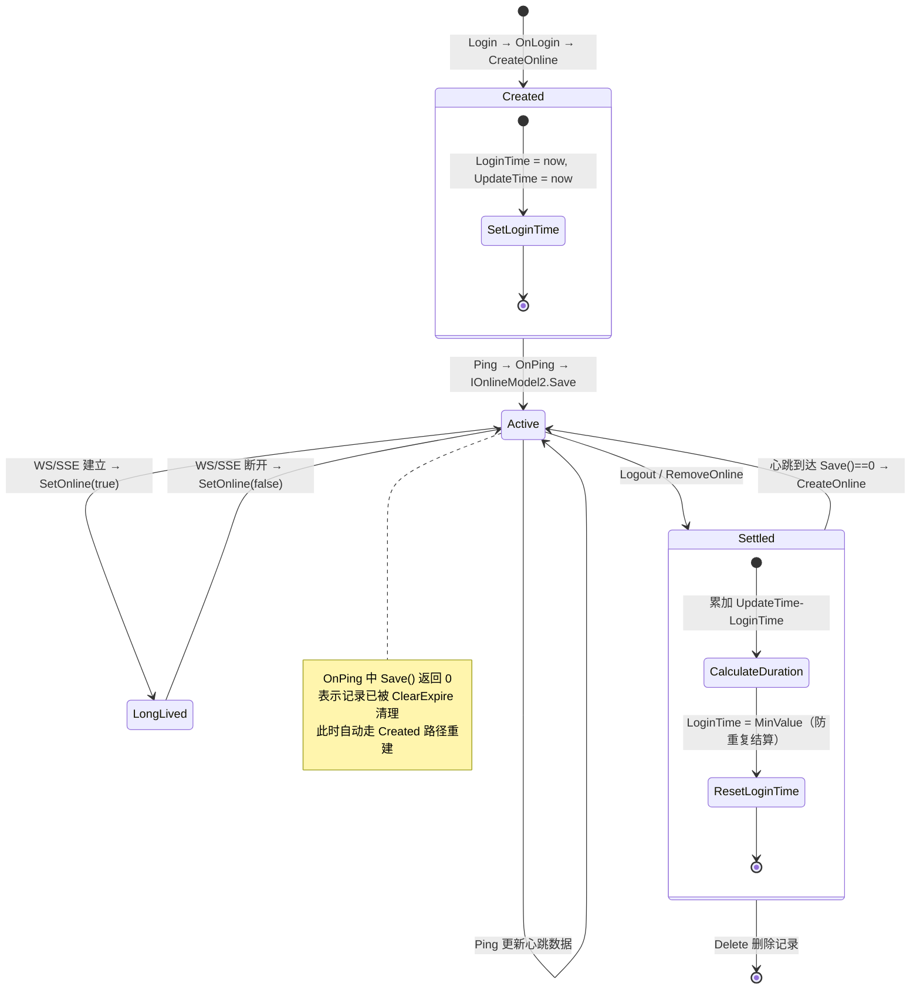
```mermaid
stateDiagram-v2
    [*] --> Created: Login → OnLogin → CreateOnline
    Created --> Active: Ping → OnPing → IOnlineModel2.Save
    Active --> Active: Ping 更新心跳数据
    Active --> LongLived: WS/SSE 建立 → SetOnline(true)
    LongLived --> Active: WS/SSE 断开 → SetOnline(false)
    Active --> Settled: Logout / RemoveOnline
    Settled --> [*]: Delete 删除记录
    Settled --> Active: 心跳到达 Save()==0 → CreateOnline

    state Created {
        [*] --> SetLoginTime: LoginTime = now, UpdateTime = now
        SetLoginTime --> [*]
    }

    state Settled {
        [*] --> CalculateDuration: 累加 UpdateTime-LoginTime
        CalculateDuration --> ResetLoginTime: LoginTime = MinValue（防重复结算）
        ResetLoginTime --> [*]
    }

    note right of Active
        OnPing 中 Save() 返回 0
        表示记录已被 ClearExpire 清理
        此时自动走 Created 路径重建
    end note
```

### 阶段说明

| 阶段 | 触发 | 关键操作 | 数据状态 |
|------|------|---------|---------|
| **创建** | Login → `OnLogin` → `CreateOnline` | `entity.SetItem("LoginTime", now)`, `entity.Save()` | LoginTime=now, UpdateTime=now |
| **心跳更新** | Ping → `OnPing` → `IOnlineModel2.Save` | 更新 CPU/内存/磁盘等监控数据 | UpdateTime 自动刷新 |
| **长连接保持** | WS/SSE 建立 → `SetOnline(true)` | `entity.SetItem("WebSocket", true)` | 标记 WebSocket 在线 |
| **结算** | Logout/`RemoveOnline` → `SettleOnline` | 累加时长 → `LoginTime=MinValue` → `entity.Update()` | LoginTime=MinValue（已结算） |
| **销毁** | `RemoveNotAlive` 超时清理 → `entity.Delete()` | 删除数据库记录 | 记录消失 |
| **重建** | 心跳到达 `Save()==0` → `CreateOnline` | 新建记录并再次 Save | LoginTime=now（重新开始） |

### 防重复结算守卫

`SettleOnline` 通过 `LoginTime` 的 MinValue 标记实现一次性结算：

```csharp
var loginTime = (DateTime)(online["LoginTime"] ?? DateTime.MinValue);
if (loginTime.Year <= 2000) return;  // 已结算，跳过

OnAccumulateOnlineTime(online, device);  // 累加

online.SetItem("LoginTime", DateTime.MinValue);  // 标记已结算
online.Update();
```

**设计意图**：在集群多实例或并发场景下，同一在线记录可能被多次尝试结算。LoginTime 持久化到数据库，首次结算后即标记为 MinValue，后续调用直接跳过，杜绝重复累加。

### 多实例一致性

`GetOnline` 不使用缓存，每次直接查询数据库获取最新状态：

```
GetOnline(context) → 构造 SessionId → QueryOnline(sid) → 数据库最新记录
```

解决缓存中同一记录的多对象副本问题——缓存副本的 LoginTime 可能不一致，一个已被结算（MinValue），另一个仍保留旧值，导致二次累加。直接查库确保每次拿到数据库权威状态。

---

## 7. 命令会话通道

### 7.1 WsCommandSession

| 属性 | 说明 |
|------|------|
| **传输** | WebSocket 全双工 |
| **心跳** | Ping/Pong 文本消息（客户端发 Ping → 服务端回 Pong） |
| **消息格式** | JSON 文本（`CommandModel` 序列化） |
| **事件广播** | `event#topic#clientid#message` 格式分发到 EventHub |
| **缓冲区** | 64KB 接收缓冲区 |
| **活跃检测** | `socket.State == WebSocketState.Open` |

**接收循环**：`ReceiveLoopAsync` 持续监听客户端消息，支持 Ping/Pong 心跳、事件分发（通过 Dispatcher → EventHub）、异常隔离（每个消息独立 try-catch）。

### 7.2 SseCommandSession

| 属性 | 说明 |
|------|------|
| **传输** | SSE（Server-Sent Events）单向推送 |
| **心跳** | 30 秒 `: heartbeat\n\n` 注释（防代理超时） |
| **消息格式** | `event: command\ndata: {json}\n\n` |
| **响应头** | `Content-Type: text/event-stream`, `Cache-Control: no-cache`, `X-Accel-Buffering: no` |
| **初始事件** | `event: connected\ndata: {"code":"..."}\n\n` |
| **活跃检测** | `!HttpContext.RequestAborted.IsCancellationRequested` |

### 7.3 通道对比

| 维度 | WebSocket | SSE |
|:----|:---------|:-----|
| **方向** | 双向 | 服务端→客户端单向 |
| **协议** | ws:// / wss:// | HTTP 长连接 |
| **浏览器兼容** | 所有现代浏览器 | 所有现代浏览器（EventSource API） |
| **代理友好** | 需特殊配置（如 nginx upgrade） | 天然兼容（普通 HTTP GET） |
| **消息类型** | 文本 + 二进制 | 仅文本 |
| **客户端响应** | 通过 WebSocket 直接回复 | 需额外 HTTP 调用（CommandReply） |
| **适用场景** | 全功能长连接 | 防火墙/代理受限环境的轻量降级 |

---

## 8. 鉴权与令牌体系

### 8.1 双令牌类型

| 类型 | 颁发者 | 用途 | 包含 | 有效期 |
|:----|:------|:-----|:-----|:-------|
| **应用令牌** | `BaseOAuthController.Token` (password grant) | 第三方平台调用 SendCommand/Info 等接口 | Subject=AppName, Id=ClientId | 配置 `TokenExpire` |
| **设备令牌** | `BaseDeviceController.Login` 响应中颁发 | 设备调用 Ping/Upgrade/PostEvents 等接口 | Subject=DeviceCode, Id=ClientId | 配置 `TokenExpire` |

### 8.2 TokenService

```csharp
public class TokenService(ITokenSetting tokenSetting, ITracer tracer) : ITokenService
{
    // 从 ITokenSetting 读取算法+密钥，构建 JwtBuilder
    protected virtual JwtBuilder GetJwt() { ... }

    // 颁发令牌
    public virtual IToken IssueToken(String name, String? id = null) { ... }

    // 解码令牌（返回 Exception 而非抛异常，上层决定处理方式）
    public virtual (JwtBuilder, Exception?) DecodeToken(String token) { ... }
}
```

**JWT 配置**（`ITokenSetting`）：

```csharp
public interface ITokenSetting
{
    String TokenSecret { get; }   // 格式 "算法:密钥"，如 "HS256:mySecretKey"
    Int32 TokenExpire { get; }    // 过期时间，单位秒
    Boolean AutoRegister { get; } // 是否自动注册
}
```

### 8.3 令牌验证路径

```
HTTP 请求 → ApiFilterAttribute（提取 Token）→ BaseController.OnAuthorize
  → TokenService.DecodeToken(token)
  → 提取 Jwt.Subject（Code）+ Jwt.Id（ClientId）
  → 通过 IDeviceService 获取设备 → 验证 Enable
  → 获取在线记录
  → 映射 ClaimsPrincipal (ApiToken)
  → Controller 方法执行
```

### 8.4 令牌自动续期

心跳响应中实现令牌续期：

```csharp
// BaseDeviceController.Ping 中
var (jwt, ex) = _tokenService.DecodeToken(Context.Token);
if (ex == null && jwt != null && jwt.Expire < DateTime.Now.AddMinutes(10))
{
    var tm = _tokenService.IssueToken(device.Code, jwt.Id);
    rs.Token = tm.AccessToken;  // 新令牌随心跳响应下发
}
```

**阈值**：10 分钟。避免频繁续期导致性能开销，同时保证在令牌过期前有充足余量。

---

## 9. 集群部署模型

### 9.1 架构

```mermaid
flowchart LR
    subgraph Cluster["REMOTING 集群"]
        A[实例 A<br/>WS 会话: 设备1,设备2]
        B[实例 B<br/>WS 会话: 设备3]
        C[实例 C<br/>无 WS 会话]
    end

    subgraph Redis["Redis"]
        EB[(EventBus<br/>Commands)]
        REB[(EventBus<br/>CommandsReplies)]
    end

    subgraph External["外部系统"]
        API[API 调用方]
    end

    API -->|SendCommand| A
    A -->|PublishAsync "code#json"| EB
    EB -->|广播| A
    EB -->|广播| B
    EB -->|广播| C
    B -->|Get→WsSession| B1[WebSocket 下发]
    C -->|无会话,忽略| C1[跳过]
    Device3 -->|CommandReply HTTP| C
    C -->|PublishResponseAsync| REB
    REB -->|广播| A
    A -->|OnCommandResponse| A1[TCS.SetResult]
    A1 -->|返回| API
```

### 9.2 关键原则

1. **全量广播，按需消费**：命令发布到 `Commands` 主题后全实例广播，只有持有目标设备 WS 会话的实例才实际下发
2. **响应回传与发起方无关**：设备通过任何实例的 HTTP 接口上报 CommandReply，通过 `CommandsReplies` 主题广播回所有实例，发起方按 CommandId 匹配 TCS
3. **无需路由表**：省去维护设备→实例映射表的复杂度，新实例加入/退出无需重路由
4. **单机降级**：未配置 Redis EventBus 时使用内存 EventBus，进程内通信，不影响功能完整性
5. **进程退出处理**：`Host.RegisterExit(() => this.TryDispose())` 确保进程退出时主动关闭事件总线消费

---

## 10. 测试策略

| 层级 | 覆盖范围 | 测试数 |
|:----|:---------|:------:|
| 服务端基础 | `BaseDeviceControllerTests` — Login/Logout/Ping/Upgrade/CommandReply/SendCommand/PostEvents/Notify | 22 |
| 设备服务 | `DeviceServiceTests` — DefaultDeviceService 核心逻辑 | 若干 |
| 令牌服务 | `TokenServiceTests` — JWT 编解码/验证 | 若干 |
| 会话管理器 | SessionManager 响应总线 + 路由测试 | 8 |
| WS 命令会话 | `WsCommandSessionTests` — WebSocket 会话管理 | 若干 |
| SSE 命令会话 | `SseCommandSessionTests` — SSE 命令推送 | 若干 |
| 全量回归 | `dotnet test` | 631（626 ✅ 3 ❌ 2 ⏭️） |

> 详细测试指南参见 `testing-strategy` 技能。

---

## 11. 与主架构文档的关系

本文档是 `Doc/架构设计.md` 中 **SRV（服务端基础）** 和 **CMD（指令下发）** 两个模块的详细展开。主文档对应章节保留模块定位和概览图，具体业务流程和设计细节在此文档中全面阐述。

---

## 变更记录

| 日期 | 变更 |
|------|------|
| 2026-07-23 | 初始创建：从主架构设计文档中分离 SRV/CMD 模块详细架构分析 |
