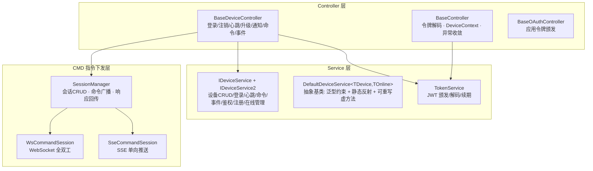
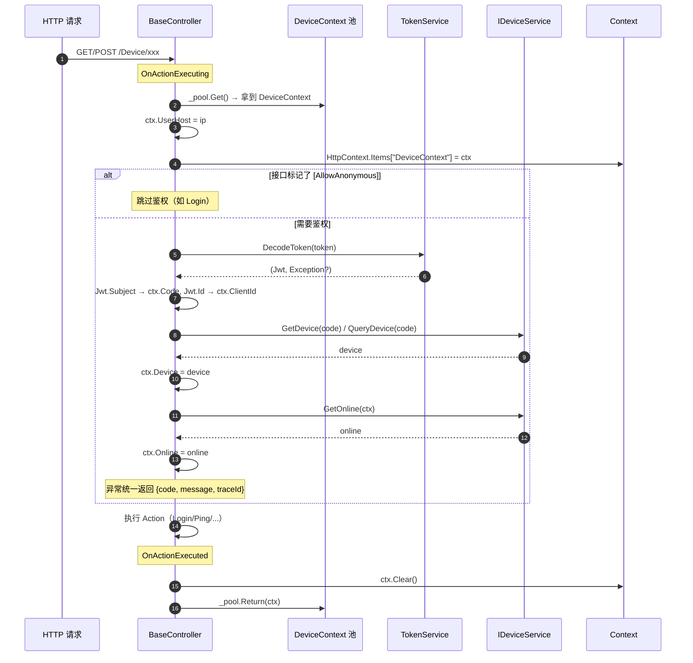
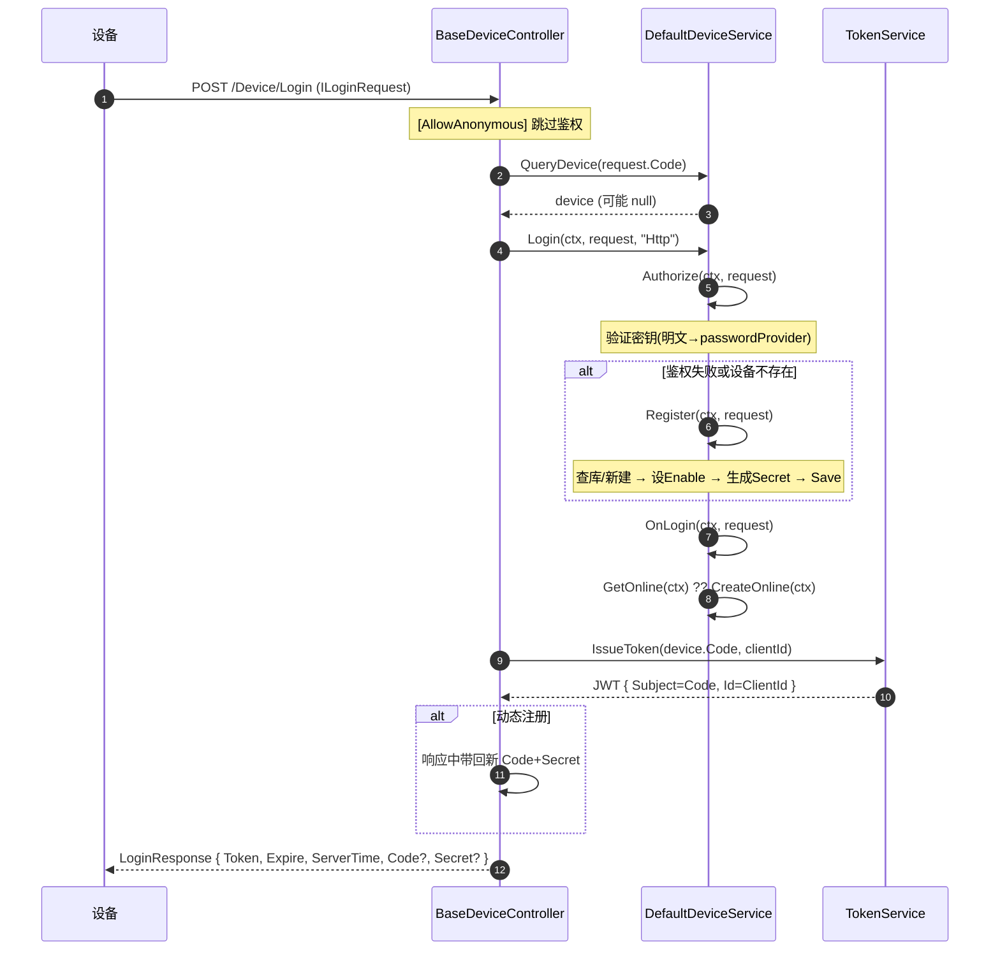
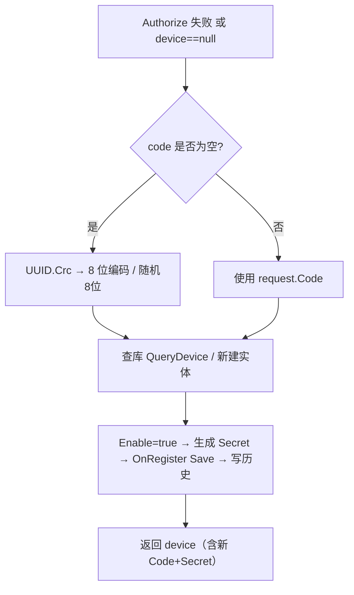
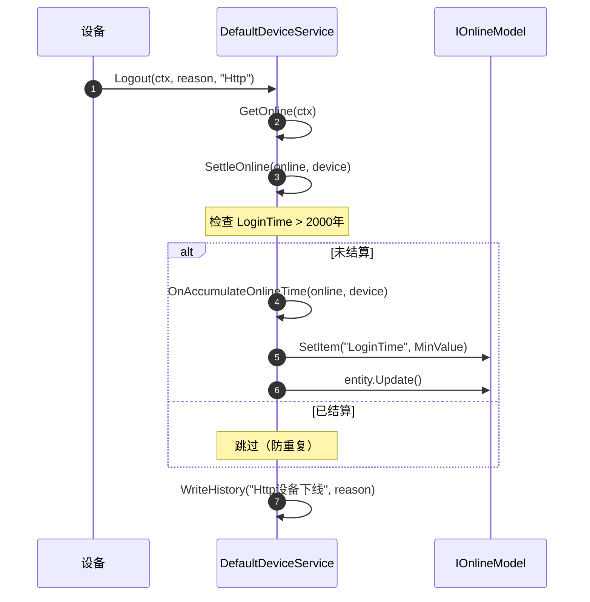
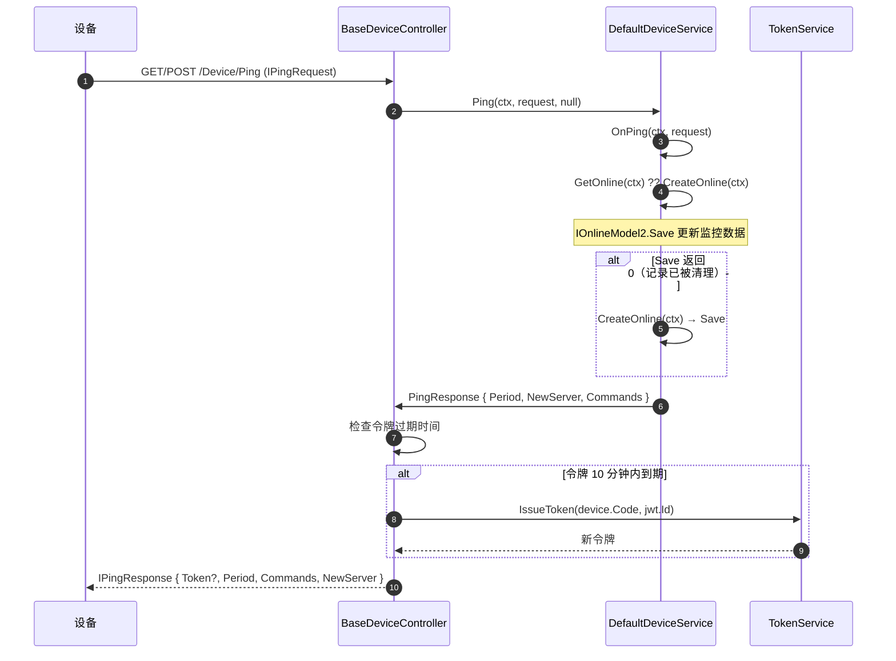
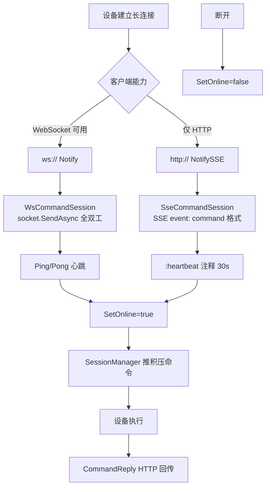
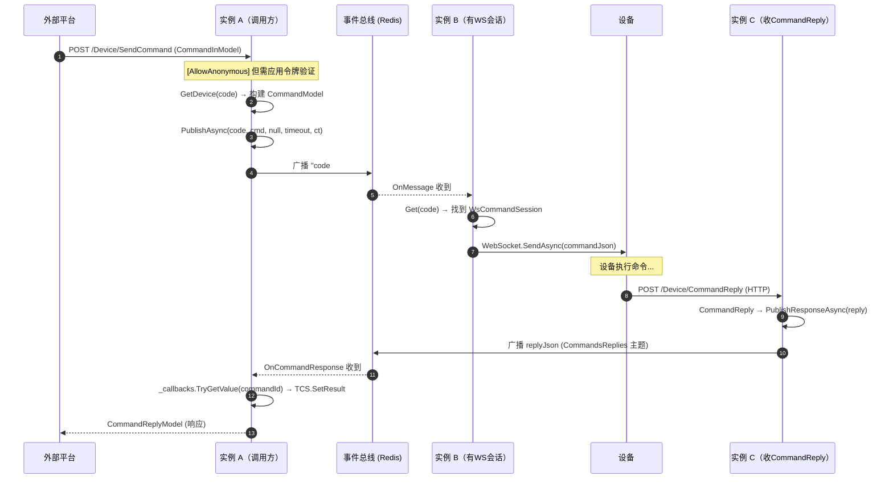
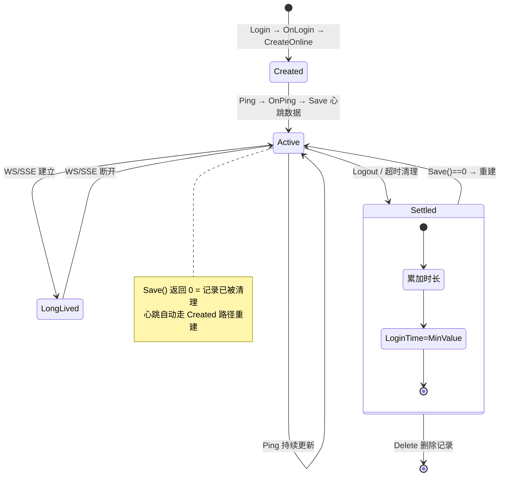
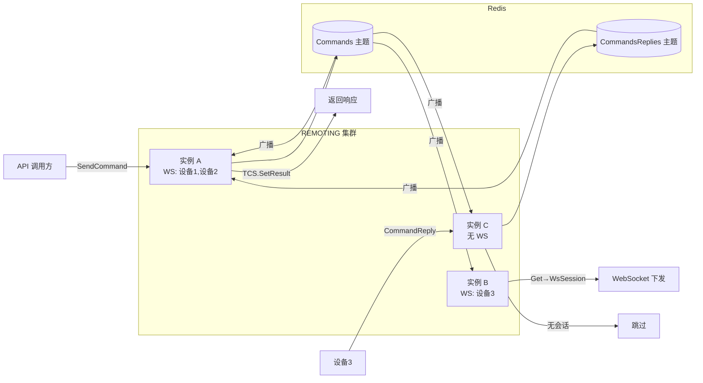

# SRV — 服务端架构

> **版本**：v3.8 | **日期**：2026-07-23
> **覆盖模块**：SRV（服务端基础）+ CMD（指令下发）
> **关联文档**：[架构设计](架构设计.md) · [需求文档](需求文档.md) · [功能清单](功能清单.md)
> **定位**：本文档用于梳理服务端架构的全貌和各业务流程的串联关系，非 API 参考手册。

---

## 1. 分层架构总览

服务端有四层：Controller 接收请求 → Service 处理业务 → SessionManager 管理下发通道 → 具体通道推送设备。



**关键关系**：
- `BaseDeviceController` 是 HTTP 入口，把业务逻辑委托给 `IDeviceService`
- `IDeviceService2` 扩展了 `IDeviceService`，增加了鉴权/注册/在线管理等细粒度方法
- `DefaultDeviceService<TDevice, TOnline>` 用泛型约束 + 静态反射避免运行时反射，通过可重写虚方法支持各环节定制
- `SessionManager` 管理所有长连接会话，通过事件总线广播命令——哪个实例有 WS 会话就由哪个实例下发
- `WsCommandSession` / `SseCommandSession` 共用 `CommandSession` 基类，可灵活切换

---

## 2. 控制器管线（每请求）

每个 HTTP 请求到达 `BaseController` 时，经过统一的预处理和后处理管线：



**要点**：
- `DeviceContext` 从对象池获取（容量 256），用后归还，避免高频请求下的 GC 压力
- 鉴权失败不抛原始异常：`ApiException` 保留业务 code，`XSqlException` 屏蔽 SQL 细节，其余统一 500
- 鉴权成功后将 JWT 内容映射为 `ClaimsPrincipal`（身份类型 `ApiToken`），方便下游 `[Authorize]` 使用

---

## 4. 核心业务流程

### 4.1 登录 → 自动注册 → 签发令牌



**串联要点**：
- 登录是唯一 `[AllowAnonymous]` 的端点，先查设备做登录前准备
- `Authorize` 先明文对比再 `passwordProvider.Verify`，全部失败→触发 `Register` 自动注册
- `Register` 自动分配编码（UUID.Crc→随机8位），生成密钥，保存后返回
- `OnLogin` 复用已有在线记录（刷新LoginTime）或新建
- 登录成功颁发JWT，动态注册时额外下发Code+Secret

### 4.2 自动注册流程（Register）

**触发条件**：`Login` 中 `device == null` 或 `Authorize` 返回 `false`



### 4.3 注销 → 在线时长结算



**要点**：注销不清除数据库记录（供后续登录复用），只结算时长 + 标记 `LoginTime=MinValue`。最终删除由超时清理线程 `RemoveNotAlive` 负责。`LoginTime` 守卫防重复结算。

### 4.4 心跳 + 在线重建 + 令牌续期



**串联要点**：
- 心跳不只是保活——它同时是**命令搭载通道**（`Commands` 搭载积压命令）和**服务器迁移信号**（`NewServer` 地址）
- 在线记录可能被超时清理线程删除，心跳到达时检测 `Save()==0` 自动重建，保证心跳不断
- 令牌 10 分钟内过期时自动颁发新令牌随心跳下发，客户端无感续期

### 4.5 升级检查

**端点**：`GET/POST /Device/Upgrade?channel=xxx`

设备请求 → `BaseDeviceController.Upgrade` → 提取请求 base URL → `DeviceService.Upgrade(ctx, channel)` → 返回 `IUpgradeInfo?`（可能 null）→ 若 `info.Source` 是相对路径则拼接为绝对 URL。

- `Upgrade` 虚方法默认返回 `null`（无升级），子类重写实现具体升级逻辑
- 升级全链路（下载→校验→解压→覆盖→重启）由客户端 UPGD 模块执行

### 4.6 事件上报

**端点**：`POST /Device/PostEvents (EventModel[])`

两条路径：
1. **设备实现 `IDeviceModel2`**：通过 `device.CreateHistory` 创建实体，批量 `Insert()`，高性能
2. **仅有 `IDeviceModel`**：逐条 `WriteHistory`，兼容旧设备

事件时间从 UTC Unix 毫秒转本地时间。

### 4.7 长连接通知（WS / SSE 双通道）



| 通道 | 方向 | 心跳 | 客户端响应 |
|:----|:----|:-----|:----------|
| WebSocket (`/Device/Notify`) | 双向 | Ping/Pong 文本消息 | 通过 WebSocket 直接回复 |
| SSE (`/Device/NotifySSE`) | 服务端→客户端单向 | `: heartbeat` 30 秒间隔 | 需额外 `CommandReply` HTTP 调用 |

**降级策略**：WS 不可用（代理限制、防火墙）时自动降级到 SSE，Ping 响应中 `Commands` 搭载积压命令作为托底。

---

## 5. 指令下发管线

这是服务端最核心的交互——外部平台发命令 → 广播到所有实例 → 持有 WS 的实例下发 → 设备执行 → CommandReply 回传。

### 5.1 下发与响应完整闭环



**集群协作模式**：
- 命令全量广播到所有实例，只有持有目标设备 WS 的实例实际下发，其余忽略
- 设备可能通过**任意实例**的 HTTP 接口上报 CommandReply，通过响应总线广播回发起方
- 无需独立路由表，新实例加入/退出无需重路由

### 5.2 响应等待机制（CallbackEntry）

`SessionManager` 内部用 `ConcurrentDictionary<Int64, CallbackEntry>` 管理等待中的回调。

```
PublishAsync(timeout>0) → 创建 CallbackEntry{TCS, CreatedAt, Timeout, Span}
  → 注册 _callbacks[commandId]
  → Task.WhenAny(tcs.Task, Task.Delay(timeout))
  → 三种结果：
     1. 设备响应到达 → TCS.SetResult → 返回响应
     2. 超时 → TryRemove → TCS.SetResult(null) → 返回 null
     3. CancellationToken → TryRemove → TCS.SetCanceled → 抛异常
```

**三重清理保障**：`finally` 即时清理 → `CancellationToken.Register` 取消清理 → 定时器 `CleanupExpiredCallbacks` 每 10 秒兜底。

---

## 6. 在线会话生命周期



**六态说明**：
- **创建**：登录时设 `LoginTime=now`、`UpdateTime=now`
- **心跳更新**：心跳时 `IOnlineModel2.Save` 刷新监控数据
- **长连接保持**：WS/SSE 建立 `SetOnline(true)`，断开 `SetOnline(false)`
- **结算**：注销/超时时 `SettleOnline` 累加时长 → `LoginTime=MinValue`（防重复结算守卫）
- **销毁**：超时清理线程 `RemoveNotAlive` 删除过期记录
- **重建**：记录被删后心跳到达 `Save()==0` → 自动 `CreateOnline` 重建

**为何不用缓存**：`GetOnline` 直接查库，避免缓存中同一记录的多副本导致 `LoginTime` 不一致而重复结算。

---

## 7. 鉴权与令牌体系

### 双令牌类型

| 类型 | 谁颁发 | 用在哪儿 | JWT Subject |
|:----|:-------|:---------|:-----------|
| **应用令牌** | `BaseOAuthController.Token`（password grant） | 第三方平台调 SendCommand/Info | AppId/AppName |
| **设备令牌** | `BaseDeviceController.Login` 响应中 | 设备调 Ping/Upgrade/PostEvents | 设备编码（Code） |

### 令牌验证路径

```
HTTP 请求 → ApiFilterAttribute 提取 Token → BaseController.OnAuthorize
  → TokenService.DecodeToken → Jwt.Subject=Code, Jwt.Id=ClientId
  → IDeviceService.GetDevice(code) 验证设备有效性
  → 获取在线记录 → 映射 ClaimsPrincipal → 执行 Action
```

### 令牌续期

心跳响应中检查 JWT 是否在 10 分钟内过期，是则颁发新令牌随心跳下发，客户端无感。

---

## 8. 集群部署模型



**关键原则**：全量广播按需消费、响应回传与发起方无关、无需路由表、单机自动降级内存 EventBus。

---

## 变更记录

| 日期 | 变更 |
|------|------|
| 2026-07-23 | 初始创建：从主架构设计文档中分离 SRV/CMD 模块详细架构分析 |
| 2026-07-23 | 瘦身重写：去掉类图、代码块，聚焦流程串联和架构梳理 |