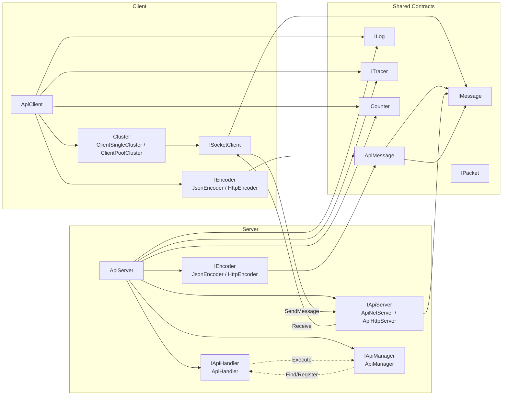

# NewLife.Remoting 组件关系图

本文件说明 NewLife.Remoting 中 RPC 客户端/服务端的核心组件关系。仅聚焦 `ApiClient` / `ApiServer` 与其关键依赖，便于理解架构与扩展点。

说明：
- ApiClient
  - 通过 `Cluster` 管理 `ISocketClient` 连接（单连接或者连接池）。
  - 依赖 `IEncoder` 进行请求/响应的编解码，统一使用 `IMessage`/`ApiMessage` 作为跨网络的消息体。
  - 可选注入 `ILog`、`ITracer`、`ICounter` 实现日志、链路追踪、统计。
- ApiServer
  - 通过 `IApiServer`（`ApiNetServer`/`ApiHttpServer`）承载网络会话，处理 `IMessage`。
  - `IApiHandler.Execute` 负责将 `ApiMessage` 路由到具体控制器动作；`IApiManager` 负责控制器/动作的注册与发现。
  - 依赖 `IEncoder` 统一编解码，支持 `UseHttpStatus` 切换 HTTP 返回语义。
- Shared
  - 公共契约位于 `NewLife.*` 基础库，跨客户端/服务端共享。
