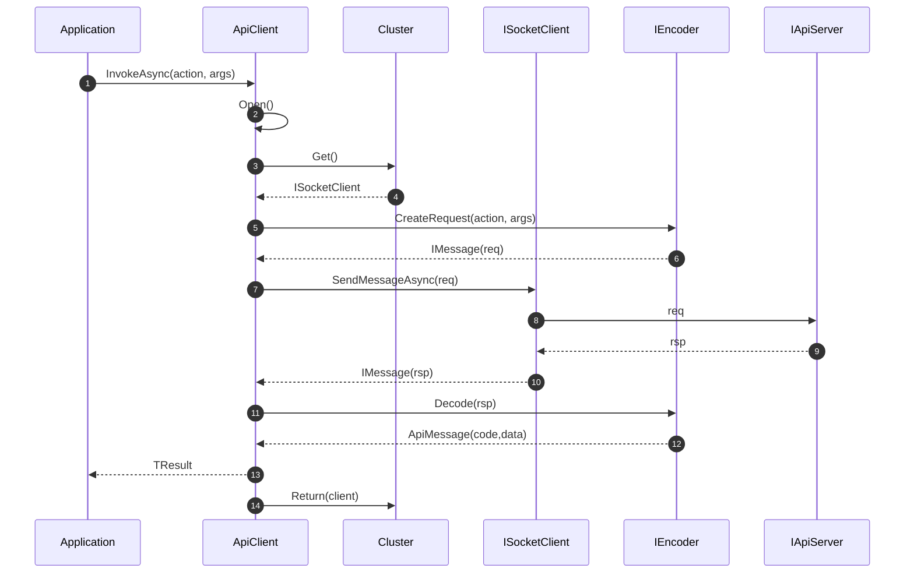
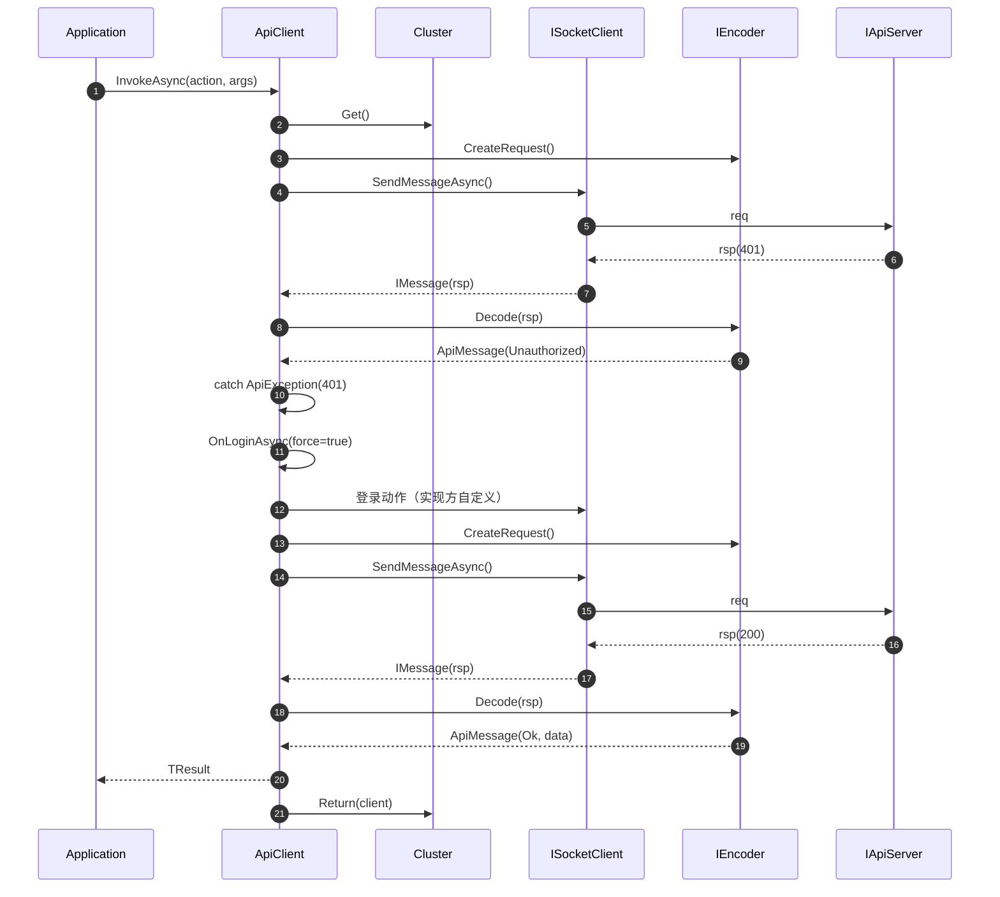
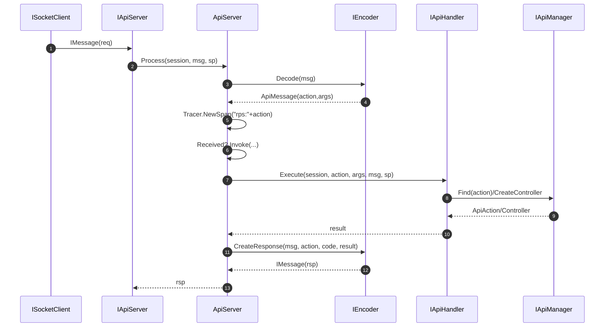

# NewLife.Remoting 关键时序图

本文件给出典型调用与处理的时序，包括：客户端发起 RPC、401 触发登录重试、服务端处理请求的完整链路。

## 1. 客户端发起 RPC 调用（成功）

## 2. 客户端 401 触发登录后重发

## 3. 服务端处理请求

备注：
- 单向调用：`msg.OneWay == true` 时，服务端 `Process` 直接返回 `null`，不应答。
- 慢追踪：客户端 `InvokeWithClientAsync` 与服务端 `Process` 均在 `finally` 记录超过 `SlowTrace` 的调用/处理日志。
