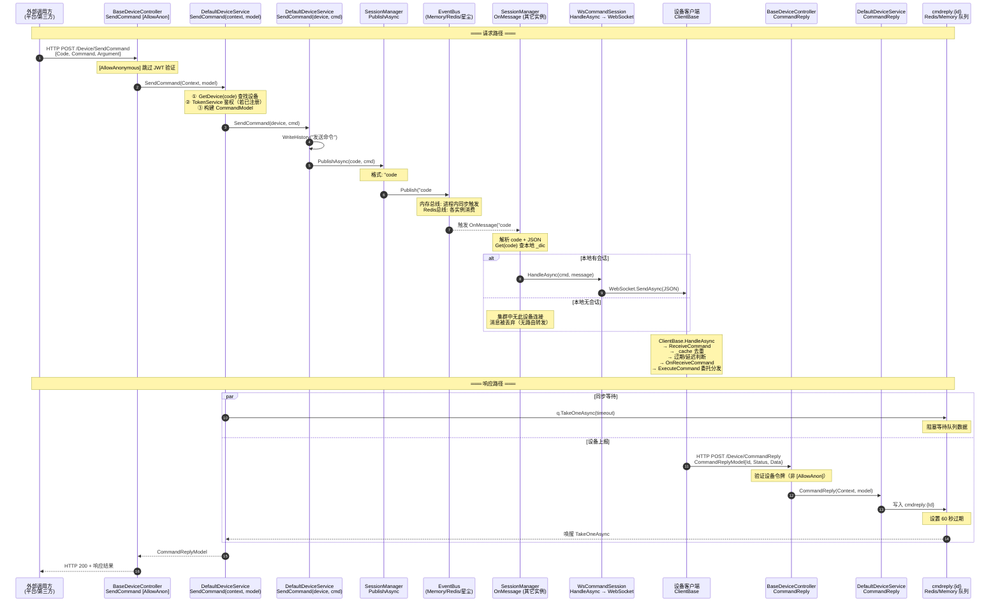
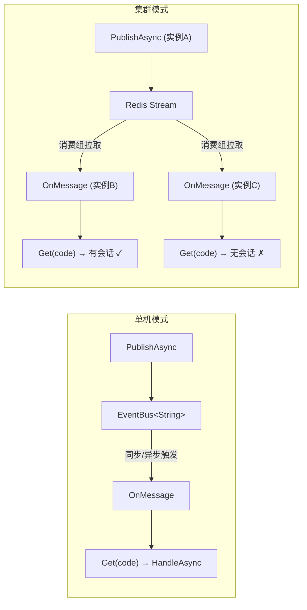
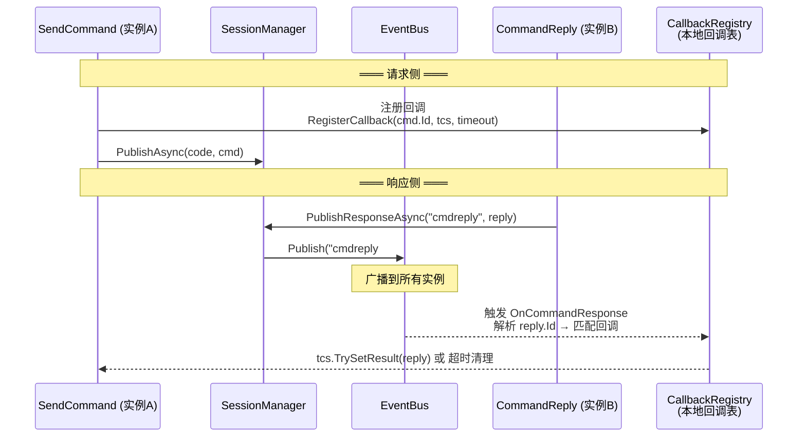
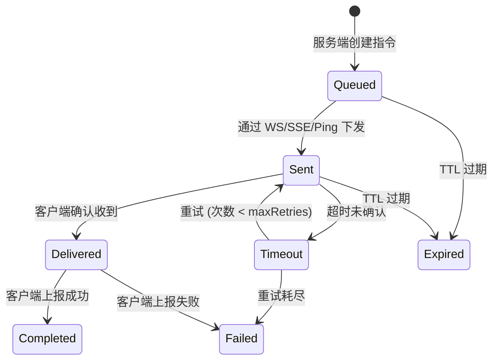
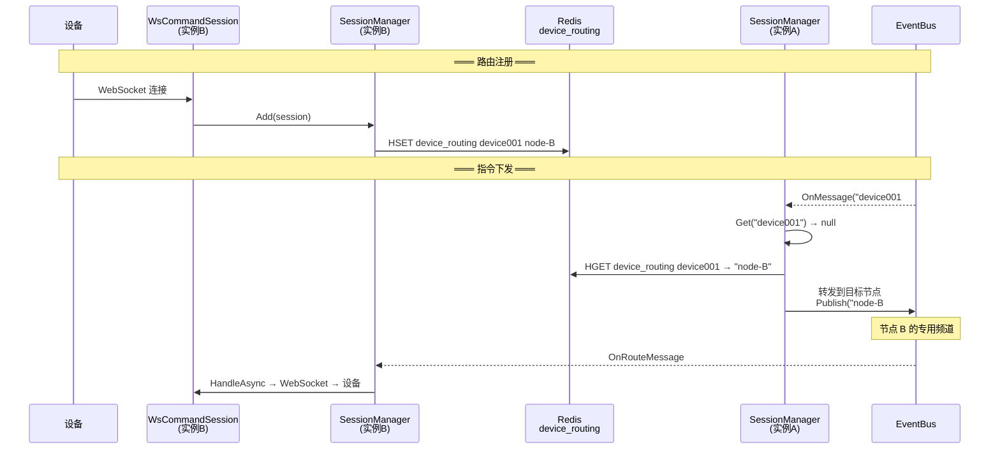
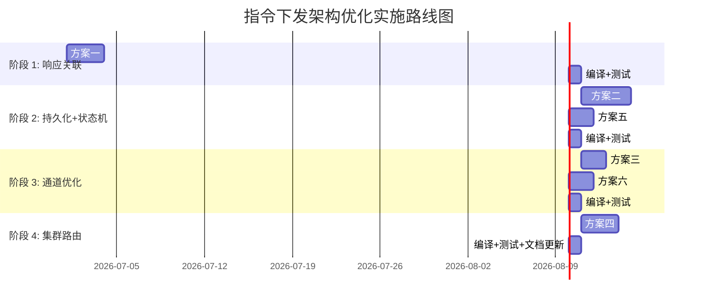

# 指令下发架构深度分析与优化方案

> 适用场景：IoT 设备指令下发、边缘节点管理、分布式任务调度、应用远程控制。
> 核心目标：稳定可靠第一，鲁棒性优先于及时性；指令执行与反馈尽快完成，心跳搭载仅为兜底。

---

## 实施状态

| 阶段 | 内容 | 状态 | 测试 |
|:---:|------|:---:|:---:|
| 阶段 1 | 响应关联：事件总线广播替代 cmdreply 队列 | ✅ 已完成 | 9 单元测试通过 |
| 阶段 1 | 指令持久化与状态机 | ✅ 已完成 | 17 单元测试通过 |
| 阶段 1 | 集成测试（响应广播、跨实例） | ✅ 已完成 | 3 集成测试通过 |
| 阶段 2 | **SSE 降级通道**（SseCommandSession + NotifySSE） | ✅ 已完成 | 5 单元测试通过 |
| 阶段 2 | **集群全局路由表**（SessionManager 路由注册/转发） | ✅ 已完成 | 5 单元测试通过 |
| 阶段 3 | 生产验证与性能调优 | 🔜 后续迭代 | — |

### 已实施的核心变更

1. **`ICommandResponseBus` + `CommandResponseBus`**：事件总线广播响应，替代 `cmdreply:{id}` Redis 队列
   - 新增文件：`Services/ICommandResponseBus.cs`、`Services/CommandResponseBus.cs`
   - 修改文件：`DefaultDeviceService.cs`（SendCommand/CommandReply 优先走 ResponseBus）

2. **指令状态机**：`CommandStatus` 新增 4 个状态（已发送/已送达/已过期/已超时）
   - 修改文件：`Models/CommandStatus.cs`、`Models/CommandModel.cs`、`Models/CommandReplyModel.cs`

3. **指令持久化**：`IDeviceService2` 新增 `SaveCommand`/`UpdateCommandStatus`/`GetPendingCommands`
   - 修改文件：`Services/IDeviceService.cs`、`DefaultDeviceService.cs`

4. **SSE 降级通道**：WebSocket 不可用时的轻量替代方案
   - 新增文件：`Extensions/Services/SseCommandSession.cs`
   - 修改文件：`BaseDeviceController.cs`（新增 `NotifySSE` 端点）

5. **集群全局路由**：基于 Redis 的设备路由表，支持跨节点指令转发
   - 修改文件：`SessionManager.cs`（RegisterRoute/UnregisterRoute/ForwardToNode/节点转发频道订阅）

6. **向后兼容**：未注入 `ICommandResponseBus` 时自动降级到旧 `cmdreply` 队列模式

### 测试覆盖

| 测试类 | 测试数 | 覆盖内容 |
|------|:---:|------|
| `CommandResponseBusTests` | 9 | 基础属性、超时/取消/响应匹配、空值异常、清理 |
| `CommandModelTests` | 17 | 新增字段默认值/读写、枚举值验证、路由字段 |
| `SessionManagerResponseBusTests` | 3 | 单实例发布订阅、内存模式隔离、路由字段传递 |
| `SessionManagerRoutingTests` | 5 | 添加/获取/删除会话、空值健壮性 |
| `SseCommandSessionTests` | 5 | 基本属性、心跳间隔、SSE 格式发送、message 直传 |
| **全量回归** | **604** | 0 失败，2 跳过（集成测试需网络） |

---

## 目录

- [1. 背景与目标](#1-背景与目标)
- [2. 当前架构全链路分析](#2-当前架构全链路分析)
  - [2.1 完整链路时序图](#21-完整链路时序图)
  - [2.2 链路环节逐节点分析](#22-链路环节逐节点分析)
  - [2.3 脆弱点汇总](#23-脆弱点汇总)
  - [2.4 cmdreply 队列机制分析](#24-cmdreply-队列机制分析)
  - [2.5 SessionManager 事件总线模式分析](#25-sessionmanager-事件总线模式分析)
- [3. 业界主流方案竞品对比](#3-业界主流方案竞品对比)
  - [3.1 竞品概览](#31-竞品概览)
  - [3.2 指令下发功能对比矩阵](#32-指令下发功能对比矩阵)
  - [3.3 非功能维度对比](#33-非功能维度对比)
  - [3.4 各平台核心架构解析](#34-各平台核心架构解析)
  - [3.5 差距分析](#35-差距分析)
- [4. 优化方案设计](#4-优化方案设计)
  - [4.1 方案一：事件总线广播响应替代 cmdreply 队列](#41-方案一事件总线广播响应替代-cmdreply-队列)
  - [4.2 方案二：指令持久化与状态机](#42-方案二指令持久化与状态机)
  - [4.3 方案三：多通道分级策略（WS + SSE + Ping）](#43-方案三多通道分级策略ws--sse--ping)
  - [4.4 方案四：集群全局设备路由表](#44-方案四集群全局设备路由表)
  - [4.5 方案五：全链路幂等与去重](#45-方案五全链路幂等与去重)
  - [4.6 方案六：分级超时与指数退避重试](#46-方案六分级超时与指数退避重试)
- [5. 实施路线图](#5-实施路线图)
- [6. 术语表](#6-术语表)

---

## 1. 背景与目标

### 1.1 系统定位

NewLife.Remoting 是 NewLife 技术栈的统一远程通信基础设施，覆盖 RPC（二进制高性能）、HTTP/REST、WebSocket 指令下发与事件推送、SRMP 远程消息协议。在 IoT 和分布式场景中，指令下发是核心能力 —— 云端/平台需要向设备或边缘节点发送操作指令，并获取执行结果。

### 1.2 当前痛点

- **链路长**：指令从 外部调用方 → Controller → Service → SessionManager → EventBus → WsCommandSession → WebSocket → 设备 → 执行 → CommandReply HTTP → Service → cmdreply 队列 → Service 回调，涉及 11 个环节
- **脆弱**：任意环节失败均导致整体失败，缺乏持久化和重试机制
- **cmdreply 队列泄漏**：Redis 中残留大量 `cmdreply:{id}` 空队列，60 秒 TTL 虽会清理但不优雅
- **集群竞态**：SendCommand 可能在实例 A 收到请求，但设备 WebSocket 连接在实例 B；响应队列 `q.TakeOneAsync` 在实例 A 等待，但 `CommandReply` 可能打到实例 C
- **鉴权漏洞**：`[AllowAnonymous]` + `ITokenService` 未注册时完全跳过验证
- **无指令持久化**：设备离线时命令丢失，依赖 Ping 心跳搭载作为唯一兜底

### 1.3 优化目标

| 维度 | 当前 | 目标 |
|------|------|------|
| 链路环节数 | 11 | ≤ 7 |
| 指令持久化 | 无（内存/Redis 临时存储） | 持久化 + 状态机，设备重连可恢复 |
| 响应关联 | Redis 队列（空队列残留） | 事件总线广播 + 本地回调注册 |
| 集群路由 | EventBus 广播（全节点收到） | 全局路由表 + 精确路由 |
| 通道冗余 | WebSocket 单通道 | WS 主 + SSE 降级 + Ping 兜底 |
| 幂等保障 | 客户端 `_cache`（进程内） | 全链路 CommandId 幂等 |
| 鉴权安全 | `[AllowAnonymous]` + 可选 TokenService | 强制令牌验证，区分应用令牌和设备令牌 |

---

## 2. 当前架构全链路分析

### 2.1 完整链路时序图



### 2.2 链路环节逐节点分析

#### 节点 1: Controller 层 — `BaseDeviceController.SendCommand`

**文件**: `NewLife.Remoting.Extensions/Controllers/BaseDeviceController.cs` 行 283-297

```csharp
[AllowAnonymous]
[HttpPost(nameof(SendCommand))]
public virtual Task<CommandReplyModel?> SendCommand(CommandInModel model)
```

- `[AllowAnonymous]` 跳过 `ApiFilterAttribute` 的 JWT 验证，这意味着**控制器的 `OnAuthorize` 不会被调用**
- 参数校验在三处：`model == null`、`model.Code` 为空、`model.Command` 为空
- 直接委托 `_deviceService.SendCommand(Context, model, HttpContext.RequestAborted)`

**脆弱点**：
1. `[AllowAnonymous]` 使得该接口完全不经过控制器层鉴权，完全依赖 Service 层的二次鉴权
2. `RequestAborted` 作为 CancellationToken——客户端断开 HTTP 连接时，取消令牌会传播到 `q.TakeOneAsync`，但**不会取消已发出的指令**

#### 节点 2: Service 层平台入口 — `DefaultDeviceService.SendCommand(DeviceContext, CommandInModel)`

**文件**: `NewLife.Remoting.Extensions/Services/DefaultDeviceService.cs` 行 432-487

```csharp
public virtual async Task<CommandReplyModel?> SendCommand(
    DeviceContext context, CommandInModel model, CancellationToken cancellationToken)
```

**关键逻辑**：
1. `GetDevice(model.Code!)` — 先查缓存再查库
2. **令牌验证**（行 442-452）：这是 `[AllowAnonymous]` 接口的**唯一防线**
   ```csharp
   var tokenService = serviceProvider.GetService<ITokenService>();
   if (tokenService != null)
   {
       if (context.Token.IsNullOrEmpty())
           throw new ApiException(ApiCode.Unauthorized, "SendCommand 需要应用令牌");
       var (jwt, ex) = tokenService.DecodeToken(context.Token);
       if (ex != null) throw ex;
   }
   ```
3. 构建 `CommandModel`：`Id = Rand.Next()`，`StartTime`/`Expire` 从相对秒数转为绝对 UTC 时间
4. 调用内部 `SendCommand(target, cmd, cancellationToken)` 发布到事件总线
5. **同步等待**：`q.TakeOneAsync(timeout, cancellationToken)`

**脆弱点**：
1. **鉴权可绕过**：若 DI 未注册 `ITokenService`（测试环境），令牌验证**完全跳过**
2. **Rand.Next() 作 Id**：`Int32` 范围 20 亿，冲突概率很低但非零，且不可追溯
3. **单点等待**：`TakeOneAsync` 是阻塞等待，HTTP 请求线程被占用（`async` 不会阻塞线程但占用连接）
4. **`timeout <= 0` 时直接返回 null**：不等待响应但命令已发出，调用方无法获知结果

#### 节点 3: Service 层内部 — `DefaultDeviceService.SendCommand(IDeviceModel, CommandModel)`

**文件**: 同上，行 410-425

```csharp
public virtual Task<Int32> SendCommand(
    IDeviceModel device, CommandModel command, CancellationToken cancellationToken)
{
    var id = WriteHistory(device, "发送命令", true, command.ToJson(...));
    if (command.Id == 0) command.Id = id;
    return sessionManager.PublishAsync(device.Code, command, null, cancellationToken);
}
```

- 写入设备历史后发布到事件总线
- **`command.Id == 0` 时用历史记录 ID 作为回退**——这意味着 `SendCommand(DeviceContext...)` 中 `Rand.Next()` 生成的 Id 始终有效

#### 节点 4: SessionManager.PublishAsync

**文件**: `NewLife.Remoting/Services/SessionManager.cs` 行 168-189

```csharp
message = $"{code}#{message}";  // 格式: "device001#{"Id":123,"Command":"Restart"}"
return Bus.PublishAsync(message, null, cancellationToken);
```

- 消息格式：`"{设备Code}#{CommandModel的JSON}"`
- **code 中不能包含 `#`**，否则解析错误

**脆弱点**：
1. `PublishAsync` 返回 `Task<Int32>`，但**调用方不检查返回值**——不知道消息是否真正发布成功
2. JSON 序列化依赖 `IJsonHost`，降级到 `command.ToJson()`，两者序列化结果可能不完全一致

#### 节点 5: EventBus 消息分发

**文件**: `SessionManager.cs` 行 94-118 (`Create` 方法)

| 总线类型 | 条件 | 消息传播范围 |
|---------|------|------------|
| `EventBus<String>` (内存) | 兜底，无 Redis/Factory | **仅当前进程** |
| Redis EventBus | 注入了 `ICacheProvider` (Redis) | **集群全部实例** |
| 自定义 EventBus | 注入了 `IEventBusFactory` | 取决于实现 |

**集群模式下的消息流**：
```
实例A: PublishAsync("device001#...") → Redis Stream
实例B: 消费到 → OnMessage → Get("device001") → 有会话 → HandleAsync
实例C: 消费到 → OnMessage → Get("device001") → 无会话 → 丢弃
```

**脆弱点**：
1. **全节点广播**：所有实例都会收到消息，但多数实例本地无此设备会话，造成无效消费
2. **消费竞争**：若多个实例都持有同一设备会话（不应出现，但 `_dic` 不保证全局唯一），可能重复下发
3. **内存总线无集群能力**：单实例部署时，依赖 Redis 的 `q.TakeOneAsync` 也无法被唤醒（因为 `CommandReply` 和 `SendCommand` 在同一进程，走本地队列）

#### 节点 6: SessionManager.OnMessage

**文件**: `SessionManager.cs` 行 198-235

```csharp
protected virtual async Task OnMessage(String message, IEventContext context, CancellationToken cancellationToken)
{
    // 解析: "device001#{"Id":123,...}"
    var p = message.IndexOf('#');
    code = message[..p];
    message = message[(p + 1)..];

    // 反序列化 CommandModel
    var dic = JsonParser.Decode(message)!;
    msg = JsonHelper.Convert<CommandModel>(dic);

    // 直接查找本地会话
    var session = Get(code);
    if (session != null)
        await session.HandleAsync(msg!, message, cancellationToken);
}
```

**脆弱点**：
1. **过期判断被注释掉**：原代码 `if (msg.Expire.Year <= 2000 || msg.Expire >= Runtime.UtcNow)` 被注释，理由"内部可能需要写过期日志"。这意味着**即使命令已过期，仍会尝试下发**
2. **无路由转发**：若本地无会话，消息直接丢弃，不会尝试转发到持有该设备会话的实例
3. **JSON 解析失败不中断**：`try-catch` 捕获后仅记录日志，继续处理 `message` 但 `msg` 为 null，传到 `HandleAsync` 后逻辑不确定

#### 节点 7: WsCommandSession.HandleAsync → WebSocket

**文件**: `NewLife.Remoting.Extensions/Services/WsCommandSession.cs` 行 97-108

```csharp
public override Task HandleAsync(CommandModel command, String? message, CancellationToken ct)
{
    if (message == null && command != null)
        message = JsonHost.Write(command);
    return socket.SendAsync(message.GetBytes(), WebSocketMessageType.Text, true, ct);
}
```

- **纯 fire-and-forget**：发送 JSON 后立即返回，不等待设备确认
- `WebSocket.SendAsync` 的 `endOfMessage: true` 表示单帧完整消息

**脆弱点**：
1. **无送达确认**：`SendAsync` 返回仅代表数据已写入 Socket 缓冲区，不代表设备已收到
2. **不等待设备 ACK**：若 WebSocket 连接恰好在此刻断开，命令丢失，服务端无感知
3. **服务端 HandleAsync 线程立即返回**，而设备侧的响应通过 **另一条 HTTP 通道** 异步回报

#### 节点 8: ClientBase 命令处理链

**文件**: `NewLife.Remoting/Clients/ClientBase.cs`

链路：`HandleAsync(IPacket)` → `ReceiveCommand` → `OnReceiveCommand` → `ExecuteCommand` → `CommandReply`

```mermaid
flowchart TD
    A["HandleAsync(IPacket)"] -->|data[0] == '{'| B["JSON 反序列化<br/>CommandModel"]
    B --> C["ReceiveCommand"]
    C -->|"id>0 && _cache.Add"| D["去重检查"]
    C -->|"expire < now"| E["已过期 → 上报取消"]
    C -->|"startTime > now"| F["延迟执行<br/>Task.Delay + 上报处理中"]
    C -->|"立即执行"| G["OnReceiveCommand"]
    G --> H["Received 事件"]
    G --> I["ExecuteCommand<br/>Commands 字典匹配委托"]
    I --> J["CommandReply<br/>HTTP POST /Device/CommandReply"]
```

**脆弱点**：
1. **去重仅进程内**：`_cache` 是 `MemoryCache` 实例，客户端重启后收到相同 Id 重复执行
2. **延迟命令不可取消**：`Task.Run` + `CancellationToken.None`，延迟期间客户端重启命令丢失
3. **委托匹配失败抛异常**：`ExecuteCommand` 找不到注册委托时抛 `ApiException(NotFound)`，包装为 `CommandStatus.错误` 后通过 `CommandReply` 上报

#### 节点 9: 响应回传 — CommandReply

**文件**: `DefaultDeviceService.cs` 行 489-510

```csharp
public virtual Int32 CommandReply(DeviceContext context, CommandReplyModel model)
{
    var topic = $"cmdreply:{model.Id}";
    var q = cacheProvider.GetQueue<CommandReplyModel>(topic);
    q.Add(model);
    cacheProvider.Cache.SetExpire(topic, TimeSpan.FromSeconds(60));
    return 1;
}
```

**脆弱点**：
1. **写队列的实例与等队列的实例可能不同**：设备 HTTP POST `/Device/CommandReply` 经过负载均衡可能打到实例 B，而 `q.TakeOneAsync` 在实例 A 等待。在 Redis 模式下，这是正确的（共享 Redis 队列）；但在内存模式下，**这将导致响应永远无法到达等待方**
2. **队列写入无确认**：`q.Add` 成功后直接返回，不检查是否有消费者在等待

#### 节点 10: 心跳搭载命令（兜底通道）

**文件**: `DefaultDeviceService.Ping` 行 286-300 + `ClientBase.Ping` 行 770-778

```csharp
// 服务端填充
if (rs != null) rs.Commands = AcquireCommands(context);

// 客户端处理
var commands = (response as PingResponse)?.Commands;
if (commands != null && commands.Length > 0)
    foreach (var model in commands)
        await ReceiveCommand(model, null, "Pong", cancellationToken);
```

**当前角色**：Ping 搭载是唯一可在 WebSocket 断开时下发的通道，但 `AcquireCommands` 默认返回空数组，需业务重写。

### 2.3 脆弱点汇总

| 编号 | 环节 | 脆弱点 | 严重度 | 影响 |
|------|------|--------|:------:|------|
| V1 | Controller | `[AllowAnonymous]` 跳过鉴权 | 🔴 高 | 依赖 Service 层补救 |
| V2 | Service | `ITokenService` 未注册时鉴权完全跳过 | 🔴 高 | 任意调用者可下发指令 |
| V3 | Service | `Rand.Next()` 作 CommandId | 🟡 中 | 虽概率极低，但非确定性 Id |
| V4 | EventBus | 全节点广播无效消费 | 🟡 中 | 浪费 CPU/网络带宽 |
| V5 | OnMessage | 过期判断被注释 | 🟡 中 | 过期命令仍下发 |
| V6 | OnMessage | 无路由转发（本地无会话则丢弃） | 🔴 高 | 集群中命令可能丢失 |
| V7 | WsCommand | `SendAsync` 后无送达确认 | 🔴 高 | 连接断开时命令静默丢失 |
| V8 | cmdreply | 内存模式下跨实例响应丢失 | 🔴 高 | 响应无法到达等待方 |
| V9 | cmdreply | Redis 空队列残留 | 🟢 低 | 60秒过期，不优雅 |
| V10 | ClientBase | 去重仅进程内 | 🟡 中 | 重启后可重复执行 |
| V11 | ClientBase | 延迟命令不可取消 | 🟡 中 | 重启后命令丢失 |
| V12 | 全链路 | 无指令持久化 | 🔴 高 | 设备离线命令永久丢失 |

### 2.4 cmdreply 队列机制分析

**当前实现**：

```
SendCommand(实例A)                    CommandReply(实例B)
      │                                      │
      ▼                                      ▼
cacheProvider.GetQueue<T>              cacheProvider.GetQueue<T>
      │                                      │
      ▼                                      ▼
q.TakeOneAsync(timeout) ──阻塞等待──→  q.Add(reply)
      │                                      │
      ▼                                      ▼
  收到响应/超时                         cache.SetExpire(60s)
```

**优点**：
- 简单直观：生产者-消费者队列
- 类型安全：`GetQueue<CommandReplyModel>` 泛型约束

**缺点**：
- **Redis 空队列残留**：`TakeOneAsync` 超时后，队列可能仍有数据（后续到达的响应），导致 `cmdreply:{id}` 成为永久空队列，只能靠 60 秒 TTL 清理
- **内存模式单实例限制**：`GetQueue` 在内存模式下通常返回 `BlockingCollection` 包装，无法跨进程
- **无法感知消费者状态**：`q.Add` 后不知道是否有消费者在等待

### 2.5 SessionManager 事件总线模式分析



**关键差异**：

| 维度 | 单机模式 | 集群模式 |
|------|---------|---------|
| 消息可达节点 | 仅当前进程 | 集群全部实例 |
| 无效消费 | 无 | 多数节点本地无会话 |
| 延迟 | < 1ms | 取决于 Redis 网络延迟 |
| 可靠性 | 内存（进程崩溃丢失） | Redis 持久化 |
| 序列化开销 | 无（直接传引用） | JSON 序列化/反序列化 |

---

## 3. 业界主流方案竞品对比

### 3.1 竞品概览

| 平台 | 类型 | 核心协议 | 指令下发模式 | 集群支持 | 开源 |
|------|------|---------|------------|---------|:---:|
| **NewLife.Remoting（当前）** | 框架/SDK | HTTP + WebSocket + SRMP | WS 推送 + 心跳搭载 | Redis EventBus 广播 | ✅ |
| **AWS IoT Core** | 云平台 | MQTT + HTTPS | Device Shadow + Jobs | 全托管自动路由 | ❌ |
| **Azure IoT Hub** | 云平台 | MQTT + AMQP + HTTPS | Direct Methods + C2D + Twin | 全托管自动路由 | ❌ |
| **ThingsBoard** | 开源平台 | MQTT + HTTP + CoAP | Persistent/Lightweight RPC | 集群内置路由 | ✅ |
| **EMQX** | MQTT Broker | MQTT 5.0/3.1 | Request-Response + 共享订阅 | Mria 集群路由表 | ✅ |
| **阿里云 IoT** | 云平台 | MQTT + HTTPS + CoAP | RRPC 同步指令 | 全托管自动路由 | ❌ |

### 3.2 指令下发功能对比矩阵

| 功能维度 | NewLife.Remoting 当前 | AWS IoT | Azure IoT Hub | ThingsBoard | EMQX | 阿里云 IoT |
|---------|:---:|:---:|:---:|:---:|:---:|:---:|
| **指令持久化** | ❌ | ✅ (Shadow/Jobs) | ✅ (Twin/C2D) | ✅ (Persistent RPC) | ⚠️ (需自建) | ⚠️ |
| **离线指令队列** | ❌ | ✅ (Shadow delta) | ✅ (C2D 48h) | ✅ (Persistent RPC) | ❌ (需自建) | ✅ |
| **指令状态机** | ❌ | ✅ (Jobs 状态机) | ❌ | ✅ (6 状态) | ❌ (需自建) | ❌ |
| **同步等待响应** | ✅ (cmdreply 队列) | ❌ (异步) | ✅ (Direct Methods) | ✅ (Two-Way RPC) | ✅ (MQTT5 Req-Resp) | ✅ (RRPC) |
| **响应关联机制** | Redis 队列 | Shadow version | $rid in Topic | $id in Response Topic | Correlation Data | MessageId |
| **集群精确路由** | ❌ (全广播) | ✅ (托管) | ✅ (托管) | ✅ (路由表) | ✅ (Routing Table) | ✅ (托管) |
| **幂等保障** | ⚠️ (客户端进程内) | ✅ (Shadow version) | ✅ (ETag) | ✅ (messageId) | ✅ (Correlation Data) | ✅ |
| **多通道下发** | WS + Ping | MQTT only | MQTT + AMQP | MQTT + HTTP + CoAP | MQTT only | MQTT + HTTPS |
| **批量指令** | ❌ | ✅ (Jobs) | ✅ (Jobs) | ⚠️ (Rule Chain) | ⚠️ (需自建) | ✅ |
| **超时重试** | ⚠️ (单次 timeout) | ✅ (Jobs 重试) | ✅ (C2D TTL) | ✅ (maxRetries) | ⚠️ (需自建) | ✅ |
| **设备侧回调注册** | ✅ (Commands 字典) | ❌ | ❌ | ⚠️ (Rule Engine) | ❌ | ❌ |
| **延迟执行** | ✅ (Task.Delay) | ✅ (Jobs scheduling) | ❌ | ❌ | ❌ | ❌ |

### 3.3 非功能维度对比

| 维度 | NewLife.Remoting 当前 | AWS IoT | Azure IoT Hub | ThingsBoard | EMQX |
|------|------|------|------|------|------|
| **部署复杂度** | 低（NuGet 引用） | 高（云服务配置） | 高（云服务配置） | 中（Docker/K8s） | 中（Docker/K8s） |
| **运维成本** | 低（自建） | 高（按消息计费） | 高（按消息计费） | 中（自建运维） | 中（自建运维） |
| **框架兼容性** | net45~net10.0 | 不限 | 不限 | Java | Erlang |
| **最大连接数** | 10 万+ | 数十亿 | 数百万/Hub | 10 万+ | 1 亿+ |
| **消息延迟** | < 10ms (WS) | < 1s (MQTT) | < 1s | < 100ms (MQTT) | < 1ms (LAN) |
| **许可证** | MIT | 商业 | 商业 | Apache 2.0 | 商业（开源版 Apache 2.0） |
| **私有化部署** | ✅ | ❌ | ❌ | ✅ | ✅ |

### 3.4 各平台核心架构解析

#### AWS IoT Device Shadow — 声明式期望状态

```
云端应用 ──更新 desired ──→ Device Shadow ──计算 delta ──→ 设备 (MQTT)
设备 ──上报 reported ──→ Device Shadow ──通知 ──→ 云端应用 (MQTT)
```

**核心机制**：
- **乐观锁**：每个 Shadow 更新携带 `version`，冲突时拒绝旧版本写入
- **离线友好**：设备离线时，desired 状态保留在云端，重连后自动同步 delta
- **多 Shadow**：可按功能模块拆分为命名 Shadow

**对 NewLife.Remoting 的启示**：
- 可引入类似 Shadow 的「设备期望状态」概念，将指令作为期望状态的临时变更
- 设备重连后自动拉取"未完成的指令"（类似 delta 推送）
- 版本号机制天然提供幂等保障

#### Azure IoT Hub Direct Methods — 同步 RPC

```
云端 HTTPS POST → /twins/{deviceId}/methods?methodName=...
设备 MQTT 订阅 ← $iothub/methods/POST/#
设备 MQTT 响应 → $iothub/methods/res/{status}/?$rid={requestId}
云端收到响应 ← HTTP Response
```

**核心机制**：
- **$rid（Request ID）在 Topic 中传递**：设备原样回传，服务端自动关联
- **超时可配**：5-300 秒
- **离线设备直接返回 404**：不排队等待

**对 NewLife.Remoting 的启示**：
- `$rid` 回传模式比 Redis 队列更优雅——响应 Topic 内嵌关联 ID，无需额外存储
- 离线设备快速失败 vs 持久化等待，两种策略各有利弊
- MQTT 场景下，设备的响应 Topic 就是天然的"回调通道"

#### ThingsBoard Persistent RPC — 完整状态机

```
QUEUED → SENT → DELIVERED → SUCCESSFUL
              ↘ (重试)     ↘ (重试耗尽)
            TIMEOUT → 重试 → SENT
              ↓
            EXPIRED (TTL) / FAILED
```

**核心机制**：
- 每步状态变更触发 Rule Engine 事件（可对接外部监控）
- **串行执行模式**（`ACTORS_RPC_SEQUENTIAL=true`）：防止设备端指令相互干扰
- 轻量 RPC 仅内存驻留，持久 RPC 写入数据库

**对 NewLife.Remoting 的启示**：
- 状态机模型是最完整的可靠性保障——可直接对标实现
- 串行执行模式适合资源受限的 IoT 设备——避免并发指令冲突
- Rule Engine 的事件驱动可参考——指令状态变更时触发自定义逻辑

#### EMQX MQTT 5.0 Request-Response — 标准化响应关联

```
请求者 PUBLISH cmd/device123/reboot
  Properties:
    Response Topic: resp/app-instance-01/device123
    Correlation Data: req-uuid-12345

设备 PUBLISH resp/app-instance-01/device123
  Properties:
    Correlation Data: req-uuid-12345  (原样返回)
```

**核心机制**：
- **Response Topic** 由请求者指定：请求者事先订阅该 Topic，设备响应定向返回
- **Correlation Data** 二进制透传：设备不解析，原样返回，请求者自行匹配
- **集群路由透明**：EMQX 的 Routing Table 自动将响应路由到订阅了 Response Topic 的节点

**对 NewLife.Remoting 的启示**：
- Response Topic + Correlation Data 是**标准化的关联模式**，不依赖特定存储（如 Redis 队列）
- 可以改造为：`SendCommand` 时注册一个「响应主题」（事件总线频道），设备 `CommandReply` 时发布到该主题
- Correlation Data = CommandId，设备原样回传，服务端精确匹配

### 3.5 差距分析

| 差距领域 | 当前状态 | 行业标杆 | 差距等级 | 追赶优先级 |
|---------|---------|---------|:---:|:---:|
| **指令持久化** | 无，设备离线命令丢失 | ThingsBoard Persistent RPC | 🔴 大 | P0 |
| **响应关联** | Redis 队列（空队列残留） | EMQX Correlation Data | 🟡 中 | P0 |
| **集群精确路由** | 全节点广播 | EMQX Routing Table | 🟡 中 | P1 |
| **指令状态机** | 无 | ThingsBoard 6 状态 | 🔴 大 | P1 |
| **离线队列** | 无 | Azure C2D 48h / AWS Shadow | 🔴 大 | P1 |
| **送达确认** | 无 | MQTT QoS 1/2 | 🟡 中 | P2 |
| **批量指令** | 无 | AWS/Azure Jobs | 🟢 小 | P2 |
| **多通道冗余** | WS + Ping | 基础覆盖 | 🟢 小 | P2 |

---

## 4. 优化方案设计

### 4.1 方案一：事件总线广播响应替代 cmdreply 队列

#### 4.1.1 问题

当前 cmdreply 队列机制的三大缺陷：
1. Redis 中残留 `cmdreply:{id}` 空队列（60 秒 TTL 后才消失）
2. 内存模式下无法跨实例（`CommandReply` 打到实例 B，`TakeOneAsync` 在实例 A 阻塞）
3. 写入方不知是否有消费者等待

#### 4.1.2 方案

将响应也走事件总线广播，通过 CommandId 精确匹配：



**核心设计**：

1. **新增 `ICommandResponseBus` 接口**（放在 `NewLife.Remoting/Services/`）：

```csharp
/// <summary>命令响应总线。基于事件总线广播命令响应，替代 cmdreply 队列</summary>
public interface ICommandResponseBus
{
    /// <summary>注册回调。等待指定 Id 的命令响应</summary>
    /// <param name="commandId">命令 Id</param>
    /// <param name="timeout">超时时间</param>
    /// <param name="cancellationToken">取消令牌</param>
    /// <returns>命令响应</returns>
    Task<CommandReplyModel?> WaitResponseAsync(Int64 commandId, Int32 timeout, CancellationToken cancellationToken);

    /// <summary>发布命令响应。由 CommandReply 调用，广播到所有实例</summary>
    /// <param name="reply">命令响应</param>
    /// <param name="cancellationToken">取消令牌</param>
    /// <returns></returns>
    Task<Int32> PublishResponseAsync(CommandReplyModel reply, CancellationToken cancellationToken);
}
```

2. **实现 `CommandResponseBus`**：
   - 内部使用 `ConcurrentDictionary<Int64, TaskCompletionSource<CommandReplyModel>>` 本地回调表
   - 订阅事件总线（Topic: `CommandReplies`），收到响应后按 `Id` 匹配并 `TrySetResult`
   - 超时后自动清理回调 + `TrySetCanceled`

3. **修改 `DefaultDeviceService.SendCommand`**：
   ```csharp
   // 旧代码
   var q = cacheProvider.GetQueue<CommandReplyModel>($"cmdreply:{cmd.Id}");
   var reply = await q.TakeOneAsync(timeout, cancellationToken);

   // 新代码
   var reply = await _responseBus.WaitResponseAsync(cmd.Id, timeout, cancellationToken);
   ```

4. **修改 `DefaultDeviceService.CommandReply`**：
   ```csharp
   // 旧代码
   var q = cacheProvider.GetQueue<CommandReplyModel>($"cmdreply:{model.Id}");
   q.Add(model);

   // 新代码
   await _responseBus.PublishResponseAsync(model, cancellationToken);
   ```

**优点**：
- ✅ 无空队列残留——响应通过事件总线广播，不产生持久化垃圾
- ✅ 内存模式下也能跨实例——只要 `CommandReply` 和 `SendCommand` 的 EventBus 共享同一个 Redis
- ✅ 回调注册模式天然支持超时清理

**注意**：
- 事件总线广播模式下，所有实例都会收到响应，但只有注册了对应 `Id` 回调的实例会处理
- 回调表的 `TaskCompletionSource` 超时后需要从字典移除，否则内存泄漏

#### 4.1.3 兼容性

- `Features.CommandReply` 门控保持不变——新旧模式通过该标志位区分
- `ICacheProvider.GetQueue` 方式保留作为 fallback，通过 `Features` 或配置切换

---

### 4.2 方案二：指令持久化与状态机

#### 4.2.1 问题

当前指令全链路无持久化：EventBus 的消息是瞬时的，设备离线则命令永远丢失。唯一补救是 Ping 心跳搭载，但 `AcquireCommands` 默认返回空。

#### 4.2.2 方案

引入指令状态机，参照 ThingsBoard Persistent RPC：



**核心设计**：

1. **`CommandModel` 扩展**（`NewLife.Remoting/Models/CommandModel.cs`）：

```csharp
public class CommandModel
{
    // 现有字段
    public Int64 Id { get; set; }
    public String Command { get; set; } = null!;
    public String? Argument { get; set; }
    public DateTime StartTime { get; set; }
    public DateTime Expire { get; set; }
    public String? TraceId { get; set; }

    // 新增字段
    /// <summary>指令状态</summary>
    public CommandStatus Status { get; set; } = CommandStatus.就绪;

    /// <summary>已重试次数</summary>
    public Int32 RetryCount { get; set; }

    /// <summary>最大重试次数。默认 3</summary>
    public Int32 MaxRetries { get; set; } = 3;

    /// <summary>重试间隔（秒）。默认 10 秒</summary>
    public Int32 RetryInterval { get; set; } = 10;
}
```

2. **`IDeviceService2` 扩展持久化方法**：

```csharp
public interface IDeviceService2 : IDeviceService
{
    // 现有方法...

    /// <summary>保存指令到持久化存储</summary>
    CommandModel SaveCommand(CommandModel command);

    /// <summary>更新指令状态</summary>
    CommandModel UpdateCommandStatus(Int64 commandId, CommandStatus status, String? data = null);

    /// <summary>获取待下发指令列表。设备重连时调用</summary>
    IList<CommandModel> GetPendingCommands(String deviceCode);

    /// <summary>获取积压指令。心跳搭载和 WS 建连时调用</summary>
    CommandModel[] AcquireCommands(DeviceContext context);
}
```

3. **持久化存储选型**：

| 方案 | 优点 | 缺点 | 推荐场景 |
|------|------|------|---------|
| **Redis Hash** | 高性能、TTL 自动清理 | 数据不持久（取决于配置）、过期不可控 | 高吞吐、指令有效期短 |
| **XCode 实体表** | 持久可靠、可审计追溯 | 写入性能较低 | 需要审计、指令有效期长 |
| **混合** | 兼顾性能和持久 | 双写复杂度高 | 推荐：Redis 热数据 + XCode 归档 |

**推荐**：默认用 Redis Hash（`cmd:{deviceCode}:{commandId}`），业务方可重写切换到 XCode 实体表。

4. **设备重连指令恢复**：

在 `BaseDeviceController.HandleNotify`（WS 建连时）和 `DefaultDeviceService.Ping`（心跳时）调用 `GetPendingCommands`：

```csharp
// HandleNotify 中 (现有位置，增强逻辑)
if (_deviceService is IDeviceService2 ds2)
{
    // 不仅获取积压命令，还获取持久化的未完成指令
    var pendingCommands = ds2.GetPendingCommands(device.Code);
    var allCommands = ds2.AcquireCommands(Context)?.ToList() ?? [];
    if (pendingCommands.Count > 0)
    {
        // 合并去重（以 Id 为键）
        foreach (var cmd in pendingCommands)
        {
            if (!allCommands.Any(c => c.Id == cmd.Id))
                allCommands.Add(cmd);
        }
    }
    foreach (var cmd in allCommands)
        await session.HandleAsync(cmd, null, cancellationToken);
}
```

---

### 4.3 方案三：多通道分级策略（WS + SSE + Ping）

#### 4.3.1 设计理念

```
优先级: WebSocket (实时) > SSE (轻量降级) > Ping 心跳搭载 (最终兜底)
```

- **WebSocket**：主通道，全双工，延迟 < 50ms，适用于 99% 场景
- **SSE**：降级通道，单向推送，适用于 WS 不可用时的轻量替代（某些代理/防火墙不支持 WS 升级）
- **Ping 心跳搭载**：最终兜底，60 秒周期，确保任何情况下指令可达

#### 4.3.2 SSE 端点设计

在 `BaseDeviceController` 中新增：

```csharp
/// <summary>SSE 下行通知。WebSocket 不可用时的降级通道</summary>
[HttpGet(nameof(NotifySSE))]
public virtual async Task NotifySSE(CancellationToken cancellationToken)
{
    Response.Headers.Append("Content-Type", "text/event-stream");
    Response.Headers.Append("Cache-Control", "no-cache");
    Response.Headers.Append("Connection", "keep-alive");

    var device = Context.Device ?? throw new ApiException(ApiCode.Unauthorized, "未登录");

    // 注册 SSE 会话（轻量版 ICommandSession，仅支持推送）
    using var session = new SseCommandSession(Response, device.Code, _serviceProvider);
    _sessionManager.Add(session);

    // 下发积压命令
    if (_deviceService is IDeviceService2 ds2)
    {
        var commands = ds2.AcquireCommands(Context);
        if (commands != null)
            foreach (var cmd in commands)
                await session.HandleAsync(cmd, null, cancellationToken);
    }

    // 保持连接直到客户端断开
    await session.WaitAsync(cancellationToken);
}
```

```csharp
/// <summary>SSE 命令会话。轻量级单向推送，不支持客户端上报</summary>
public class SseCommandSession : CommandSession
{
    private readonly HttpResponse _response;

    public override Task HandleAsync(CommandModel command, String? message, CancellationToken ct)
    {
        // SSE 格式: "event: command\ndata: {json}\n\n"
        var json = message ?? JsonHost.Write(command);
        return _response.WriteAsync($"event: command\ndata: {json}\n\n", ct);
    }

    public async Task WaitAsync(CancellationToken ct)
    {
        // 保持连接，定期发送心跳注释防止代理超时
        while (!ct.IsCancellationRequested)
        {
            await Task.Delay(30_000, ct);
            await _response.WriteAsync(": heartbeat\n\n", ct);
        }
    }
}
```

#### 4.3.3 客户端适配

在 `ClientBase.OnPing` 中增加 SSE 通道维护逻辑：

```csharp
protected virtual async Task OnPing(Object state)
{
    if (Features.HasFlag(Features.Ping)) await Ping();

    if (_client is ApiHttpClient http)
    {
        // 优先 WebSocket
        if (Features.HasFlag(Features.Notify))
            await ValidWebSocket(http);

        // SSE 降级: WebSocket 不可用时启用
        if (Features.HasFlag(Features.NotifySSE) && _ws == null)
            await ValidSSE(http);
    }
}
```

---

### 4.4 方案四：集群全局设备路由表

#### 4.4.1 问题

当前 `SessionManager.OnMessage` 中，若本地 `_dic` 无对应会话，消息直接丢弃。在集群中，这导致只有持有设备 WebSocket 连接的实例能处理指令，而其他实例白白消费消息。

#### 4.4.2 方案

维护全局设备路由表：**Redis Hash `device_routing`**，Key = `deviceCode`，Value = `nodeId`。



**核心设计**：

1. **路由注册**：`SessionManager.Add` 时 `HSET device_routing {code} {nodeId}`
2. **路由注销**：`SessionManager.Remove` 时 `HDEL device_routing {code}`
3. **路由查询**：`OnMessage` 中本地无会话时，查询 `HGET device_routing {code}`
4. **精确转发**：找到目标节点后，向目标节点的专用频道发布消息

**优化**：
- 本地缓存路由表，减少 Redis 查询（`MemoryCache` 60 秒 TTL）
- 设备上下线频繁时，可改用 Redis Pub/Sub 通知路由变更

---

### 4.5 方案五：全链路幂等与去重

#### 4.5.1 问题

当前仅客户端做进程内去重（`_cache.Add($"cmd:{model.Id}", model, 3600)`），存在以下漏洞：
- 客户端重启后，相同 CommandId 的指令会重复执行
- 服务端重试下发时，可能产生重复指令
- 事件总线 `at-least-once` 语义下，消息可能被消费多次

#### 4.5.2 方案

**三层幂等保障**：

| 层级 | 位置 | 机制 | 存储 |
|------|------|------|------|
| L1 服务端 | `SendCommand` 入口 | 创建指令前检查 CommandId 是否已存在 | Redis/DB |
| L2 传输层 | `SessionManager.OnMessage` | 检查指令状态，已完成的跳过 | Redis |
| L3 客户端 | `ClientBase.ReceiveCommand` | 现有 `_cache.Add` 去重（保持） | MemoryCache |

**L1 实现**（`DefaultDeviceService.SendCommand`）：

```csharp
// 幂等检查：同一 CommandId 不重复创建
if (model.Id > 0)
{
    var existing = _cache.Get<CommandModel>($"cmd:{model.Id}");
    if (existing != null && existing.Status >= CommandStatus.已完成)
    {
        // 返回已有结果
        return new CommandReplyModel { Id = existing.Id, Status = existing.Status, Data = existing.Data };
    }
}
```

**L2 实现**（`SessionManager.OnMessage`）：

```csharp
// 状态检查：已完成的指令跳过
if (msg.Status >= CommandStatus.已完成)
{
    span?.AppendTag($"指令 [{msg.Id}] 状态为 {msg.Status}，跳过下发");
    return;
}

// 去重检查
if (msg.Id > 0 && !await _cache.AddAsync($"cmd:sent:{msg.Id}", true, 60))
{
    span?.AppendTag($"指令 [{msg.Id}] 已下发，跳过重复");
    return;
}
```

#### 4.5.3 指令 Id 生成策略优化

将 `Rand.Next()` 改为 **Snowflake 雪花 ID**（`Int64`），优点：
- 全局唯一：无需担心冲突
- 时间有序：可追踪指令创建时间
- 可追溯：ID 中包含节点标识

```csharp
// 使用 NewLife 内置的 Snowflake
cmd.Id = NewLife.Data.Snowflake.Instance.NewId();
```

---

### 4.6 方案六：分级超时与指数退避重试

#### 4.6.1 问题

当前超时机制单一：`CommandInModel.Timeout` 秒，超时即返回 null。无重试机制，无退避策略。

#### 4.6.2 方案

**分级超时设计**：

| 阶段 | 超时时间 | 超时行为 | 可配置 |
|------|---------|---------|:---:|
| 指令送达（Sent→Delivered） | 5s（默认） | 重试 3 次，指数退避 | ✅ |
| 指令执行（Delivered→Completed） | 30s（默认） | 不重试，等待设备上报 | ✅ |
| 整体超时（外部调用方等待） | `CommandInModel.Timeout` | 返回超时状态 | ✅ |

**指数退避重试**：

```csharp
// DefaultDeviceService.SendCommand 中
for (var retry = 0; retry <= cmd.MaxRetries; retry++)
{
    var delivered = await TryDeliverCommand(code, cmd, cancellationToken);
    if (delivered)
    {
        UpdateCommandStatus(cmd.Id, CommandStatus.已送达);
        break;
    }

    if (retry < cmd.MaxRetries)
    {
        var delay = cmd.RetryInterval * Math.Pow(2, retry);  // 10s, 20s, 40s
        await Task.Delay((Int32)delay * 1000, cancellationToken);
    }
}
```

**复用 `IRetryPolicy`**（`NewLife.Remoting/Clients/IRetryPolicy.cs`）：

```csharp
// 在向事件总线发布消息时，使用已有的 IRetryPolicy 机制
var policy = serviceProvider.GetService<IRetryPolicy>();
if (policy != null)
{
    for (var attempt = 0; attempt < maxRetries; attempt++)
    {
        try
        {
            await sessionManager.PublishAsync(code, cmd, null, cancellationToken);
            break;
        }
        catch (Exception ex) when (policy.ShouldRetry(ex, attempt, out var delay, out _))
        {
            await Task.Delay(delay, cancellationToken);
        }
    }
}
```

---

## 5. 实施路线图



| 阶段 | 内容 | 改动文件 | 预估工作量 | 风险 |
|:---:|------|---------|:---:|------|
| **1** | 方案一：事件总线响应广播 | `SessionManager.cs`, `DefaultDeviceService.cs`, 新增 `CommandResponseBus.cs` | 3d | 低 — 新增模式，旧模式保留 |
| **2** | 方案二：指令持久化+状态机<br/>方案五：全链路幂等 | `CommandModel.cs`, `DefaultDeviceService.cs`, `ClientBase.cs` | 6d | 中 — 存储选型需验证 |
| **3** | 方案三：SSE 降级通道<br/>方案六：分级超时重试 | `BaseDeviceController.cs`, `ClientBase.cs`, 新增 `SseCommandSession.cs` | 4d | 低 — SSE 独立端点 |
| **4** | 方案四：集群全局路由表 | `SessionManager.cs` | 3d | 中 — 路由一致性需验证 |

### 阶段 1 详细清单（优先实施）

| 编号 | 任务 | 文件 | AC |
|:---:|------|------|-----|
| F01 | 新增 `ICommandResponseBus` 接口 | 新建 `Services/ICommandResponseBus.cs` | 接口定义清晰，WaitResponseAsync + PublishResponseAsync |
| F02 | 实现 `CommandResponseBus` | 新建 `Services/CommandResponseBus.cs` | 回调注册、超时清理、事件总线订阅 |
| F03 | `DefaultDeviceService.SendCommand` 改为走 ResponseBus | `DefaultDeviceService.cs` | 保留旧模式通过 Features 切换 |
| F04 | `DefaultDeviceService.CommandReply` 改为广播 | `DefaultDeviceService.cs` | 同上 |
| F05 | `SessionManager` 支持响应频道 | `SessionManager.cs` | 新增 ResponseTopic 配置 |
| F06 | 编译 + 运行现有测试 | — | 全部通过 |
| F07 | 新增 SessionManager 响应广播测试 | `XUnitTest/` | 覆盖单机/模拟集群场景 |

---

## 6. 术语表

| 术语 | 定义 |
|------|------|
| **SRMP** | Simple Remote Message Protocol，NewLife 自研 RPC 协议，本文档中指令下发的 HTTP/WS 部分也基于其扩展 |
| **CommandModel** | 内部传输的指令模型，包含 Id、Command、Argument、StartTime、Expire、TraceId 等 |
| **CommandInModel** | 平台级输入模型，包含 Code、Command、Argument、StartTime、Expire、Timeout（秒数，非绝对时间） |
| **CommandReplyModel** | 设备侧上报的指令执行结果，包含 Id、Status（CommandStatus 枚举）、Data |
| **EventBus** | 事件总线，支持内存（进程内）和 Redis（跨进程）两种模式，用于消息广播 |
| **SessionManager** | 会话管理器，管理 WebSocket 长连接会话，通过事件总线实现跨进程指令分发 |
| **WsCommandSession** | WebSocket 命令会话，代表一个设备的长连接，负责通过 WebSocket 向设备发送指令 |
| **cmdreply 队列** | 当前用于关联指令请求和响应的 Redis 队列，键名 `cmdreply:{Id}` |
| **ClientBase** | 应用客户端基类，封装登录、心跳、更新、指令接收、事件上报等能力 |
| **Features** | 枚举标志位，控制客户端功能开关（Login/Logout/Ping/Notify/CommandReply/PostEvent 等） |
| **CommandStatus** | 指令状态枚举：就绪/处理中/已完成/错误/取消 |
| **Correlation Data** | MQTT 5.0 标准：请求者携带的不透明二进制数据，响应者原样返回，用于请求-响应匹配 |
| **SSE** | Server-Sent Events，HTTP 单向推送协议，作为 WebSocket 的轻量降级通道 |
| **Device Shadow** | AWS IoT 概念：设备在云端的数字孪生，通过 desired/reported/delta 实现异步指令下发 |
| **Persistent RPC** | ThingsBoard 概念：持久化到数据库的 RPC 指令，支持离线队列和重试 |
| **D2D (Device-to-Device)** | 链路编号约定：D2D-1 为直接下发，D2D-2 为响应路径 |

---

> 本文档基于 NewLife.Remoting v3.7 代码分析，业界竞品数据截至 2026-07。后续各阶段实施将产生独立的代码变更和测试报告。
