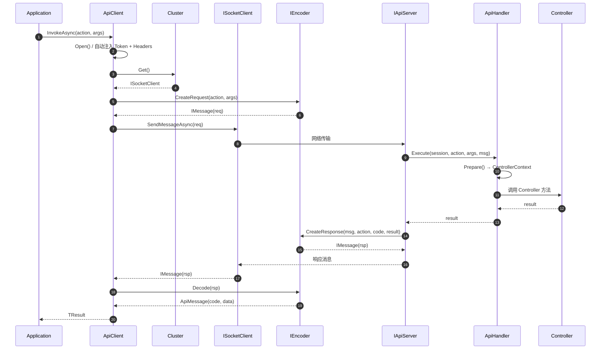
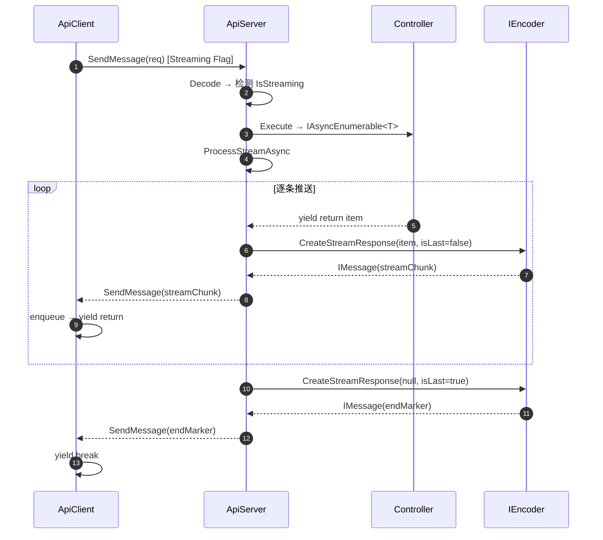
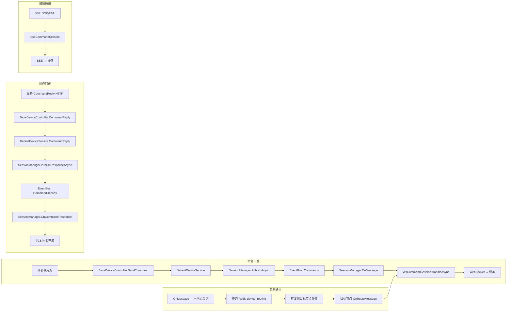
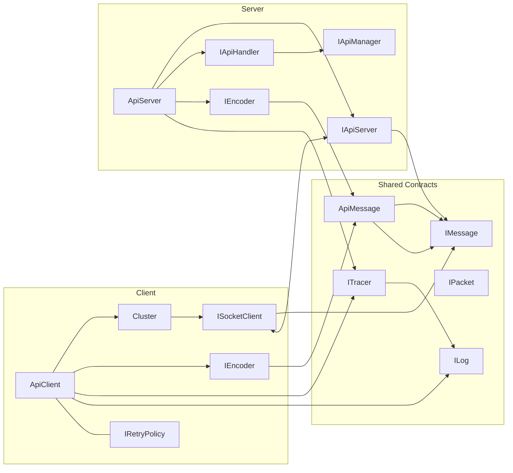

```mermaid
flowchart TD
    subgraph 生命周期
        A[Open] --> B[Login]
        B --> C[Ping 定时器]
        C --> D[WsChannel 维护]
        D --> E{WS 可用?}
        E -->|是| F[WebSocket 全双工]
        E -->|否| G[SseChannel 降级]
    end

    subgraph 命令处理
        H[HandleAsync] --> I[JSON 反序列化]
        I --> J[ReceiveCommand]
        J --> K{_cache 去重}
        K -->|重复| L[跳过]
        K -->|新命令| M[OnReceiveCommand]
        M --> N[Received 事件]
        M --> O[ExecuteCommand]
        O --> P[Commands 字典匹配委托]
        P --> Q[CommandReply 上报]
    end

    subgraph 自动更新
        R[UpgradeAsync] --> S[Download]
        S --> T[CheckFileHash]
        T --> U[Extract]
        U --> V[Update 覆盖]
        V --> W[Restart]
    end
```

# 架构设计 — NewLife.Remoting

> 最后更新: 2026-07-15

## 1. 架构概览

NewLife.Remoting 采用**分层 + 插件化**架构，核心通信库 `NewLife.Remoting` 提供 RPC 框架的基础设施，扩展库 `NewLife.Remoting.Extensions` 提供 IoT 场景的指令下发和设备管理能力。

```
┌─────────────────────────────────────────────────────────┐
│                 应用层 (Application)                       │
│  Controller     Service     ClientBase     Upgrade        │
├─────────────────────────────────────────────────────────┤
│               NewLife.Remoting.Extensions                 │
│  BaseDeviceController  WsCommandSession  SseCommandSession│
│  IDeviceService        TokenService      CommandResponseBus│
├─────────────────────────────────────────────────────────┤
│                NewLife.Remoting (核心层)                   │
│  ApiClient/ApiServer  ApiHandler    ApiManager            │
│  JsonEncoder/HttpEncoder  Cluster   IRetryPolicy          │
│  SessionManager  CommandSession  OwnerPacket              │
├─────────────────────────────────────────────────────────┤
│              传输层 (Transport)                            │
│  TCP/UDP (Socket)    HTTP/HTTPS    WebSocket              │
├─────────────────────────────────────────────────────────┤
│           底层依赖 (NewLife.Core / XCode)                  │
│  IPacket/IMessage   ICache     ILog    ITracer   ICounter  │
└─────────────────────────────────────────────────────────┘
```

### 设计原则

| 原则 | 说明 |
|------|------|
| **最小侵入** | 不改 `IMessage`、`IActionFilter`、`ICluster` 等 NewLife.Core 基础接口 |
| **向后兼容** | 旧客户端可连接新服务端，新客户端可连接旧服务端 |
| **渐进增强** | 先 SRMP 二进制流，HTTP 通过 SSE 天然兼容 |
| **零拷贝** | Controller 返回的数据包直接挂载到响应消息链，不做额外拷贝 |
| **场景驱动** | 简单场景（RPC 调用）追求简洁直接；复杂场景（指令下发集群路由）提供完整架构 |

---

## 2. 项目结构

### 2.1 NewLife.Remoting（核心通信库）

| 目录/文件 | 职责 |
|-----------|------|
| `ApiClient.cs` | RPC 客户端，连接管理、请求/响应、流式调用、Headers 注入、重试 |
| `ApiServer.cs` | RPC 服务端，多协议监听、请求处理流水线、流式推送 |
| `ApiAction.cs` | 动作元数据，反射预编译，IsStreaming/IsPacket/IsAccessor 检测 |
| `ApiHost.cs` | 客户端/服务端基类，共享 Encoder/Tracer/Log 配置 |
| `IApiHandler.cs` | 请求处理器，`ApiHandler` 默认实现路由到 Controller |
| `IApiManager.cs` | 动作管理器，`ApiManager` 负责控制器注册与发现 |
| `IEncoder.cs` | 编码器体系，`EncoderBase` → `JsonEncoder` / `HttpEncoder` |
| `IApi.cs` / `IApiServer.cs` / `IApiSession.cs` | 核心接口契约 |
| `ICluster.cs` | 集群接口，`ClientSingleCluster` / `ClientPoolCluster` |
| `IRetryPolicy.cs` | 重试策略接口 |
| `ApiMessage.cs` | SRMP 协议消息模型 |
| `JsonEncoder.cs` | JSON 编解码 + 流式块编码 |
| `Clients/` | 客户端基类 `ClientBase`、WS/SSE 通道、自动更新 `Upgrade` |
| `Services/` | `SessionManager` 会话管理器、`CommandSession` 会话基类 |
| `Models/` | 请求/响应模型（CommandModel, PingRequest, LoginRequest 等） |

### 2.2 NewLife.Remoting.Extensions（扩展库）

| 目录/文件 | 职责 |
|-----------|------|
| `Controllers/BaseDeviceController.cs` | 设备管理 HTTP 端点：SendCommand/CommandReply/Notify/NotifySSE/Upgrade |
| `Controllers/BaseController.cs` | 基础控制器，通用 API 端点 |
| `Services/IDeviceService.cs` | 设备服务接口 |
| `Services/DefaultDeviceService.cs` | 设备服务默认实现 |
| `Services/WsCommandSession.cs` | WebSocket 命令会话 |
| `Services/SseCommandSession.cs` | SSE 命令会话（降级通道） |
| `Services/TokenService.cs` | JWT 令牌服务 |
| `ApiFilterAttribute.cs` | API 过滤器，JWT 验证 |
| `WebHelper.cs` | Web 辅助方法 |

---

## 3. 核心模块架构

### 3.1 RPC 调用流水线 (M1)



**关键设计点**：
- **401 自动重登**：收到 401 响应后自动调用 `OnLoginAsync(force=true)`，在同一连接上重发请求
- **重试策略**（可选）：实现 `IRetryPolicy` + `MaxRetries`，对非 401 异常按策略重试
- **超时管理**：`Timeout` 属性控制请求超时，与外部 CancellationToken 联合取消

### 3.2 流式调用 (M2)



**协议格式**（SRMP）：
```
首帧:   Flag(Streaming=1) + Seq + Len + [action] + [data]
中间帧: Flag(Streaming=1) + Seq + Len + [data]
末帧:   Flag(Streaming=1, EndOfStream=1) + Seq + 0
```

**HTTP SSE 兼容**：
```
HTTP/1.1 200 OK
Content-Type: text/event-stream

data: {"code":0,"data":"...\n\n"}
data: {"code":0,"data":"...\n\n"}
data: {"code":0,"data":""\n\n"}
```

### 3.3 元数据/Headers 传递 (M3)

```
ApiClient.Headers 字典
  ├─ 用户设置: client.Headers["TenantId"] = "tenant-01"
  ├─ 自动注入: DefaultSpan.Current?.TraceId → Headers["TraceId"]
  └─ 自动合并到 InvokeAsync/InvokeStreamAsync 的 args 字典

服务端提取路径:
  ApiHandler.Prepare → ctx.Items["Headers"]
  ControllerContext.Current.Items["Headers"]
```

- **不改 IMessage 接口**：通过参数字典 `__headers` key 透传，不扩展 SRMP 协议
- **兼容性**：旧客户端不发送 Headers，新服务端兼容处理；旧服务端忽略 Headers 字段

### 3.4 指令下发管线 (M4)



**响应等待机制**：
- `PublishAsync` 中 `timeout > 0` 时注册 `TaskCompletionSource<CommandReplyModel>` 到本地 `_callbacks` 字典
- 超时或取消时自动清理回调注册，防止内存泄漏
- 未注入事件总线时自动降级到旧 `cmdreply:{id}` Redis 队列

**集群路由**：
- 设备建连时 `HSET device_routing {code} {nodeId}`
- 设备断连时 `HDEL device_routing {code}`
- 本地无会话时查询路由表，向目标节点专用频道转发

### 3.5 客户端基类 (M5)



### 3.6 自动更新 (M6)

```
检测 → 下载(.zip) → 哈希校验 → 解压(临时目录) → 文件覆盖 → 回滚保护 → 进程重启
```

**安全覆盖策略**：运行中的 .dll/.exe → 先改名 `.del` → 再拷贝新文件 → 旧文件保留用于回滚

**跨平台重启**：
- Windows: `Process.Start` 拉起新进程
- Linux: 通过 `dotnet` 命令或 systemd 服务重启
- OSX: 同 Linux

### 3.7 重试策略 (M7)

```csharp
public interface IRetryPolicy
{
    Boolean ShouldRetry(Exception exception, Int32 attempt,
        out TimeSpan delay, out Boolean refreshClient);
}
```

- **生效条件**：`RetryPolicy != null` 且 `MaxRetries > 0`
- **401 特例**：由框架层处理（登录重发），不计入重试次数
- **refreshClient**：为 true 时归还当前连接，从集群重新获取

---

## 4. 内存管理设计

### 4.1 IOwnerPacket 所有权转移

```
IMessage.Payload → OwnerPacket(header) → Next → OwnerPacket(data) → Next → ...
```

`OwnerPacket.Dispose()` 级联释放：
1. 归还自身缓冲区到 `ArrayPool<Byte>.Shared`
2. 调用 `Next.TryDispose()` 级联释放后续节点
3. 将 `Next` 置 null，防止重复释放

### 4.2 所有权管理关键路径

```csharp
// ApiServer.Process
Object? result = null;
IMessage? response = null;
try
{
    result = OnProcess(...);  // 可能返回 IOwnerPacket
    response = enc.CreateResponse(msg, action, code, result);  // result 挂载到 Payload 链
    return response;
}
finally
{
    // 仅在 result 未纳入响应时才释放（OneWay/异常场景）
    if (response == null) result.TryDispose();
}
```

### 4.3 链式数据包结构

```csharp
// EncoderBase.Encode
var pk = new OwnerPacket(headerLen);
var writer = new SpanWriter(pk.GetSpan());
writer.Advance(8);           // 预留协议头空间
writer.Write(action);
writer.Write(value.Total);

var pk2 = pk.Slice(8, writer.Position - 8, true);  // transferOwner=true
if (value != null) pk2.Next = value;                 // value 挂载到 Next 链

return pk2;
```

---

## 5. 技术选型

| 领域 | 选型 | 理由 |
|------|------|------|
| 传输协议 | TCP/UDP/HTTP/WS | 统一 API，按场景选择 |
| 序列化 | JSON（默认）+ IPacket 二进制直通 | 免 .proto，灵活可替换 |
| 流式客户端 API | `IAsyncEnumerable<T>` | C# 8.0+ 原生支持 |
| 流式检测 | 反射 `IAsyncEnumerable<>` 接口检测 | 不依赖新接口或注解 |
| SRMP 流式标识 | Flag 位 bit5/bit4 | 复用现有 1 字节 Flag |
| HTTP 流式 | SSE (`text/event-stream`) | 标准协议，curl 可调试 |
| Headers 透传 | 参数字典注入 | 不改 IMessage，不扩展协议 |
| 内存管理 | `OwnerPacket` + `ArrayPool` | 零拷贝链式传递 |
| 事件总线 | 内存 `EventBus<T>` / Redis EventBus | 单机/集群按需切换 |
| 设备路由 | Redis Hash | 轻量级，无需额外服务 |
| 重试 | `IRetryPolicy` 接口 | 可插拔，默认不启用 |

---

## 6. 关键设计决策

| 决策点 | 方案 | 备选方案 | 选择理由 |
|--------|------|---------|---------|
| 流式协议 | SRMP Flag 扩展 | 新消息类型 | Flag 扩展最小改动，旧客户端忽略未知 bit |
| Headers 传递 | 参数字典注入 | SRMP 协议 Headers 段 | 不改协议、不改 IMessage |
| SSE 结束标记 | 最后一帧 data 为空 | `event: end` | 与现有 ApiMessage JSON 格式一致 |
| 流式编码器 | `EncoderBase.EncodeStreamChunk` | 独立 `IStreamEncoder` | 复用现有 Encoder 体系 |
| 响应关联 | 事件总线广播 + TCS 回调 | Redis 队列 | 无空队列残留、跨实例兼容 |
| 指令持久化 | Redis Hash | XCode 实体表 | 高性能、自动过期（业务方可重写） |
| 集群路由 | Redis Hash 路由表 | EventBus 广播 | 精确路由减少无效消费 |

---

## 7. 风险与缓解

| 风险 | 影响 | 缓解措施 |
|------|------|---------|
| 流式帧乱序 | 客户端收到错序数据 | 复用 Sequence 号，客户端按序交付 |
| 旧客户端连接新服务端 | 旧客户端忽略 Streaming Flag | 仅当显式调用 `InvokeStreamAsync` 时才触发流式 |
| SSE 兼容性 | 旧 HTTP 客户端不理解 SSE | `InvokeStreamAsync` 仅在新路径实现 |
| 集群路由一致性 | 路由表与真实会话不一致 | 本地缓存 + 60 秒 TTL 兜底 |
| ArrayPool 竞争 | 高并发下缓冲区竞争 | EnsureOwnedPayload Clone 隔离 |

---

## 8. 测试策略

| 层级 | 工具 | 覆盖范围 |
|------|------|---------|
| 单元测试 | xUnit | ApiAction/ApiMessage/JsonEncoder/ApiHandler/CommandModel 等核心类 |
| 流式集成测试 | xUnit | StreamingIntegrationTests 5 项（SRMP + SSE + 取消 + 空流 + 错误） |
| Headers 集成测试 | xUnit | TraceParentIntegrationTests 3 项 |
| SessionManager 测试 | xUnit | 响应总线 3 项 + 路由 5 项 |
| 内存管理测试 | xUnit | OwnerPacketLifecycleTests 所有权转移与级联释放 |
| 全量回归 | `dotnet test` | 586 测试通过（2026-07-15） |

> 详细测试指南参见 `testing-strategy` 技能。

---

## 9. 组件依赖图



---

## 10. 变更文件清单

### 核心库 (NewLife.Remoting)

| 文件 | 职责 | 关键 API |
|------|------|---------|
| `ApiClient.cs` | RPC 客户端 | InvokeAsync/InvokeStreamAsync/Headers/RetryPolicy |
| `ApiServer.cs` | RPC 服务端 | Process/ProcessStream/Start/Stop |
| `ApiAction.cs` | 动作元数据 | IsStreaming/IsPacket/IsAccessor |
| `IEncoder.cs` | 编码器体系 | CreateRequest/CreateResponse/CreateStreamResponse |
| `EncoderBase.cs` | 编码器基类 | Encode/EncodeStreamChunk/Decode |
| `JsonEncoder.cs` | JSON 编码器 | 流式块编码 |
| `HttpEncoder.cs` | HTTP 编码器 | SSE 输出 |
| `ApiHandler.cs` | 请求处理器 | Execute/Prepare |
| `IApiManager.cs` | 动作管理器 | Register/Find/CreateController |
| `Services/SessionManager.cs` | 会话管理器 | PublishAsync/PublishResponseAsync/Add/Remove |
| `Services/CommandSession.cs` | 会话基类 | HandleAsync |
| `Clients/ClientBase.cs` | 客户端基类 | InvokeStreamAsync/OnLoginAsync/Ping/Upgrade |
| `Clients/Upgrade.cs` | 自动更新 | Download/Extract/Update/Run |

### 扩展库 (NewLife.Remoting.Extensions)

| 文件 | 职责 | 关键 API |
|------|------|---------|
| `Controllers/BaseDeviceController.cs` | 设备控制器 | SendCommand/CommandReply/Notify/NotifySSE |
| `Services/DefaultDeviceService.cs` | 设备服务 | SendCommand/CommandReply/Ping/Login |
| `Services/WsCommandSession.cs` | WS 会话 | HandleAsync |
| `Services/SseCommandSession.cs` | SSE 会话 | HandleAsync/WaitAsync |
| `Services/TokenService.cs` | 令牌服务 | EncodeToken/DecodeToken |

---

## 变更记录

| 日期 | 变更 |
|------|------|
| 2026-07-15 | 初始创建：合并 RPC重构架构.md + RPC内存管理设计.md + remoting-components.md + remoting-sequences.md + 指令下发架构.md，重新组织为 M1~M7 模块化架构文档 |
