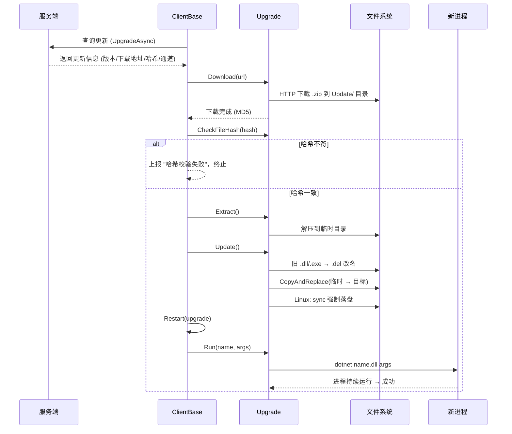
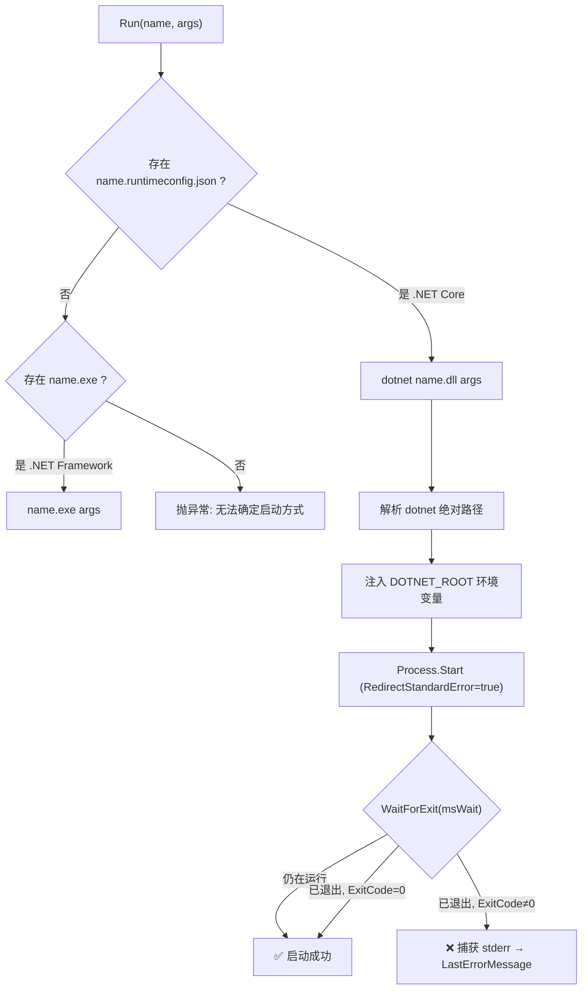
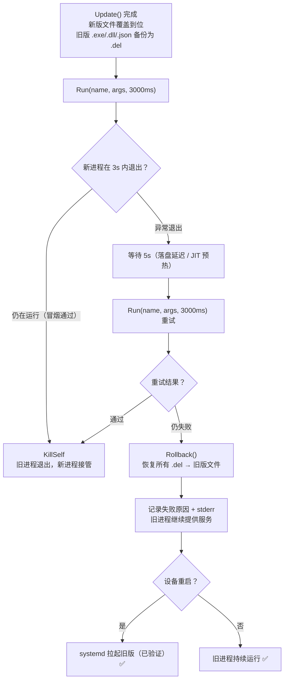
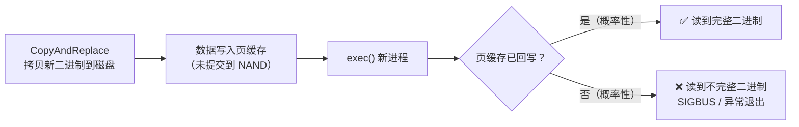

# 自动更新机制

## 概述

`NewLife.Remoting` 提供了一套完整的应用自动更新机制，涵盖**检测 → 下载 → 校验 → 解压 → 文件覆盖 → 进程重启**全链路。核心类为 `Upgrade`（文件操作）和 `ClientBase.Upgrade`/`Restart`（流程编排），已在星尘代理（StarAgent）等生产环境中稳定运行超过 20 年。

### 解决的问题

- **文件覆盖**：运行中的 exe/dll 在 Windows 上被锁定，Linux 上覆盖可能导致段错误。通过「先改名再拷贝」策略安全替换。
- **进程重启**：跨平台（Windows/Linux/OSX）拉起新版本进程，支持服务模式（systemd）和普通进程模式。
- **版本管理**：避免频繁更新同一个版本（`_lastVersion` 去重）。
- **回滚保护**：更新失败时自动恢复被移动的旧文件。

---

## 更新流程



### 各阶段详解

| 阶段 | 方法 | 说明 |
|------|------|------|
| 检测 | `UpgradeAsync` | 调用服务端接口查询是否有新版本，返回 `IUpgradeInfo`（版本号、下载地址、哈希、通道、强制更新标志） |
| 下载 | `Upgrade.Download` | HTTP GET 下载 .zip 更新包到 `Update/` 目录，超时 `DownloadTimeoutSeconds`（默认 30s）。通过 Content-Disposition 头获取真实文件名。瞬时网络故障自动重试两次（共三次尝试） |
| 校验 | `Upgrade.CheckFileHash` | 对下载文件计算 MD5，与服务端下发的哈希比对，防止文件损坏或被篡改 |
| 解压 | `Upgrade.Extract` | 解压 .zip 到系统临时目录，仅支持 .zip 格式 |
| 预安装 | `Info.Preinstall` | 可选。在覆盖文件之前执行预安装脚本（如安装运行时依赖） |
| 覆盖 | `Upgrade.Update` | 按 `Mode`（Partial/Standard/Full）清理目标目录；Standard 模式将当前 .exe/.dll 改名为 .del（Linux 上无法覆盖运行中文件）；`CopyAndReplace` 拷贝新文件；Linux 上 `sync` 强制落盘 + `StorageFlushDelay` 等待；失败时恢复旧文件 |
| 执行器 | `Info.Executor` | 可选。覆盖完成后执行更新后脚本 |
| 重启 | `Restart` | 调用 `Upgrade.Run` 拉起新版本进程。通过 `BuildRestartArguments()` 虚方法构建重启参数，`MyStarClient` 可重载以支持服务模式（`-restart`）和进程模式（`-run`） |

---

## 进程拉起策略

### Muxer 优先

`Upgrade.Run` 采用 **muxer 优先** 策略启动 .NET Core 应用：



### 为什么用 muxer 而不是 apphost

- `dotnet <dll>` 是跨平台标准写法，与 StarAgent 的系统约定一致。
- .NET muxer（`dotnet`）能根据 `.runtimeconfig.json` 自动路由到正确的运行时版本，支持多版本共存。
- 原生 apphost（无扩展名的二进制）依赖运行时可发现性（`DOTNET_ROOT` / `/etc/dotnet/install_location`），在 systemd 精简环境下可能失败。
- muxer 本身已在内存中（热路径），即使目标 dll 尚未完全落盘，报错信息也比 apphost 的 SIGBUS 崩溃更具可读性。

### dotnet 路径解析

`ResolveDotNetPath()` 按优先级查找：

1. `DOTNET_ROOT` 环境变量 → `$DOTNET_ROOT/dotnet`
2. `/usr/bin/dotnet`（Linux 标准符号链接位置）
3. `/usr/local/bin/dotnet`
4. 回退到 `"dotnet"`（依赖系统 PATH）

### 环境变量注入

`InjectDotNetRoot()` 从 dotnet 路径反推运行时根目录，向子进程注入：
- `DOTNET_ROOT` — 通用运行时根目录
- `DOTNET_ROOT_ARM64` / `DOTNET_ROOT_X64` — 架构特定的高优先级变量

### 启动诊断

当进程异常退出（非零退出码）时，`Run` 会：
1. 读取子进程 stderr（最多 4096 字节）
2. 将 `ExitCode` + stderr 写入 `LastErrorMessage`
3. 调用方（`ClientBase.Restart` / `MyStarClient.Restart`）通过 `WriteInfoEvent` 上报到星尘节点历史

---

## 更新模式（UpdateModes）

`Upgrade.Mode` 控制更新时目标目录的清理策略：

| 模式 | 值 | 说明 |
|------|-----|------|
| `Partial` | 1 | **部分包**：不清理目标目录，直接覆盖包内文件，保留其它文件 |
| `Standard` | 2 | **标准包**（默认）：覆盖前将 `*.exe;*.dll` 移名为 `.del`，然后 `CopyAndReplace` 覆盖 |
| `Full` | 3 | **完整包**：清空目标目录所有文件（移名为 `.del`）和子目录。保护清单：`appsettings.json`、`appsettings.*.json`、`Update/`、`Log/`、`Config/` 及其下的 `.del` 文件 |

`Mode` 默认值为 `Standard`，如需由服务端下发可扩展 `IUpgradeInfo` 增加可选字段。

### 进程终止

`Upgrade.KillSelf()` 用于更新完成后优雅终止当前进程：
- 非控制台应用先调用 `CloseMainWindow()`
- 最后执行 `Environment.Exit(0)`

> 注意：`Environment.Exit` 之后的代码不会执行，这是预期行为。

---

## 冒烟测试与自动回滚

自更新最怕新版本有 bug 把自己"玩死"。本机制采用 **冒烟测试 + 自动回滚** 策略确保不死：



### 核心逻辑

1. **冒烟测试**：旧进程不退出，先尝试拉起新进程。`Run` 在 3 秒窗口内观察新进程是否存活。
2. **首次失败不立即判定**：等待 5 秒后重试一次，给慢速存储（eMMC GC）、JIT 冷启动等留下缓冲。
   > 同一启动周期内 `exec()` 从内核页缓存读取文件——数据是完整的，不存在"读到半写入"问题。重试的价值在于排除 eMMC 后台垃圾回收、CPU 降频冷启动等瞬时延迟，而非页缓存一致性问题。
3. **重试仍失败** → `Rollback` 将所有 `.del` 备份恢复（含 `.runtimeconfig.json`、`.deps.json`），旧进程继续运行。
4. **测试通过** → `KillSelf` 退出旧进程，新进程接管。即使此时 systemd 重启服务，拉起的也是已验证的新版。

### 备份范围

`Standard` 模式在 `CopyAndReplace` 前备份：
- `*.exe` / `*.dll` — 可执行文件（覆盖运行中文件会导致段错误，必须先改名）
- `*.runtimeconfig.json` / `*.deps.json` — 随 .NET 版本变化的构建输出文件
- 配置文件 `appsettings.json` 不会被覆盖（`CopyAndReplace` 内部保护），因此不备份

### 与 StarAgent 的配合

StarAgent 使用 `dotnet StarAgent.dll` 启动新版作为冒烟测试：

- 若新版正常 → 测试通过 → 旧版退出 → systemd 管理新版
- 若新版有致命缺陷（启动即崩）→ 测试失败 → `Rollback` 恢复旧版 → 旧版继续运行
- 若设备断电重启 → systemd 拉起的是恢复后的旧版，不会"自毁"

`Upgrade.Rollback()` 自动处理两种 `.del` 命名：
- 普通：`StarAgent.dll.del` → 恢复为 `StarAgent.dll`
- 时间戳变体：`StarAgent.dll_260608153000.del` → 恢复为 `StarAgent.dll`

---

## A4 ARM64 故障案例复盘

### 现象

A4 设备（ARM64 + Ubuntu 22.04 + eMMC 存储）在 net9 → net10 自动更新后，`Upgrade.Run` 拉起新进程失败。节点历史显示：

```
13:35:30 强制更新完成，准备重启后台服务！PID=1316
13:35:31 拉起新进程失败，延迟3000ms后重试
13:35:34 强制更新完成，但拉起新进程失败！
```

同一版本在其他 x86/ARM 机器上正常。

### 时间线

| 时间 | 事件 |
|------|------|
| 13:34:35 | 旧 agent（3.1.2024.1117）→ net9 agent 升级成功 |
| 13:34:54 | 开始下载 net10 运行时 |
| 13:35:28 | **net10 运行时安装完成**（解压到 `/usr/share/dotnet`，创建软链 `/usr/bin/dotnet`） |
| 13:35:29 | net9 agent 检测到 net10 更新，开始下载 |
| 13:35:30 | 覆盖完成，调用 `Restart` |
| 13:35:31 | **拉起失败**（进程 ~1 秒内非零退出） |
| 13:35:34 | 重试仍失败，上报 "拉起新进程失败" |
| 13:36:00 | 旧进程退出，systemd 自动重启服务 → 新 agent 正常上线 |

### 根因

**不是代码逻辑 bug，是 A4 ARM64 慢速存储（eMMC）上的 IO 竞态条件。** 此故障在 2024 年 11 月已被首次记录（commit `0eb5f38`："在A4上执行StarAgent自动更新时，有一定几率无法自动重启"）。



**加重因素**：net10 运行时安装与升级仅间隔 2 秒，系统 IO 高负载时页缓存回写延迟更大，触发几率显著增加。

### 修复措施（三层防御）

| 层 | 措施 | 文件 | 作用 |
|---|------|------|------|
| ① | `CopyAndReplace` 后 `sync` 强制落盘 | `Upgrade.Update` | 确保二进制数据提交到存储介质后再重启 |
| ② | ARM64 Linux 上 `StorageFlushDelay`（默认 800ms）等待页缓存回写 | `Upgrade.Update` | 给慢速存储（eMMC/SD）额外回写时间窗口，可配置 |
| ③ | stderr 捕获 → `LastErrorMessage` → `WriteInfoEvent` 上报 | `Upgrade.Run` / `ClientBase.Restart` | 即使失败也能在节点历史看到 ExitCode 和错误输出 |

### 为什么 2024-11 的补丁（加重试）不够

重试时 IO 可能仍然拥堵（系统正在处理大量回写），导致第二次 `exec()` 依然读到不完整二进制。**重试只降低失败概率，不解决根因（数据未落盘）。**

---

## 兼容性

### 目标框架

`Upgrade.cs` 编译面向 `net45;net461;netstandard2.0;netstandard2.1;net5.0-net10.0`。

- **net45/net461**：`InjectDotNetRoot` 跳过架构特定环境变量（`RuntimeInformation` 不可用）。
- **.NET Core 5.0+**：完整支持 `DOTNET_ROOT` + 架构特定变量。

### 平台差异

| 平台 | 启动方式 | 文件改名 |
|------|---------|---------|
| Windows | 直接执行 .exe 或 `dotnet &lt;name&gt;.dll` | .exe/.dll → .del（覆盖前改名） |
| Linux | `dotnet &lt;name&gt;.dll`（muxer 优先），apphost 仅用作非 .NET Core 兜底 | .exe/.dll → .del + `sync` 强制落盘 + `chmod +x` |
| OSX | `dotnet &lt;name&gt;.dll` | 同 Linux 逻辑 |

---

## Stardust MyStarClient 适配说明

`MyStarClient` 在 `D:\X\Stardust\StarAgent\MyStarClient.cs` 中重写了 `Restart` 以支持服务/进程双模式，并已同步基类的冒烟测试 + 自动回滚策略。

### 双模式差异

| 模式 | 启动参数 | 成功时 | 失败时 |
|------|---------|--------|--------|
| **服务模式**（systemd） | `-restart -upgrade` | 不自杀，外部命令重启服务会结束当前进程 | `Rollback` 恢复旧版，记录 `LastErrorMessage` |
| **进程模式**（普通） | `-run -upgrade` | `Service.StopWork` + `KillSelf` | `Rollback` 恢复旧版，记录 `LastErrorMessage` |

### 与基类的对齐

`MyStarClient.Restart` 与 `ClientBase.Restart` 使用完全相同的三级策略：

1. **Run(name, args, 3000ms)** — 冒烟测试
2. **失败 → 等待 5s → 重试一次**（应对慢速存储 / JIT 预热）
3. **仍失败 → `upgrade.Rollback()`** — 恢复所有 `.del` 恢复旧版文件
4. 失败日志均携带 `upgrade.LastErrorMessage`（含 ExitCode + stderr）

### 为什么服务模式不调用 KillSelf

服务模式下，`-restart -upgrade` 参数告诉新版 StarAgent 通过 `systemctl restart` 接管服务。systemd 会先杀旧进程再启新进程，所以旧进程无需（也不应）主动退出——否则可能与 systemd 的进程管理产生竞态。

### 后续优化方向

当前双模式仍需整体覆写 `Restart`，因为服务模式的"不自杀"语义无法通过纯 `BuildRestartArguments()` 钩子表达。如果基类增加 `protected virtual Boolean ShouldKillSelf => true` 属性，`MyStarClient` 可仅覆写 `BuildRestartArguments` + `ShouldKillSelf`，从而消除整段 `Restart` 覆写。

---

## 相关文件

| 文件 | 说明 |
|------|------|
| `NewLife.Remoting/Clients/Upgrade.cs` | 文件下载、解压、覆盖、进程拉起 |
| `NewLife.Remoting/Clients/ClientBase.cs` | 更新流程编排（`Upgrade`、`Restart`） |
| `D:\X\Stardust\StarAgent\MyStarClient.cs` | StarAgent 重写的重启逻辑（服务/进程两路） |
| `D:\X\NewLife.Agent\NewLife.Agent\Models\SystemdSetting.cs` | systemd 服务单元生成 |
| `D:\X\Stardust\Stardust\Managers\NetRuntime.cs` | .NET 运行时安装 |

## 相关文档

- [ClientBase 使用说明](ClientBase.md)
- [重试策略](重试策略.md)
