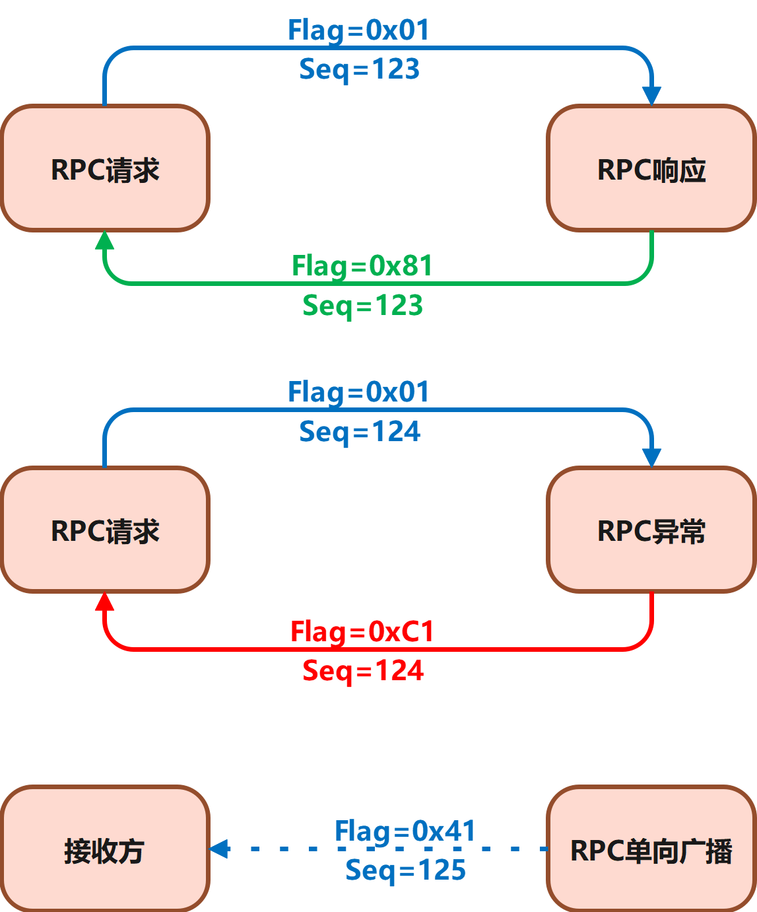

# NewLife.Remoting - 协议通信库


协议通信库，二进制封装，提供高吞吐低延迟的高性能RPC框架  

源码： https://github.com/NewLifeX/NewLife.Remoting  
Nuget：NewLife.Remoting / NewLife.Remoting.Extensions  

# 系统架构
## RPC架构
客户端：ApiClient  
服务端：ApiServer  
应用客户端：ClientBase  
特点：
1. 服务端根据Action把请求转发给各个Controller，用法跟WebApi一致。
2. 简单高性能，通信报文使用二进制序列化，中间没有任何损耗
3. 接口出入参支持灵活的Json序列化（常规接口），同时也支持高效的二进制序列化（图片视频）
4. TCP/UDP长会话，服务端支持主动下发消息
5. 最高连接，单机400万TCP长连接
6. 常见吞吐，单机10万TPS，最高2266万TPS
7. 服务端可寄宿于控制台、Web项目、桌面应用、IoT嵌入式应用
8. 支持集群部署横向扩展，每个客户端跟其中一个服务端维持长连接

代表性应用（蚂蚁调度AntJob）：

1. 客户端AntClient继承自ClientBase，通过Tcp/Udp等协议连接服务端ApiServer，进行登录、心跳等操作。
2. 客户端使用应用AppId和AppSecret登录，获得令牌，后续无需携带或验证令牌，直到令牌过期重新登录。


## HTTP架构
客户端：ApiHttpClient  
服务端：ASP.NET WebApi
应用客户端：ClientBase  
应用服务端：BaseDeviceController  
特点：

1. 标准ASP.NET WebApi作为服务端，重用原有技术栈。
2. 客户端ApiHttpClient是标准HttpClient的进一步封装，支持多服务端地址负载均衡。
3. 默认通信使用Json序列化，不适合传输文件、图片和视频等二进制数据。
4. 服务端提供BaseController基类，封装了令牌验证等鉴权机制
5. 服务端提供BaseDeviceController基类，封装常见的登录、心跳和更新等接口
6. 通过WebSocket长连接实现指令下发，心跳保活
7. 常见吞吐，单机1万TPS
8. 服务端仅寄宿于 Kestrel和IIS
9. 支持集群部署横向扩展，客户端每次请求都可能分流到不同应用服务器

代表性应用（轻量级IoT平台ZeroIoT）：

1. 客户端HttpDevice继承自ClientBase，通过Http/Https协议连接服务端WebApi，进行登录、注销、心跳和更新等操作。
2. 客户端使用设备DeviceCode和DeviceSecret登录，获得令牌，后续每次请求头都需要带上令牌。
3. 在心跳时检测并维持WebSocket长连接。


# SRMP协议
在分布式系统中，RPC尤为重要。SRMP是新生命团队专门为了RPC框架而设计的通信协议，既支持内网高速通信，也能覆盖物联网嵌入式设备。

经过十多年实战经验积累以及多方共同讨论，新生命团队（[https://newlifex.com](https://newlifex.com)）制订了一种简单而又具有较好扩展性的RPC（Remote Procedure Call）协议。

全称：**简易远程消息交换协议**，简称： **SRMP（Simple Remote Messaging Protocol）**

SRMP主要定位于以下场景：
- 内网高速通信，大吞吐量（>10万tps）、低延迟（<1ms）
- 外网远程通信，稳定可靠，海量连接（>10万）
- 物联网硬件设备，容易简单实现协议
- 支持TCP/UDP/串口/蓝牙BLE等多种通信方式

# 协议基础
## 消息结构
**协议： 1 Flag + 1 Sequence + 2 Length + N Payload**  
- **1个字节标识位，标识请求、响应、错误、单向广播等；**  
- **1个字节序列号，用于请求响应包配对；**  
- **2个字节数据长度N，小端字节序，指示后续负载数据长度（不包含头部4个字节），解决粘包问题；**  
- **N个字节负载数据，数据内容完全由业务决定，最大长度65534=64k-2。**  

## 长度扩展
数据中心内网通信中，负载数据大于等于64k时，数据长度字段填65535（0xFFFF），启用后续4字节扩展长度，最大长度4G（0xFFFFFFFF），此时头部总长度是8字节。  
嵌入式物联网硬件设备建议直接忽略扩展长度，仅需支持4字节头部，限制负载数据小于64k。  

采用固定2字节表示长度，方便任意语言接入，特别是嵌入式实现，在这一点上完胜变长的七位压缩编码整数。内网高速通信可实现8字节头部扩容，而物联网嵌入式设备则可以直接不考虑扩容。  
1字节序列号，主要用于UDP通信、串口通信、无线通信等做请求与响应的匹配，这是多路复用的根基所在。  

## 通信方式
本协议默认采用请求应答模式，此外还支持异常响应及单向广播，由协议标识位最高两位来定义。


1. 客户端向服务端发起RPC请求（Flag=0x01），携带自增序列号Seq，异步等待响应。
2. 服务端收到RPC请求后，处理业务并把结果打包成RPC响应（Flag=0x81），使用相同的Seq发回去给客户端。
3. 客户端收到响应后，匹配Seq，返回给调用方。
4. 服务端处理RPC请求出现异常时，打包RPC异常（Flag=0xC1），使用相同的Seq返回给客户端。
5. 客户端收到异常响应后，匹配Seq，向调用方抛出异常。
6. 客户端和服务端随时可以向对方发送单向广播（Flag=0x41），接收方无需回复。
7. 客户端可以发起RPC请求以及单向广播，服务端仅能回复响应以及发送单向广播而不能主动发起RPC请求。

# RPC报文
SRMP主要分为请求、响应、异常和单向广播几种报文。报文由协议头和负载数据体两大部分组成。
## 请求报文
RPC请求报文，数据体分为接口名称Action和请求参数Data两部分。1个字节表示名称长度，因此名称最大长度为255字符。4个字节表示请求参数的数据长度，最大4G。  
如若有扩展需要，可在后面附加多个具有4字节长度的变长数据，整体格式不变。例如，某些场景需要Token令牌或者TraceId追踪，实际上可以作为请求参数一部分来整体封包。  
请求参数默认采用Json序列化封包，高速接口支持直接以二进制Packet作为参数，绕开序列化的成本开支。强烈建议10000tps以上的接口采用高速Packet传参，此时接口入参只能有一个Packet参数。用户自己对参数进行二进制序列化。  
在高并发大吞吐系统中，序列化成本占据整体通信耗时的70%以上，远远超过网络开支。  

| 字节 | 7 | 6 | 5 | 4 | 3 | 2 | 1 | 0 |
| --- | --- | --- | --- | --- | --- | --- | --- | --- |
| 1 Flag | 请求0 | 单向0 | 保留 |  |  |  |  |  |
| 1 Seq | 序列号（0~255） |  |  |  |  |  |  |  |
| 2 Length | 数据长度（0~65534） |  |  |  |  |  |  |  |
| Body | 名称长度（1字节） |  | 接口名称（Action） |  |  |  |  |  |
|  | 数据长度（4字节） |  | 请求参数（Data） |  |  |  |  |  |


## 响应报文
RPC响应报文，数据体分为接口名称Action和结果数据Data两部分。1个字节表示名称长度，因此名称最大长度为255字符。4个字节表示结果数据的数据长度，最大4G。  
如若有扩展需要，可在后面附加多个具有4字节长度的变长数据，整体格式不变。  
响应数据默认采用Json序列化封包，高速接口支持直接以二进制Packet作为数据，绕开序列化的成本开支。强烈建议10000tps以上的接口采用Packet作为响应数据，此时接口返回类型必须是Packet。用户自己对数据进行二进制反序列化。  

| 字节 | 7 | 6 | 5 | 4 | 3 | 2 | 1 | 0 |
| --- | --- | --- | --- | --- | --- | --- | --- | --- |
| 1 Flag | 响应1 | 错误0 | 保留 |  |  |  |  |  |
| 1 Seq | 序列号（0~255） |  |  |  |  |  |  |  |
| 2 Length | 数据长度（0~65534） |  |  |  |  |  |  |  |
| Body | 名称长度（1字节） |  | 接口名称（Action） |  |  |  |  |  |
|  | 数据长度（4字节） |  | 结果数据（Data） |  |  |  |  |  |


## 异常报文
RPC异常响应报文，数据体分为接口名Action、错误码Code和结果数据Data三部分。响应代码固定4字节整数，其它同响应报文。

| 字节 | 7 | 6 | 5 | 4 | 3 | 2 | 1 | 0 |
| --- | --- | --- | --- | --- | --- | --- | --- | --- |
| 1 Flag | 响应1 | 错误1 | 保留 |  |  |  |  |  |
| 1 Seq | 序列号（0~255） |  |  |  |  |  |  |  |
| 2 Length | 数据长度（0~65534） |  |  |  |  |  |  |  |
| Body | 名称长度（1字节） |  | 接口名称（Action） |  |  |  |  |  |
|  | 响应代码（Code）（4字节） |  |  |  |  |  |  |  |
|  | 数据长度（4字节） |  | 结果数据（Data） |  |  |  |  |  |


## 单向广播
RPC单向广播报文，标记位高位填01，其它同请求报文。

| 字节 | 7 | 6 | 5 | 4 | 3 | 2 | 1 | 0 |
| --- | --- | --- | --- | --- | --- | --- | --- | --- |
| 1 Flag | 请求0 | 单向1 | 保留 |  |  |  |  |  |
| 1 Seq | 序列号（0~255） |  |  |  |  |  |  |  |
| 2 Length | 数据长度（0~65534） |  |  |  |  |  |  |  |
| Body | 名称长度（1字节） |  | 接口名称（Action） |  |  |  |  |  |
|  | 数据长度（4字节） |  | 请求参数（Data） |  |  |  |  |  |


# 参数封包
客户端请求和服务端响应，其中都有Data数据主体部分（请求参数和结果数据），根据使用场景不同，主要分为Json封包、二进制封包和基础类型封包等方式。SRMP协议强大之处在于，可以混合使用多种封包方式，简单接口使用Json封包和基础类型封包，文件和多媒体传输接口使用二进制封包。  
请求参数对应接口入参，接口返回对应Invoke返回，一般要求两边类型对应。但也不尽然，只要一边能够解析另一边的数据就行。  

## 封包原理
1. 客户端发起Invoke调用时，接口名称Action和参数对象Data将封包成为请求报文。其中接口名称固定为字符串封包，而请求参数根据使用场景不同，使用不同的封包方式，**最终都是二进制数据**。  
2. **服务端接口入参，一般使用客户端请求参数相同类型**，但也可以使用完全不同的类型，只要能够解析出来即可。例如，不管请求参数是什么类型，接口入参一定可以使用Byte[]或Packet，此时可就得自己解析二进制数据了。又如，请求参数是复杂对象，使用Json封包，而接口入参使用String，那么将会收到一段Json字符串。  
3. 服务端接口返回结果数据，一般使用强类型对象，使用Json封包或二进制封包返回，**最终也都是二进制数据**。  
4. 客户端Invoke收到服务端响应时，**根据TResult解析结果数据Data**，一般使用服务端接口的返回类型。也可以使用Byte[]/Packet/String/IDictionary<String,Object>等类型解析返回数据。  
5. 如果服务端接口抛出异常，将返回异常报文，并且把异常信息打包在Data中返回。客户端Invoke内部解析异常报文的Code和Data以后，**抛出ApiException异常**。  

## Json封包
请求参数或结果数据是复杂对象时，默认使用Json序列化。
```csharp
await _Client.InvokeAsync<Object>("api/info", new { state="abcd", state2=1234 })
```
客户端使用以上代码，请求参数Data的封包就是：`{"state":"abcd","state2":1234}`，共30字节。  
Json封包具有很好的可读性和兼容性，能够满足绝大多数应用场景。它的缺点就是性能损耗，频繁传输较大对象时，大部分时间都耗费在Json序列化之上。  

## 二进制封包
请求参数或结果数据是极为复杂且需要自定义序列化的对象，或者干脆直接就是传输二进制数据时，使用二进制封包。  
复杂对象支持**IAccessor接口**时，可通过该接口的Read/Write实现二进制序列化及反序列化；  
参数或结果直接就是**Byte[]**或**Packet**时，直接封包；
```csharp
await _Client.InvokeAsync<Object>("api/info", new MyAccessor{ state="abcd", state2=1234 })
```
客户端使用以上代码，请求参数Data的封包就是：`0461626364D209`，共7个字节，远比Json封包的30字节要小得多。  
二进制封包具有极高的吞吐性能、极小的报文大小。它的缺点就是可读性很差，网络抓包后几乎识别不出来内容。例如文件传输和多媒体传输等场景，就可以优先使用二进制封包。  

## 基础类型封包
请求参数和结果数据也支持使用简单类型，例如整数、小数、布尔型、时间日期和字符串等，此时统一按照字符串进行封包传输。  


## 新生命项目矩阵
各项目默认支持net7.0/net7.0/netstandard2.1/netstandard2.0/net4.61，旧版（2022.1225）支持net4.5/net4.0/net2.0  

|                               项目                               | 年份  | 说明                                                                                   |
| :--------------------------------------------------------------: | :---: | -------------------------------------------------------------------------------------- |
|                             基础组件                             |       | 支撑其它中间件以及产品项目                                                             |
|          [NewLife.Core](https://github.com/NewLifeX/X)           | 2002  | 核心库，日志、配置、缓存、网络、序列化、APM性能追踪                                    |
|    [NewLife.XCode](https://github.com/NewLifeX/NewLife.XCode)    | 2005  | 大数据中间件，单表百亿级，MySql/SQLite/SqlServer/Oracle/TDengine/达梦，自动分表        |
|      [NewLife.Net](https://github.com/NewLifeX/NewLife.Net)      | 2005  | 网络库，单机千万级吞吐率（2266万tps），单机百万级连接（400万Tcp）                      |
| [NewLife.Remoting](https://github.com/NewLifeX/NewLife.Remoting) | 2011  | RPC通信框架，内网高吞吐或物联网硬件设备场景                                            |
|     [NewLife.Cube](https://github.com/NewLifeX/NewLife.Cube)     | 2010  | 魔方快速开发平台，集成了用户权限、SSO登录、OAuth服务端等，单表100亿级项目验证          |
|    [NewLife.Agent](https://github.com/NewLifeX/NewLife.Agent)    | 2008  | 服务管理组件，把应用安装成为操作系统守护进程，Windows服务、Linux的Systemd              |
|     [NewLife.Zero](https://github.com/NewLifeX/NewLife.Zero)     | 2020  | Zero零代脚手架，基于NewLife组件生态的项目模板，Web、WebApi、Service                    |
|                              中间件                              |       | 对接知名中间件平台                                                                     |
|    [NewLife.Redis](https://github.com/NewLifeX/NewLife.Redis)    | 2017  | Redis客户端，微秒级延迟，百万级吞吐，丰富的消息队列，百亿级数据量项目验证              |
| [NewLife.RocketMQ](https://github.com/NewLifeX/NewLife.RocketMQ) | 2018  | RocketMQ纯托管客户端，支持Apache RocketMQ和阿里云消息队列，十亿级项目验                |
|     [NewLife.MQTT](https://github.com/NewLifeX/NewLife.MQTT)     | 2019  | 物联网消息协议，MqttClient/MqttServer，客户端支持阿里云物联网                          |
|      [NewLife.IoT](https://github.com/NewLifeX/NewLife.IoT)      | 2022  | IoT标准库，定义物联网领域的各种通信协议标准规范                                        |
|   [NewLife.Modbus](https://github.com/NewLifeX/NewLife.Modbus)   | 2022  | ModbusTcp/ModbusRTU/ModbusASCII，基于IoT标准库实现，支持IoT平台和IoTEdge               |
|  [NewLife.Siemens](https://github.com/NewLifeX/NewLife.Siemens)  | 2022  | 西门子PLC协议，基于IoT标准库实现，支持IoT平台和IoTEdge                                 |
|      [NewLife.Map](https://github.com/NewLifeX/NewLife.Map)      | 2022  | 地图组件库，封装百度地图、高德地图和腾讯地图                                           |
|       [NewLife.IP](https://github.com/NewLifeX/NewLife.IP)       | 2022  | IP地址库，IP地址转物理地址                                                             |
|                             产品平台                             |       | 产品平台级，编译部署即用，个性化自定义                                                 |
|           [AntJob](https://github.com/NewLifeX/AntJob)           | 2019  | 蚂蚁调度，分布式大数据计算平台（实时/离线），蚂蚁搬家分片思想，万亿级数据量项目验证    |
|         [Stardust](https://github.com/NewLifeX/Stardust)         | 2018  | 星尘，分布式服务平台，节点管理、APM监控中心、配置中心、注册中心、发布中心              |
|      [NewLife.ERP](https://github.com/NewLifeX/NewLife.ERP)      | 2021  | 企业ERP，产品管理、客户管理、销售管理、供应商管理                                      |
|         [CrazyCoder](https://github.com/NewLifeX/XCoder)         | 2006  | 码神工具，众多开发者工具，网络、串口、加解密、正则表达式、Modbus                       |
|           [XProxy](https://github.com/NewLifeX/XProxy)           | 2005  | 产品级反向代理，NAT代理、Http代理                                                      |
|        [HttpMeter](https://github.com/NewLifeX/HttpMeter)        | 2022  | Http压力测试工具                                                                       |
|         [GitCandy](https://github.com/NewLifeX/GitCandy)         | 2015  | Git源代码管理系统                                                                      |
|          [SmartOS](https://github.com/NewLifeX/SmartOS)          | 2014  | 嵌入式操作系统，完全独立自主，支持ARM Cortex-M芯片架构                                 |
|          [SmartA2](https://github.com/NewLifeX/SmartA2)          | 2019  | 嵌入式工业计算机，物联网边缘网关，高性能.NET6主机，应用于工业、农业、交通、医疗        |
|                           菲凡物联FIoT                           | 2020  | 物联网整体解决方案，建筑、环保、农业，软硬件及大数据分析一体化，单机十万级点位项目验证 |
|                           NewLife.UWB                            | 2020  | 厘米级（10~20cm）高精度室内定位，软硬件一体化，与其它系统联动，大型展厅项目验证        |

## 新生命开发团队
  

新生命团队（NewLife）成立于2002年，是新时代物联网行业解决方案提供者，致力于提供软硬件应用方案咨询、系统架构规划与开发服务。  
团队主导的开源NewLife系列组件已被广泛应用于各行业，Nuget累计下载量高达60余万次。  
团队开发的大数据核心组件NewLife.XCode、蚂蚁调度计算平台AntJob、星尘分布式平台Stardust、缓存队列组件NewLife.Redis以及物联网平台NewLife.IoT，均成功应用于电力、高校、互联网、电信、交通、物流、工控、医疗、文博等行业，为客户提供了大量先进、可靠、安全、高质量、易扩展的产品和系统集成服务。  

我们将不断通过服务的持续改进，成为客户长期信赖的合作伙伴，通过不断的创新和发展，成为国内优秀的IT服务供应商。  

`新生命团队始于2002年，部分开源项目具有20年以上漫长历史，源码库保留有2010年以来所有修改记录`  
网站：https://newlifex.com  
开源：https://github.com/newlifex  
QQ群：1600800/1600838  
微信公众号：  
  
